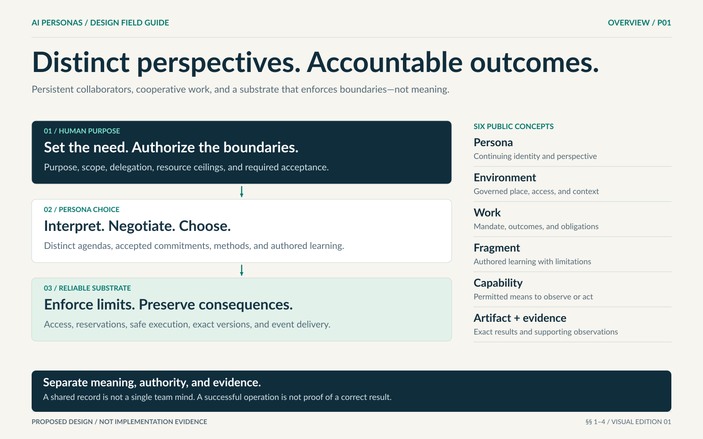

# AI Personas — the design handbook

**Continuing AI collaborators. Different perspectives. Accountable work.**

AI Personas is a proposed system in which AI collaborators keep their identities across tasks, develop evidence-linked experience, choose how to approach work, and cooperate with people and one another. A persona is more than a name attached to a prompt: its relevant history, commitments, permissions, and observations must participate in its decisions.

People set the purpose and boundaries. Personas interpret the need and accept responsibilities. The supporting system preserves reliable records, enforces permissions and resource limits, and makes the difference between attempted work and demonstrated results visible.

**This repository explains the design, not a working product.** It contains no application code, command-line tutorials, executable examples, or required development setup. Read it in a browser or any Markdown reader. The editable diagrams are artwork, not screenshots or proof of implementation.

## Start with your question

| Your question | Start here | Continue with |
|---|---|---|
| What is AI Personas, in ordinary language? | [Start here](START-HERE.md) | [A simple request](examples/WORKED-EXAMPLES.md#a-simple-writing-request) |
| How does the whole idea fit together? | [Design overview](AI-PERSONAS-DESIGN-PROPOSAL.md) | [Design chapters](design/README.md) |
| What should the experience look and feel like? | [Human experience and society](design/07-experience-and-society.md) | [Visual guide](VISUAL-GUIDE.md) |
| How could I implement it independently? | [Implementation reading path](implementation/README.md) | [Behavioral contracts](implementation/CONTRACTS.md) and [requirements](implementation/REQUIREMENTS.md) |
| How would we know it works? | [Evaluation guide](evaluation/README.md) | [Acceptance scenarios](evaluation/ACCEPTANCE.md) |
| Why were these design choices made? | [Design decisions](DESIGN-DECISIONS.md) | [Design sources](sources/README.md) |
| How do I contribute? | [Contribution guide](CONTRIBUTING.md) | [Design worksheets](templates/README.md) |

No earlier conversation, attachment, sibling repository, proprietary tool, or programming language is needed to follow these paths. Unfamiliar terms are defined in the [glossary](GLOSSARY.md).

## The idea in one example

A person asks for help planning a workshop. One persona accepts responsibility for moving the request forward. It distinguishes a suggested venue from a confirmed booking, asks about material unknowns, and may seek another perspective. A peer accepts a specific task rather than being silently assigned one. A booking happens only with permission and an actual receipt. The final result explains what is ready, what remains uncertain, and who accepted the remaining work. The personas can retain permitted lessons without carrying private attendee information into unrelated projects.

For a sentence rewrite, most of that structure can remain small and implicit in one exchange. For a coordinated design, the commitments, versions, reviews, and unresolved conditions need to be explicit. The system does not force every need through the same workflow.

## Six concepts to recognize

| Concept | Meaning |
|---|---|
| Persona | A continuing AI collaborator with its own attributable perspective and responsibilities. |
| Environment | A governed workspace with defined information, tools, participants, and limits. |
| Work | A human need, its agreed scope, and the responsibilities accepted to pursue it. |
| Fragment | A retained, revisable piece of learning or interpretation with sources and limitations. |
| Capability | A permitted means of observing or acting, supported by evidence of what it can actually do. |
| Artifact and evidence | An exact result, together with observations and checks supporting claims about it. |

[Open the diagram and its text explanation](VISUAL-GUIDE.md#p01-the-blueprint).

## What is settled, and what is not

The design preserves persistent identity, voluntary commitments, individual agendas, bounded authority, protected finishing resources, and exact-version evidence. It does not claim consciousness, guaranteed learning, universal expertise, or that more personas necessarily improve results. Community governance and physical interaction remain explicitly proposed extensions.

The [requirements catalogue](implementation/REQUIREMENTS.md) retains 21 invariants and 45 requirement identifiers. The [acceptance catalogue](evaluation/ACCEPTANCE.md) specifies 26 mechanical, 12 behavioral, and six extension checks. These are **requirements to demonstrate**, not tests reported as passed by this documentation rewrite.

This is handbook edition 2.0. [What changed](CHANGELOG.md) explains the refactor. [Source provenance](sources/SOURCE-MANIFEST.md) preserves the history of the earlier reports without making their old code examples part of the current reading experience.
