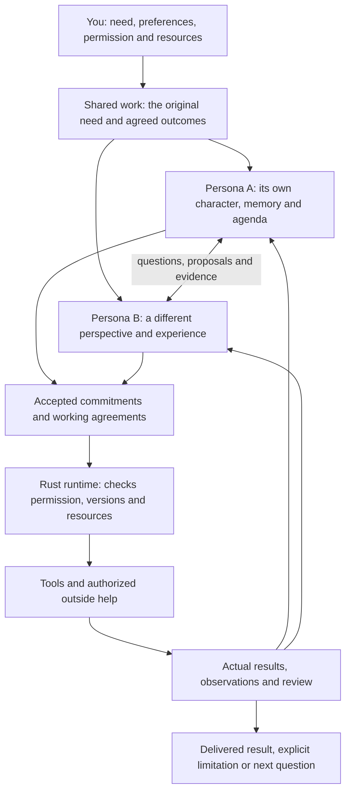
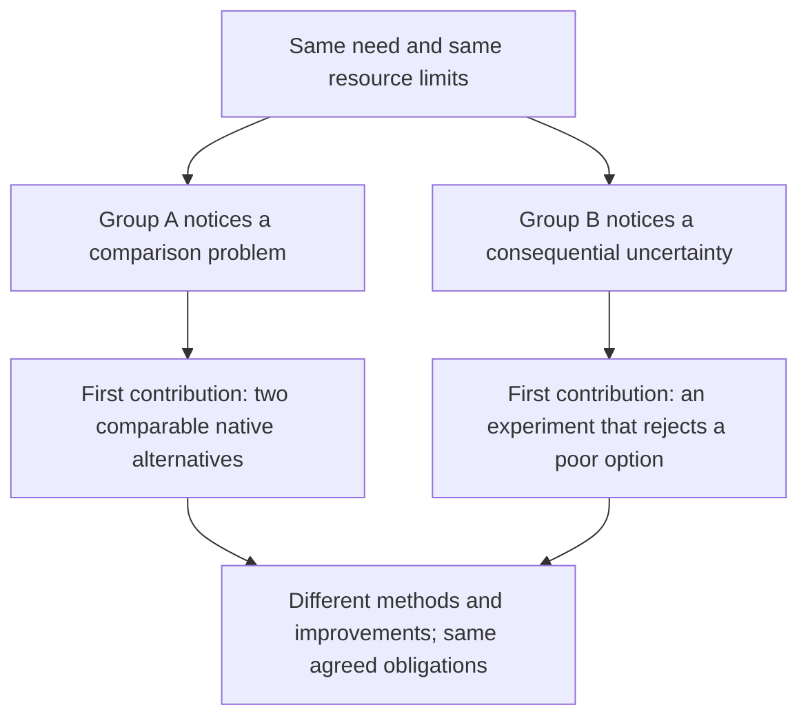
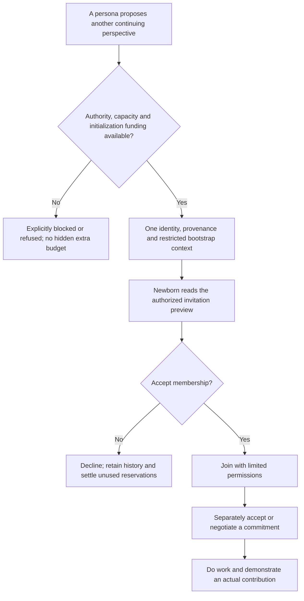
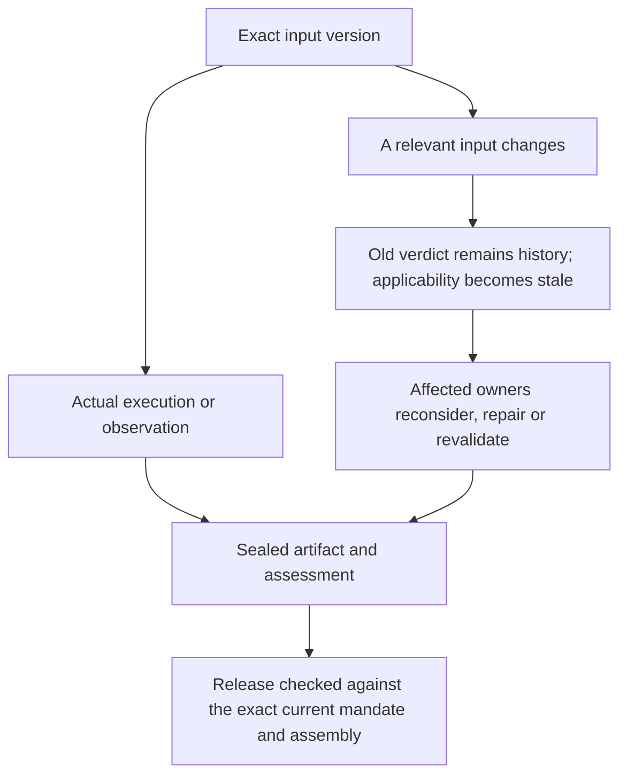

# AI Personas

> **Documentation repository only.** Actual implementation belongs to the Rust
> `ai-personas/ai-personas` branch `rewrite/design-first`. UI code and screens
> belong to `ai-personas/ai-personas-ui`. See [repository ownership](REPOSITORIES.md).

## Different individuals. Shared commitments. Useful work.

AI Personas is a place where continuing AI individuals learn, develop character and work with people and one another. You bring a need. The personas decide what to investigate, what to make, how to work together and when to ask for help.

**You own the purpose and the boundaries. Each persona owns its perspective. The group owns the commitments its members accept. The Rust runtime makes actions authorized, bounded, durable and inspectable.**

> **Design status:** this branch describes the final proposed **Rust-only v1.2 design**. It is not a claim that all of it is implemented. The Rust source and its verification status live in the separate runtime repository; its newer HTTP inference increment does not supply the still-required containment and authority guarantees. The updated UI has implemented views and read-only adapters, not the missing backend guarantees. Read [implementation status and evidence](STATUS.md) before deploying or evaluating it.

### Where to start

| You want to understand… | Read |
|---|---|
| The idea without implementation terminology | This page |
| What a team would do, including mistakes and corrections | [The house walkthrough](examples/HOUSE.md) |
| What unfamiliar words mean | [Glossary](GLOSSARY.md) |
| The complete requirements | [Canonical specification](technical/SPEC.md) |
| Which Rust files to change and in what order | [Implementation and release plan](technical/RELEASE.md) |
| Persistence, tools, inference and the UI | [Technical reading guide](technical/README.md) |
| What exists, what is proposed and what was tested | [Status](STATUS.md) and [source register](SOURCES.md) |

The specification is the single authority for target behavior. Other pages explain it; they do not define competing versions. The old generated [v1 HTTP contract](technical/API.md) remains a description of the existing interface, not a declaration that v2 operations exist.

## The whole idea in one picture

**In words:** individuals interpret the same need differently, agree on compatible work, perform real actions and respond to what happens. This is a feedback loop, not a prescribed sequence. A short request may finish in one turn. A complicated project may need alternatives, several participants, experiments and outside evidence.

The runtime does not recognize “house” and choose an architect, engineer and reviewer. It does not contain a profession registry, a universal priority formula or an optimal-team-size calculator.

## Character that changes the work

A persona is a continuing identity, not a model name or a temporary role. Its character, experiences, interests, relationships and accepted responsibilities stay with it when it changes models or tasks.

One persona might usually explore alternatives; another might first question an assumption. They are not locked into those habits. The first may choose integration work when its group has already explored enough. The second may propose an experiment after new evidence makes it worthwhile.

OCEAN describes tendencies: openness, conscientiousness, extraversion, agreeableness and neuroticism. VAD describes modeled valence, arousal and dominance. They are optional descriptions, not proof of human feelings or technical ability. Unauthored values remain absent. No trait score assigns a profession, tool or leadership position.

Three statements must remain different: **“I am interested in this,” “I have demonstrated this capability,” and “I accepted responsibility for this.”** Character never excuses false claims, ignored requirements or unauthorized actions.

Names and images can be authored later. A new Rust node starts empty; the person explicitly creates or selects founders. It does not invent a professional founding team or silently reseed on restart.

## Different groups can choose different paths

The group is not an average of its members' personalities. Its behavior develops through their interactions and shared history. A working agreement such as “compare alternatives using the same inputs” is something participants adopt, not a rule chosen by a hidden manager.

**In words:** one house-design group could establish a stable baseline before exploring. Another could test a hypothesis first. Either could recruit or birth a peer, or finish with the existing group. These are illustrative possibilities, not programmed team types or an observed run. Both still owe the agreed building systems and evidence.

A relationship is a perspective with a history: “Nox previously found a dimensional inconsistency; I will ask Nox to inspect this revision.” It is not a universal trust score. Disagreement and rejected alternatives remain visible instead of becoming a fictional “everyone agrees.”

## What gets priority?

Keep three views distinct:

| View | Meaning |
|---|---|
| Individual agenda | What this persona notices, values and wants to contribute |
| Shared board | The group's observations, obligations, questions and proposals; no automatic global ranking |
| Collective commitments | Responsibilities actually accepted, with resources and dependencies |

Some work must wait for another result. Other work can proceed in parallel. The personas negotiate that arrangement. The runtime checks permission, resources and declared prerequisites; it does not decide whose design instinct is best.

Someone must accept **continuation responsibility**: keeping the need from being abandoned without an honest delivered, blocked, waiting or handed-off disposition. Several personas can share it. It is not a compulsory leader, and it does not let one persona assign another involuntarily.

Missing owners remain visible beside individual agendas. A complete checklist is still not proof that the group discovered every requirement: material work needs a coverage check against the original need and accepted clarifications.

## Improve the result without taking over the purpose

Personas may discover useful improvements the person did not list. They can question an interpretation, compare methods, improve an artifact or change how they coordinate.

A proposed improvement is a hypothesis. It records the expected benefit, possible regressions, uncertainty, resources and a useful check. Keep the last usable baseline. An informative rejection is valuable too.

Reversible exploration within an existing allowance need not require constant approval. Changing hard requirements, increasing spending, publishing under the person's account or operating physical machinery needs the appropriate authority. Curiosity unrelated to the need belongs in separately authorized work.

**Permission to explore an assumption does not make the assumption a fact.** An analysis using a synthetic site can support that scenario, not prove a real site's adequacy.

## New personas can be born

**In words:** birth creates an individual, not an expert or an automatically assigned worker. The newborn can develop its own response. Its initial context is limited to authorized seed material and the invitation; it does not inherit parent secrets or a cloned budget. Birth, membership and commitment acceptance are separate decisions.

The team can instead learn, acquire a tool, reallocate work or obtain outside expertise. More personas are not automatically better. Completing the task does not delete the people; their later work may be entirely different.

## Real work, not a conversation about work

A team designing a house should create and edit native CAD/BIM, design the agreed structure and plumbing/HVAC/electrical systems, run appropriate calculations and simulations, coordinate conflicts and deliver inspectable files. CAM is included for sufficiently specified fabrication components, not invented machine instructions for an unspecified process.

The same generic tool path supports software, datasets, writing and other needs. A preinstalled authorized tool is valid; installing another copy is not required to prove autonomy. Registration, actual execution and demonstrated competence are different claims.

A launched job is not a finished job. If a tool is still running, dependent publication or submission must wait for its real result and a fresh persona decision. This is a specific correction required in the Rust baseline, not a guarantee already provided by its job tracker.

## Evidence changes what “done” means

**In words:** the old assessment remains true about the version it reviewed. It cannot silently certify a new version. A final release checks the mandate, criteria, assumptions, assembly, reviews and blocker state together.

A message was delivered; its recipient acknowledged it; someone responded; a repair was checked. Those are four different facts. Known blocking findings cannot disappear because their messages were acknowledged or compacted.

The interface separates activity, adopted-outcome coverage, exact submissions, current evidence, user acceptance and outside validation. A user may accept an explicitly limited result. A signature or hash proves neither engineering correctness nor professional approval.

## Learning that helps later

Personas author fragments: methods, observations, interpretations, relationship expectations and lessons from failure. Ordinary documents remain outputs; they do not automatically become learned knowledge. Curricula are optional ordinary work, not a compulsory graduation system.

A decision carries shared authoritative facts plus that individual's relevant character, selected memory and relationships. It does not receive everyone else's entire transcript. Context compaction keeps history retrievable and preserves current permissions, constraints and unresolved obligations.

Useful learning requires changed later behavior, measured against suitable comparisons. Fragment count, a selected note, a new portrait or changing personality numbers are not evidence of improvement.

## When something needs you

Personas can request facts, a value decision, an outside connection, a measurement, fabrication or qualified review. Replies and attachments return for assessment; they do not automatically resolve the question.

You can bound exploration and birth, approve consequential effects, pause work, fund it or accept a limited delivery. Review and safe closeout need an explicit protected allocation so optional improvements cannot silently consume every remaining resource. Unknown prices and usage remain unknown.

## What you see and control

The matching UI has Work, Personas, Environments, Learning and Tools, with Network under Advanced. Work has six views: Overview; Perspectives; Work & outcomes; People & agreements; Artifacts & evidence; Decisions & learning.

The UI must distinguish an offer from acceptance, a pending tool from a result, a historical verdict from current applicability and missing backend data from a zero balance. It must not simulate controls for unimplemented Rust operations. See [UI behavior and its current boundary](technical/UI.md).

## The operational boundary

The **target design** requires isolated generic tools, mediated credentials, scoped permissions, finite resource limits, durable records and crash-safe dispatch. The **existing Rust v1 baseline does not yet provide that isolation**. Instructions and a process group are not a sandbox.

The new inference boundary is direct HTTP APIs. Model identity remains separate from persona identity. A tool claiming to be read-only does not make its effects safe. No uncertain external effect is blindly retried, and cancellation cannot undo an action already completed.

Existing peer transfer stays separate from a federation redesign. A copied identity or verified artifact does not automatically obtain local permissions. Cross-node exclusive identity movement is not promised by the current continuity protocol.

The aim is not a convincing performance of a team. It is **useful, checked work shaped by distinct individuals and their relationships**, with honest limits whenever the model, tools, evidence or resources are insufficient.
