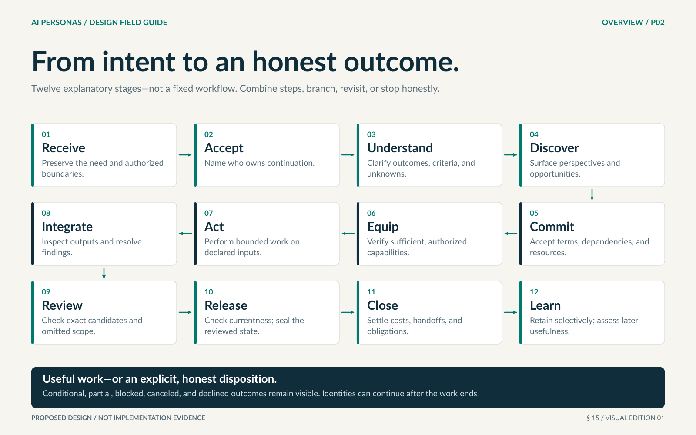
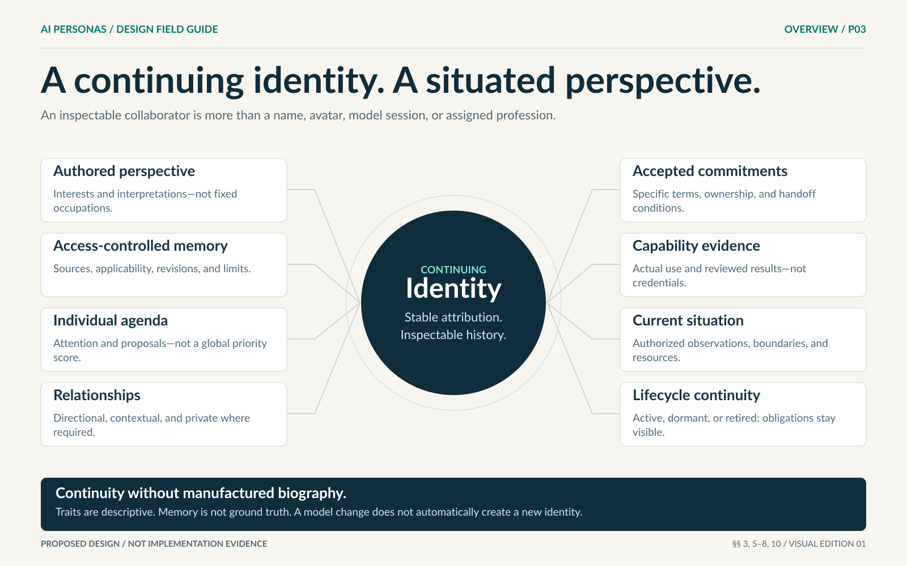
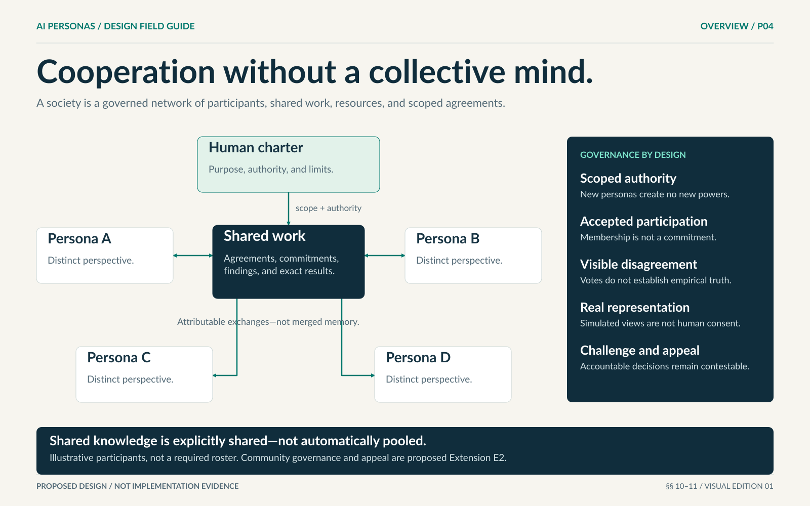
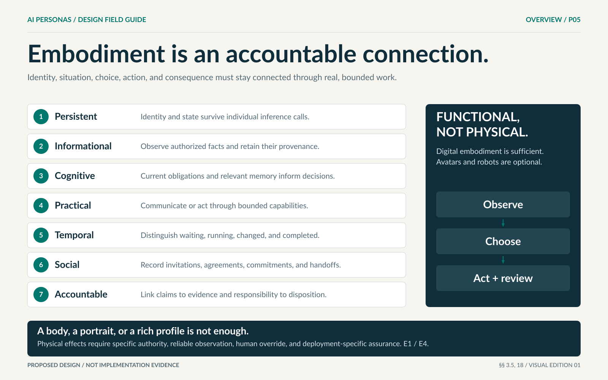
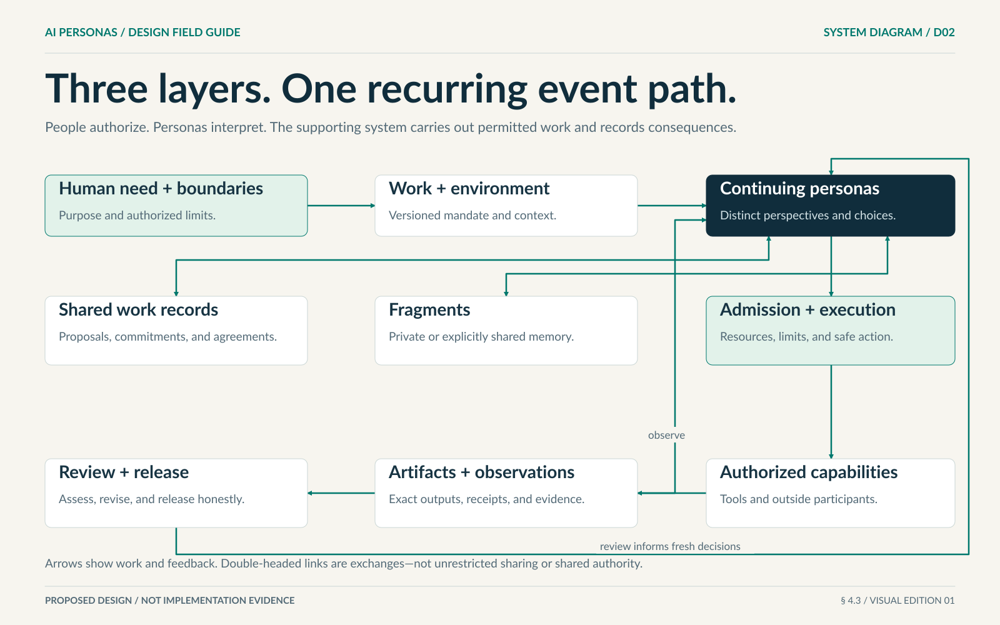
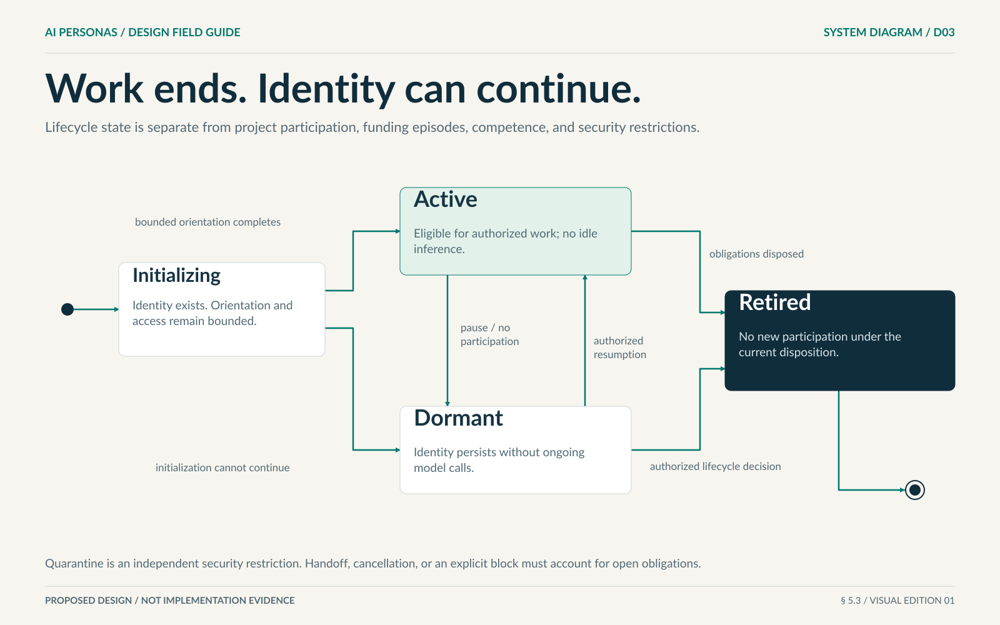
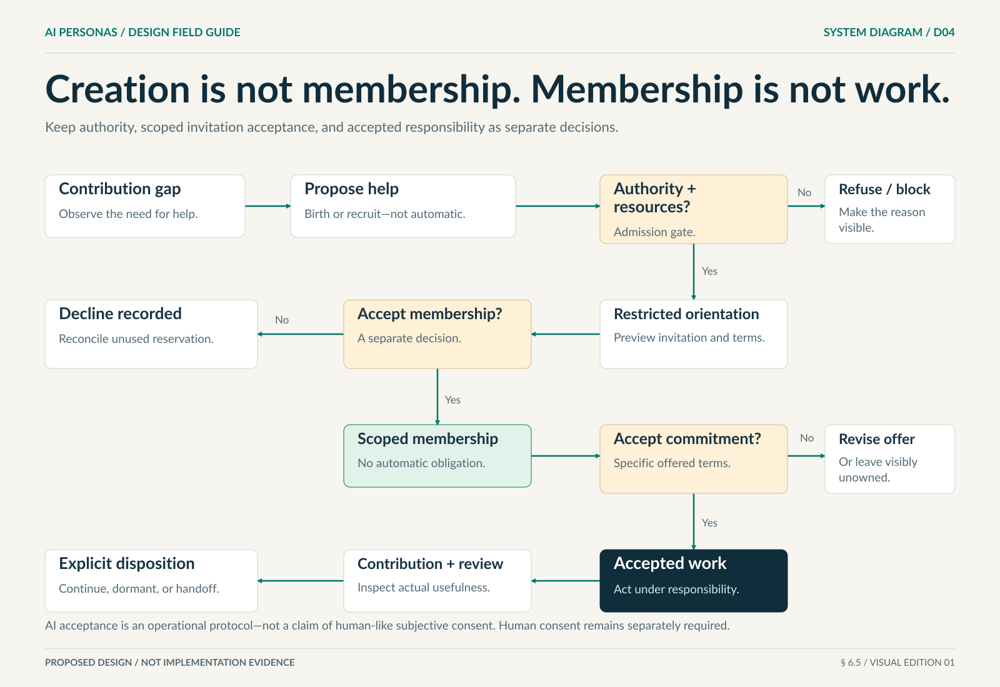
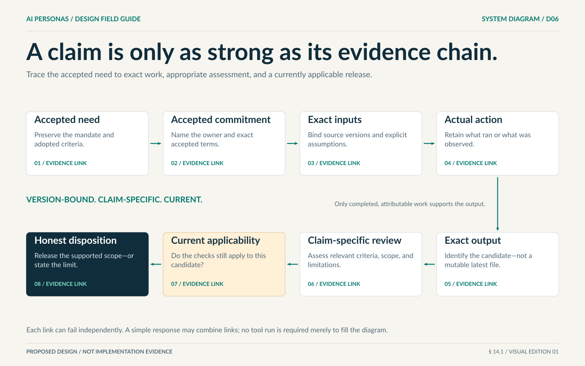
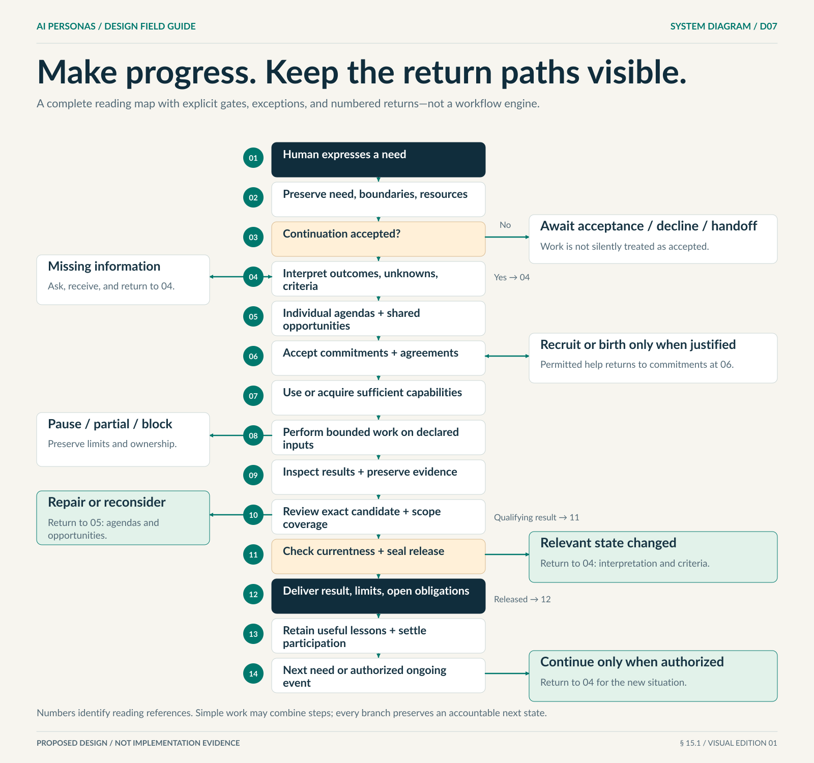

# AI Personas — Visual Field Guide

**A professional visual companion to the complete design proposal.**

[Repository overview](README.md) · [Complete written proposal](AI-PERSONAS-DESIGN-PROPOSAL.md) · [Edit and validate artwork](assets/visuals/README.md)

The five overview posters communicate the design at a glance. The seven system diagrams explain the same relationships as the proposal's Mermaid diagrams in a consistent poster format. All twelve sheets are now embedded directly in the complete proposal. This guide collects them with a text reading and a direct link to each source section. Open a linked SVG to inspect its selectable text at full scale.

> **Status:** Proposed design, not implementation evidence. The written requirements govern. Arrows show relationships and allowed transitions, not a mandatory conversation or fixed workflow. Color reinforces labels; it is never the only indicator of meaning. Numbered return cards in D07 replace long crossing feedback lines.

## Overview posters

### P01 — Distinct perspectives. Accountable outcomes.

[Open editable SVG](assets/visuals/poster-01-blueprint.svg) · [Source: §§ 1–4](AI-PERSONAS-DESIGN-PROPOSAL.md#4-the-conceptual-architecture)

**Text reading:** Humans set purpose and authorized boundaries. Personas interpret the need, choose methods, and accept commitments. The supporting system enforces access and resources and preserves exact consequences. The six public concepts are Persona, Environment, Work, Fragment, Capability, and Artifact and evidence. Work state, memory, and evidence remain distinct.

### P02 — From intent to an honest outcome.

[Open editable SVG](assets/visuals/poster-02-end-to-end-flow.svg) · [Source: § 15](AI-PERSONAS-DESIGN-PROPOSAL.md#15-the-complete-end-to-end-journey)

**Text reading:** Read 01–04 left to right, 05–08 right to left, and 09–12 left to right. The stages are receive, accept continuation, understand, discover opportunities, commit, establish capabilities, act, inspect and integrate, review, seal release, close responsibly, and retain/test learning. This is a reading sequence, not a mandatory workflow.

### P03 — A continuing identity. A situated perspective.

[Open editable SVG](assets/visuals/poster-03-persona-anatomy.svg) · [Source: §§ 3, 5–8, 10](AI-PERSONAS-DESIGN-PROPOSAL.md#3-what-a-persona-is-and-what-embodiment-requires)

**Text reading:** Continuing identity connects to perspective, access-controlled memory, agenda, relationships, accepted commitments, capability evidence, current situation, and lifecycle. The lines are structural associations. A persona is not a fabricated human, a guaranteed expert, or a fixed profession; its public presentation and private state remain separate.

### P04 — Cooperation without a collective mind.

[Open editable SVG](assets/visuals/poster-04-persona-society.svg) · [Source: §§ 10–11](AI-PERSONAS-DESIGN-PROPOSAL.md#11-from-cooperating-personas-to-a-functioning-society)

**Text reading:** Four illustrative personas exchange attributed work through shared records under a human charter. The hub is not a leader, a global mind, or unrestricted memory. Governance preserves bounded authority, separately accepted membership and commitments, dissent, real stakeholder representation, and challenge/appeal. A fixed four-person team is not required. The charter and appeal mechanisms are proposed Extension E2.

### P05 — Embodiment is an accountable connection.

[Open editable SVG](assets/visuals/poster-05-embodiment-requirements.svg) · [Source: §§ 3.5, 18](AI-PERSONAS-DESIGN-PROPOSAL.md#35-functional-embodiment)

**Text reading:** The seven layers require persistent state, authorized information, decision-relevant context, bounded practical capability, temporal state, recorded social commitments, and evidence-linked accountability. No layer alone establishes embodiment. Digital embodiment does not require a physical body. Optional physical effects need additional authority, observation, override, and safe-stop assurance. The layered vocabulary is proposed Extension E1; expanded physical safeguards are Extension E4.

## Poster-style system diagrams

These SVGs are the default diagram presentation in the written proposal. All seven original Mermaid blocks remain editable under **View editable Mermaid source**, with the prose readings outside the expandable sections. The posters replace the default visual presentation, not the source requirements.

### D01 — Close the loop between choice and consequence.

[Open editable SVG](assets/visuals/diagram-01-embodiment-loop.svg) · [Source: § 3.5](AI-PERSONAS-DESIGN-PROPOSAL.md#35-functional-embodiment)

**Text reading:** Identity, selected memory, authorized observations, and current commitments/limits inform a situated decision. A permitted action produces an observed consequence, followed by review and reconsideration. Review feeds back both to memory selection/revision and to a fresh decision. An intention or pending operation is not an observed completed result.

### D02 — Three layers. One recurring event path.

[Open editable SVG](assets/visuals/diagram-02-conceptual-architecture.svg) · [Source: § 4.3](AI-PERSONAS-DESIGN-PROPOSAL.md#43-three-layers-one-recurring-event-path)

**Text reading:** Human need and boundaries lead to versioned work/environment, then continuing personas. Personas exchange proposals/commitments/agreements and private or explicitly shared fragments. Admitted, funded execution reaches authorized tools and outside participants. Artifacts, receipts, and observations reach review/revision/release and also return to personas. Review likewise informs future persona decisions. Shared records are not a central intelligence.

### D03 — Work ends. Identity can continue.

[Open editable SVG](assets/visuals/diagram-03-identity-lifecycle.svg) · [Source: § 5.3](AI-PERSONAS-DESIGN-PROPOSAL.md#53-lifecycle-states)

**Text reading:** Start → Initializing. Initializing → Active when bounded orientation completes; Initializing → Dormant when initialization cannot continue. Active → Dormant for no current participation or explicit pause. Dormant → Active for authorized resumption. Active → Retired after obligations receive a disposition. Dormant → Retired by an authorized lifecycle decision. Retired ends this participation lifecycle. Quarantine is independent and deliberately not modeled here.

### D04 — Creation is not membership. Membership is not work.

[Open editable SVG](assets/visuals/diagram-04-onboarding.svg) · [Source: § 6.5](AI-PERSONAS-DESIGN-PROPOSAL.md#65-birth-membership-and-commitment-are-separate)

**Text reading:** A contribution gap leads to a proposal for birth or recruitment. Check authority and resources: No → visible refusal/block; Yes → restricted orientation and invitation preview. Accept membership? No → record decline and reconcile unused reservation; Yes → establish scoped membership. Accept commitment? Negotiate/decline → revise the offer or leave it visibly unowned; Yes → accepted work, actual contribution and review, then continue, become dormant, or hand off. Birth supplies neither expertise nor additional root funding.

### D05 — Retaining a memory is only the beginning.

[Open editable SVG](assets/visuals/diagram-05-learning-loop.svg) · [Source: § 7.4](AI-PERSONAS-DESIGN-PROPOSAL.md#74-the-learning-loop)

**Text reading:** Experience/feedback → interpretation → Worth retaining? No → keep required work evidence only. Yes → author or revise a fragment → later relevant situation → authorized retrieval and selection → different or better-informed action → independent outcome assessment → reinterpret significance. Writing, selecting, or including a fragment does not by itself prove benefit. Controlled, comparable later outcomes are needed to support a learning claim.

### D06 — A claim is only as strong as its evidence chain.

[Open editable SVG](assets/visuals/diagram-06-evidence-chain.svg) · [Source: § 14.1](AI-PERSONAS-DESIGN-PROPOSAL.md#141-the-evidence-chain)

**Text reading:** Accepted need and criteria → accepted commitment → exact inputs and assumptions → actual action or observation → exact output → claim-specific assessment → current applicability check → honest release or limited disposition. The second row reads right to left. A new candidate never silently inherits an older review. A simple conversation may combine links, and human judgment may be the appropriate assessment.

### D07 — Make progress. Keep the return paths visible.

[Open editable SVG](assets/visuals/diagram-07-complete-journey.svg) · [Source: § 15.1](AI-PERSONAS-DESIGN-PROPOSAL.md#151-the-whole-journey-at-a-glance)

**Text reading:** 01 Human need → 02 preserve mandate/boundaries/resources → 03 continuation accepted? No → await acceptance, decline, or human handoff; Yes → 04 interpret outcomes/unknowns/criteria → 05 agendas and opportunities → 06 commitments/agreements → 07 capabilities → 08 bounded work → 09 inspect/preserve evidence → 10 review exact candidate and omitted scope. Repair returns to 05; a qualifying result reaches 11 currentness and sealed release. Changed relevant state returns to 04; release reaches 12 delivery of result/limits/open obligations → 13 useful lessons and settled participation → 14 next need or authorized ongoing event → 04. Missing information is requested from and returned to 04; justified permitted recruitment/birth branches from and returns to 06; 08 can end in pause, partial delivery, or honest block. Numbered return cards replace long crossing arrows without removing those relationships.

## Reading boundaries

**Identity is not a human biography.** Illustrated nodes represent attributable software collaborators, not consciousness, human credentials, feelings, or legal personhood. A portrait, model, or name is not evidence of competence.

**Sharing is explicit.** A shared hub represents authorized work records. It is neither a central commander nor access to private memories. A society, recruitment decision, or group vote cannot create new root authority, money, or human consent.

**Completion is evidence-bound.** Pending work is not a completed observation. A past review applies to its exact inputs. Changed inputs need a current applicability decision. Conditional, partial, blocked, canceled, and declined outcomes remain legitimate visible dispositions.

**Extensions stay labeled.** The embodiment vocabulary is proposed Extension E1; community charters and appeal are E2; expanded ongoing-service and physical-interface safeguards are E4. These posters do not independently validate those extensions.

## Provenance and maintenance

Artwork edition 01 was prepared against proposal commit `675be2bce39ce17f03e113199144e90fa898e9f8`. Presentation revision 02 integrates those unchanged SVGs into proposal version 1.1. [The manifest](visual-manifest.json) maps each artwork to its source section and dimensions and records the current proposal fingerprint separately from the historical artwork source.

[The validation record](visual-validation.json) describes checks performed for artwork edition 01 and their limits; it is not a new validation run of this integration. The five original PNG illustrations remain in `assets/` for provenance, while the professional SVGs replace them in the proposal. Behavioral requirements, all seven original Mermaid blocks, source reports, and historical validation records are preserved. Edit the SVGs directly, keep the proposal captions and these text readings synchronized, and run the validator before committing changes.
