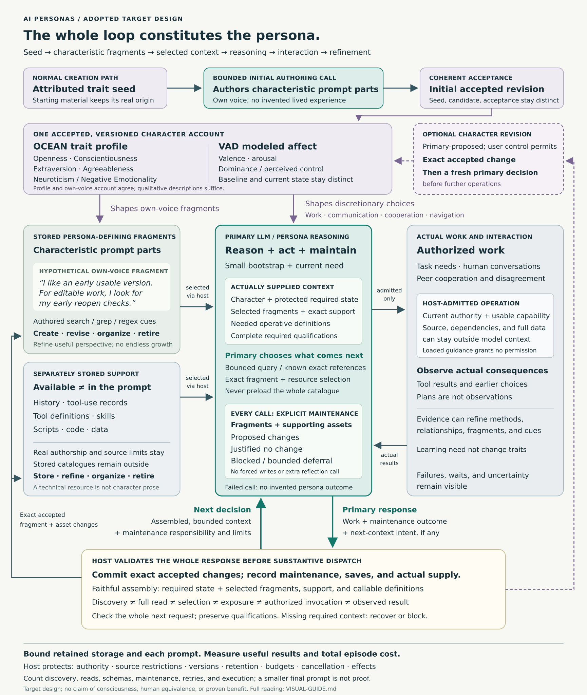

# The persona-files loop

[Home](README.md) · [Persona core](design/PERSONA-CORE.md) · [Work and boundaries](design/WORK-AND-BOUNDARIES.md) · [Artwork provenance](sources/SOURCE-MANIFEST.md#artwork-retirement)

[Open the full-size illustration](assets/persona-files-loop.svg)

## A complete text reading

The left panel is the persona's ordinary readable files. Its accepted current self defines its authored character. Other fragments can carry experiences, methods, relationship interpretations, uncertainties, and corrections in its own voice. The quoted preference is fictional illustrative prose, not recorded experience. The persona chooses useful names and organization; the pictured subjects are not a compulsory folder taxonomy. It can list, search, use supported grep-like or regular-expression matching, read exact versions, and propose attributable edits.

The center is the primary LLM acting as that continuing persona. In the same ordinary decision it can do useful work, interpret experience, maintain its files, and choose the optional fragments relevant to its next decision. It may retain a tentative idea, correct a method, defer, or make no lasting change. No mandatory edit, extra reflection writer, graph engine, numeric personality controller, or delegated selector owns these choices.

The right panel contains actual work and observations: the user's request, environmental and tool results, peer contributions, and evidence of the persona's own earlier choices. Proposed actions require current admission. Only actual observed consequences count as observations; a plan, pending action, or intended effect cannot be rewritten as success. A peer can decline, a capability can fail, and a persona can wait or stop honestly. Applicable obligations remain visible.

The two lower arrows make the self-prompting mechanism explicit. The primary LLM chooses exact relevant optional fragments for the next work-scoped context. The host then faithfully assembles that choice with current self, mandatory work and authority, resources, important observations, unresolved effects, and required qualifications. The next ordinary primary decision receives that checked context. These arrows are a continuing relationship, not an instruction to spend two extra calls or complete every activity in a fixed order.

Search discovery, a full read, an authored selection, actual inclusion, subsequent application, and measured benefit are distinct. A search match does not select itself. A read is an observation and does not automatically become permanent attention or an endorsed method. Required corrections accompany usable full content; optional associations do not activate a neighborhood. Stale, unavailable, private, or oversized required context leads to bounded recovery or an explicit block rather than silently incomplete guidance.

The bottom boundary applies throughout. Current access, processing destination, source restrictions, exact versions, resource ceilings, and cancellation are checked independently of what a persona's files say. Commitments, receipts, charges, and unresolved effects remain trustworthy records. A first-person fragment cannot confer permission, cancel another participant's obligation, change an actual receipt, or prove its own usefulness.

## Scope and visual status

This is an illustration of the adopted target design. It is not a product screenshot, live persona trace, multi-call benchmark, or evidence of learning benefit. The detailed normative documents govern simplifications in the image. The one loop does not require a second persona, a tool, a new lesson, a physical body, or between-task exploration for every request.

The current SVG is editable vector artwork with a title, accessible description, explicit labels, and this full text explanation. It contains no scripts, external images, external font requests, or embedded application logic. Its logical canvas is 1600 by 1160; that is not a guarantee about printing or every viewer's font rendering. Color reinforces written meaning rather than being its only carrier.

This new sheet was rendered and visually inspected at full size and at a 960-pixel embedded width during this documentation revision. That check covered labels, margins, arrows, and alignment with the prose; it establishes presentation only, not implementation correctness or model behavior.

This edition replaces the prior poster and fragment-recall collections in active navigation. Their exact historical bytes and original validation scope remain linked from the [source manifest](sources/SOURCE-MANIFEST.md). No retired or untouched figure is claimed as freshly inspected.

When editing the sheet, preserve both directions of the next-context relationship, primary-model ownership, actual-observation limits, and the lower enforcement boundary. Update this reading with the image, then inspect the rendered result at full and ordinary embedded size for clipping, overlap, font substitution, and arrow clarity. SVG parsing alone cannot establish visual readability.
