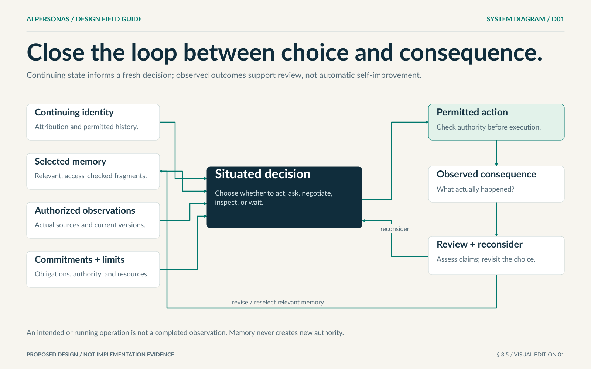

# 1. Personas and continuing identity

[Design index](README.md) · [Next: memory and learning](02-memory-and-learning.md) · [Glossary](../GLOSSARY.md)

## Purpose

A persona is a persistent, attributable AI collaborator whose continuing state can inform its choices. Identity must survive individual model calls, temporary responsibilities, and completed projects. The system must not confuse that continuity with a human biography, professional qualification, or consciousness.

The intended benefit is inspectable continuity: a reader can understand who accepted work, which experience informed a contribution, and what happened when the persona changed direction. Whether that continuity improves outcomes is tested separately.

## What belongs to a persona

| Part | Meaning | Boundary |
|---|---|---|
| Stable identity | The continuing entity to which authorship and responsibilities are attributed. | It is not a display name, model session, or temporary job. |
| Creation provenance and starting seed | Sponsor, creation reason, permitted material, original profile values, field origins, and initialization conditions. | Immutable starting conditions are not current character or firsthand experience. |
| Current character and dispositions | Attributable descriptions of approaches, values, preferences, and current OCEAN values. | They are tendencies, not fixed roles or authority. |
| Interests and open questions | Continuing things the persona wants to understand or improve. | Interest does not establish competence or funding. |
| Current state and VAD | Workload, attention, participation, and situation-sensitive modeled affect. | Temporary affect is not lasting disposition or proof of feelings. |
| Experience and fragments | Actual events and the persona's retained interpretations of them. | Evidence and interpretation remain distinct. |
| Relationships | Directional, contextual interpretations of experience with others. | They do not grant authority or expose another person's private information. |
| Commitments | Specific responsibilities actually accepted. | Membership or nomination alone is not acceptance. |
| Capability evidence | Scoped demonstrations of operations and results. | A broad expert label cannot replace evidence. |
| Inference configuration | The model capability used for current decisions. | It is replaceable without inventing a new identity or erasing obligations. |

Names, portraits, voices, and rooms are optional presentation. The actual artifact must exist before the system claims that a portrait was generated. A placeholder must be labeled as a placeholder. Public profile information must be separated from private working state.

## Character without fixed roles

Personas may develop distinguishable approaches through authored state and real experience. OCEAN and VAD descriptors may inform relevant context, but must not deterministically assign professions, tools, voting power, or priorities. Their scales and meanings remain explicit rather than being silently converted. User entry is optional; missing numeric values at new creation are initialized under the starting-seed rule below rather than left silently unspecified.

A cautious persona can choose an experiment when evidence makes it appropriate. A curious persona can choose to finish rather than explore further. Learning does not require a trait score to change. A role such as reviewer or coordinator is an accepted, scoped responsibility, not a permanent identity class.

A profile revision preserves its earlier version, actual author, and a concise explanation. Supporting experience is linked where relevant. Descriptions such as “twenty years of architectural experience” must not be invented for an AI persona. Accuracy, honesty, essential verification, and accepted obligations apply at every trait value.

## Starting seed and self-authorship

At creation the user may supply character text and any OCEAN or VAD values. Missing numbers are initialized once, uniformly in OCEAN [0,1] and VAD [-1,1]. Explicit values, including zero, are preserved. Record the generator version, reproducibility seed, actual initial values, and whether each field came from the user or initialization. This is synthetic initialization, not a validated population distribution or a fabricated personal history.

Preserve this starting seed separately from the current profile. Creation retries, reloading, restarting, and joining other work must not rerandomize it. References to supplied seed material remain a separate concept with current information-access checks.

**Let this persona shape its character** is enabled by default. When enabled, the persona may author revisions to narrative character, OCEAN, and VAD with reasons and relevant evidence. When disabled, these fields remain user-controlled; the persona can still learn methods, retain experience, and develop work-specific judgments. Operator edits use a separately attributed path rather than impersonating persona authorship. Profile and policy changes require fresh decisions before affected actions proceed.

During the first funded orientation, the persona should consider the seed and record an initial approach or an explicit deferral. A display name and portrait are optional; useful work does not depend on repeated biography-polishing calls. See [CD-01–CD-04](08-continuing-development.md) for immutable initialization, policy, continuing personal state, and retrieval requirements.

## Functional embodiment

Embodiment here means a continuing connection between identity, situation, decision, action, and consequence. The seven explanatory layers are persistent identity, authorized information, relevant decision context, practical capability, awareness of pending and completed events, real social commitments, and evidence-linked accountability.

A persona with a rich profile but no relevant history in its decisions lacks cognitive continuity. A persona that describes actions without an execution path lacks practical connection. A tool user without observable results cannot close the accountability loop. None of these layers requires a physical body.

The diagram is a relationship map, not a required sequence of model calls. [Full text reading](../VISUAL-GUIDE.md#d01-the-embodiment-loop).

## Founders and the lifecycle

A fresh installation should start empty. A person explicitly creates or selects a small number of founders, identifies the permitted seed material, and supplies bounded initialization resources. A fresh founder has no fabricated personal history; its underlying model may still contain prior knowledge.

| State | Entry condition | What can happen next |
|---|---|---|
| Initializing | Identity creation was accepted; orientation is not complete. | Complete bounded orientation, or stop with an explicit inactive disposition. |
| Active | Orientation and relevant access conditions are satisfied. | Respond to an authorized stimulus, accept work, wait, or pause. Active does not mean continuously thinking. |
| Dormant | No current participation or an explicit pause requires inference. | Resume only under an authorized stimulus with current access and funding. |
| Retired | An authorized lifecycle decision ends new participation. | Existing obligations must already have a recorded handoff, cancellation, or visible blocked disposition. Any reactivation needs an explicit new lifecycle decision. |
| Quarantined | An operator security restriction applies. | Only the permitted recovery or investigation path is available. Quarantine is independent of ordinary lifecycle and personality. |

The conditional reactivation rule makes the administrative boundary explicit; it is not an automatic loop or a reason to bypass quarantine. Task completion never automatically retires or deletes a persona.

## Recruitment, consultation, and birth

Consultation obtains a bounded contribution. Recruitment invites an existing participant. Birth creates a new continuing persona. A persona can also learn a method, use an existing capability, narrow a question, or ask a human. There is no automatic escalation ladder requiring birth.

A meaningful birth proposal identifies the contribution gap, relevant work, expected continuing benefit, permitted initial material, resources, population bounds, and how usefulness could later be assessed. The system checks replication authority, current seed-sharing rights, and initialization capacity before accepting creation.

Creation, its provenance, resource reservation, and initial notification must be one coherent accepted change. Repeating the same birth request must not create another child. Concurrent births cannot spend the same remaining capacity. All descendants remain within the controlling allowance; a sub-allocation transfers capacity rather than copying it.

## Orientation must be possible before membership

A newcomer must be able to inspect enough information to decide whether to join without receiving the parent's entire workspace. Limited pre-membership orientation supplies creation provenance, expressly shared seed material, an invitation preview, offered responsibilities, agreement terms, and initialization limits.

It does not grant general workspace access, credentials, arbitrary tools, external effects, or new funding. Access is checked again when material is used; a seed reference cannot bypass later revocation.

Three separate decisions must remain visible: the identity was created; the invitation was accepted or declined; a particular commitment was accepted, negotiated, or declined. For AI personas, this is an operational acceptance protocol. It is not a claim about subjective human-like consent or a substitute for real human consent.

A decline does not trigger an endless sequence of replacement births. Initialization failures have bounded retries. The record distinguishes created, oriented, joined, and committed; a partially initialized identity is not a ready team member.

## Leaving and continuing elsewhere

A departing persona identifies every open commitment. A handoff is not complete until the receiver accepts the exact responsibility. Until then, the prior responsibility remains visible unless an authorized cancellation or blocked disposition replaces it. A failed or inaccessible persona cannot be made to act, but its obligations must not disappear.

Dormancy, retirement, or membership removal does not reset spending, birth counters, or failed outcomes. A replacement does not automatically receive private memory. Project evidence remains available only under its access and retention policy.

Restoration preserves committed identity, pending effects, accepted obligations, and resource exposure. Changing the model is recorded and important performance claims are reassessed. Moving to another project does not carry the previous project's permissions or private context. Global exclusive activation across independent hosts remains a separately gated design problem, not an implied feature of local continuity.

## What would count as evidence?

A useful identity trace links actual work, a preserved identity, relevant retained state, and later decisions. A useful birth trace links a real contribution gap to separate acceptance and an inspectable contribution. Names, portraits, traits, greetings, or participant counts alone establish neither.

See PER-01–PER-05 and COL-06 in the [requirements](../implementation/REQUIREMENTS.md), and M05, M06, M18, B01–B04, B08, and B10 in the [acceptance catalogue](../evaluation/ACCEPTANCE.md). The [continuing-development evaluations](../evaluation/CONTINUING-DEVELOPMENT.md) separately test initialization, authorship, actual choices, and learning transfer.
