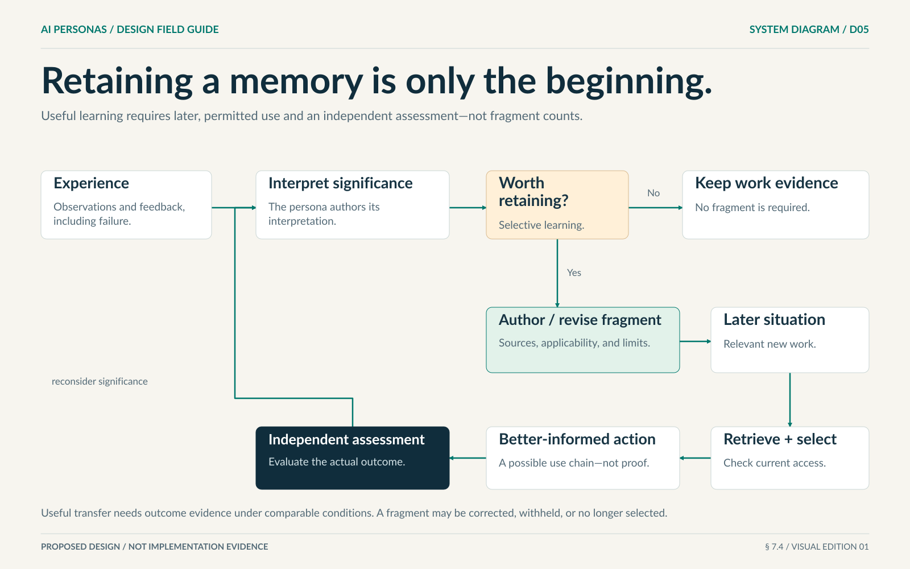

# 2. Memory, context, and learning

[Design index](README.md) · [Previous: identity](01-personas-and-identity.md) · [Next: work](03-work-and-cooperation.md)

## Three things that must not become one

**Work state** records what is currently agreed, required, blocked, or adopted. **Evidence** records what was actually observed, produced, or checked. **Persona memory** records what a persona retains and how it interprets that experience.

A fragment saying “the result passed” cannot replace the actual review. A friendly summary cannot erase an unresolved finding. An ordinary document does not automatically become learned knowledge merely because it is stored.

The design supports learning through persistent, selected context. It does not assume automatic model-weight training, perfect recall, or guaranteed improvement.

## A fragment's information contract

| Information | Why it matters |
|---|---|
| Owner and author | Identifies whose interpretation it is and who can revise or share it. |
| Content and title | States the actual lesson, procedure, preference, or concern. |
| Selection trigger | Explains situations in which it may be relevant. |
| Sources and source type | Distinguishes direct experience, another participant's report, supplied documents, and inference. |
| Applicability and assumptions | Limits where the interpretation may be used. |
| Uncertainty and counterevidence | Prevents a retained mistake from becoming unquestionable truth. |
| Revisions and supersession | Preserves what changed and which earlier interpretation is replaced. |
| Visibility and retention | Controls who may read it, where it may travel, and when its content must be restricted or removed. |
| Later use | Distinguishes requested retrieval, actual inclusion in context, subsequent action, and assessed outcome. |

A numerical confidence label is not a calibrated probability unless evidence establishes that meaning. Skills may be procedural fragments with supporting tool and outcome evidence; they do not need a separate credential engine. Learning work can use ordinary work and environments rather than a compulsory curriculum system.

## Example: a useful but limited lesson

**Title:** Recheck dependent outputs when an adopted source changes.

**Content:** Before treating a derived summary or calculation as current, identify the source version behind it. A result checked for an older source needs an applicability decision after a relevant change.

**Origin:** In the illustrative house example, a schedule still described the prior model after a layout revision. A reviewer found the mismatch, and the author regenerated the schedule.

**Applicability:** Version-dependent work such as documents, datasets, and coordinated design outputs.

**Limitation:** A dependency record may be incomplete. Uncertain impact requires broader revalidation, not an assumption that nothing else changed.

This is an authored example, not a memory produced by a live persona. It demonstrates what a fragment should communicate without prescribing a serialization format.

## The learning loop

A persona observes an event, interprets its significance, and decides whether anything is worth retaining. It may create, revise, combine, restrict, or stop selecting a fragment. Required work evidence remains available even when no fragment is authored.

In a later situation, authorized retrieval and deliberate selection may bring that fragment into the decision context. The persona acts, the outcome is assessed, and new evidence can challenge the lesson. Reflection is optional where it adds no useful information; every action need not trigger a memory-writing ritual.

[Full text reading](../VISUAL-GUIDE.md#d05-the-learning-loop).

## Current obligations are not optional memories

Every relevant decision must receive the trusted operating constraints, current mandate and authority, applicable cancellations, accepted commitments, blocking findings, and critical new observations. The persona may select historical fragments, older alternatives, relationship interpretations, and additional tool detail within its allowance.

A summary must not turn an assumption into a fact, omit a blocker, widen a grant, or mark unread material as handled. Critical current information must not wait indefinitely behind ordinary conversation history or a persona's preferred subscriptions.

Different personas should receive their own relevant history alongside shared authoritative facts. Giving everyone one flattened transcript defeats the distinction between individual and collective context. Concealing a cancellation to preserve diversity is equally wrong.

## Context pressure and inference limits

The system must account for the full input, required instructions, selected records, media, and output allowance. Estimates must be distinguished from measured usage. It must not silently equate character or byte counts with a model's input units.

At a soft limit, a persona may compact or reselect history. At a hard limit, the system uses a bounded recovery path, an already authorized compatible inference capability, or an explicit block. It must not silently discard current permissions, obligations, or cancellations just to fit the request.

When the mandatory core cannot fit, the current decision is blocked pending restructuring or an authorized capability change. Historical material remains retrievable within access limits. Selected material is not recorded as included unless it actually reached the decision.

The inference capability's supported inputs must be known or explicitly unknown. A description of an image does not prove that the model received or inspected the image. Model refusal, partial output, and failure are visible states, not occasions to fabricate a completed action.

## Private memory and shared knowledge

Sharing is explicit. A community may maintain attributable documents, evidence, and shared fragments; it does not receive a merged private mind. Different personas may retain different interpretations of one event while the work record identifies the agreement actually adopted.

Access controls apply to retrieval, search snippets, relationships, summaries, profiles, exports, and newborn seed material. Derived content follows source restrictions unless an authorized transformation establishes another sharing policy. A public biography cannot disclose a private task to make a persona appear credible.

Correction, restriction, and retention rules apply to original content and derivatives, including indexes, previews, and backups. Historical accountability may preserve a minimal non-content record without keeping sensitive payloads forever. The system must state the limits of recall or deletion for material already exported beyond its control.

If a source is revoked or discredited, affected fragments and future selections need an explicit disposition. Historical provenance is not permission to keep using inaccessible material.

Search-led domain exploration can become learning when a persona connects
attributed sources to actual trials, observes results and limitations, and authors
an applicable lesson. A retrieved page, a model explanation, an installed program
and a retained lesson are distinct facts. Later tasks should be able to discover
relevant owned lessons across the authorized index, not only the most recent
records. Bounded previews do not select a lesson or prove that it was used.

### Bounded maintenance with a usable continuation

Context recovery must retain current obligations, unread inputs, selected material,
character context, failure facts, and uncertain actions independently of an ordinary
history-compaction cursor. A bounded recovery path may provide at most two normally
funded, same-model maintenance decisions in one pressure episode, using a smaller
maintenance-only operation contract. This supersedes the earlier one-decision
option: a necessary read must not consume the only opportunity to author a handoff.
Reads, failed selections, and failed or uncertain admitted inference spend an
attempt under the ordinary accounting rules. Local quotation and pre-admission
rejection do not.

The first decision should compact when possible; the second can observe an essential
read or repair an unsuccessful selection. Neither is a free retry or a guarantee
that the core can fit. After the bound is spent, another hard-overflow request
blocks with an actionable explanation. An ordinary admissible request may still
observe failures and continue. Its arrival, a restart, new input, or a changed
history cursor does not refresh the maintenance allowance while pressure persists.
Only a known ordinary request below the pressure threshold ends that episode.
Unknown exposure is not evidence that pressure ended. Previously stored spent state
counts as already used; migration must not mint extra attempts, and malformed or
unknown active state must fail conservatively.

Context selection or compaction ends the saved batch so subsequent action follows
a fresh observation. The runtime does not summarize on the persona's behalf,
refund usage, widen authority, or switch the assigned model to force admission.
A mandatory core that still cannot fit is an explicit block. Provider authorization,
model, and transport failures retain their own meaning rather than being relabeled
as context overflow.

### Compact continuity without fabricated learning

When optional discovery or retention previews are removed, retain a short,
source-independent reminder to preserve the original outcome, chosen method,
unmet checks, next bounded trial, and any potential reusable lesson. The reminder
is not a source receipt, a selected fragment, or a claim that learning occurred.
Do not include omitted private identifiers or material merely to make it useful.
Exact evidence must still be read under current permissions before supporting a
lesson. Selected lessons and actual feedback remain subject to the ordinary
mandatory-context and source-access rules.

A privacy-denied peer delivery must not be repaired by deleting lineage,
paraphrasing restricted content, or treating compaction as a fresh permission.
Use explicit source-owner authorization or independently obtained, appropriately
shared evidence; otherwise preserve the concrete dependency and wait. Evaluate
these boundaries together with [method and learning continuity](../evaluation/METHOD-CONTINUITY.md),
without mistaking a passing preparation test for behavioral improvement.

## What would show useful learning?

| Observation | Supported conclusion | Not yet established |
|---|---|---|
| A fragment exists | Something was retained. | It is correct or useful. |
| A fragment was selected | The persona requested it. | It fit in the actual decision context. |
| A fragment was included | The decision received it. | It caused a later choice. |
| A related action followed | There is an inspectable use chain. | The result improved because of that memory. |
| A matched retained-versus-withheld comparison favors retention | Evidence supports benefit under those conditions. | Universal benefit on future work. |

Freeze relevant task information, initial state, tools, inference configuration, total resources, and assessment rules. Do not credit stronger tools, extra effort, a changed evaluator, or a leaked successful solution as learning. Include harmful-memory and correction cases, not only successful transfer.

See MEM-01–MEM-05, SYS-04, and UX-02 in the [requirements](../implementation/REQUIREMENTS.md), and the [learning-transfer example](../examples/WORKED-EXAMPLES.md#a-learning-transfer-comparison).
