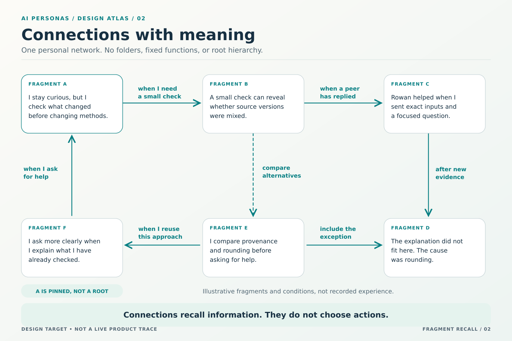

# The persona as an evolving fragment network

[Design index](README.md) · [Illustrated recall design](FRAGMENT-RECALL.md) · [Acceptance](../evaluation/FRAGMENT-PERSONA.md)

## Status, purpose, and precedence

This is a normative design target. A persona's continuing cognitive representation is its own authored fragments, the meaningful connections between them, and its choices about future recall. The language model expresses that persona through a bounded current context; it does not need the whole archive in every request.

This revision replaces the canonical tree and functional groupings with a personal graph. No fragment needs a parent, a root, or a category such as social, learning, reflection, or identity. The [recall design](FRAGMENT-RECALL.md) permits an optional, separately metered semantic selector such as Jev. It does not permit another model to author the persona's memory or an extra generative reflection call.

These documents and the [handoff contract](../implementation/FRAGMENT-RECALL-CONTRACT.md) supersede conflicting tree-first and no-auxiliary-selection-model wording in earlier identity, memory, development, and continuity descriptions. The [old memory address](MEMORY-TREE.md) is a compatibility reading path only. Invariants I01–I21, the 45 requirement identifiers, privacy, accepted responsibilities, and existing extension gates remain intact. Publication is not implementation, consciousness, or measured maturity.

## 1. What continues

The cognitive persona is a versioned network of its interpretations, not a static biography plus a generic notebook. A fragment can express a method, a meaningful encounter, a concern, a future intention, or several of these at once. Those examples explain possible content; they are not storage classes or required headings.

Stable identity, immutable creation provenance, actual messages and tool observations, accepted commitments, authority, and resources still have operational meaning outside that interpretation. A fragment can refer to an accepted responsibility but cannot create or cancel it. Deleting an interpretation does not erase an event. Switching models does not erase identity or obligations.

Keep three meanings distinguishable: what happened, what this persona currently makes of it, and when the persona wants to recall it. Evidence, interpretation, and a recall condition can be connected without becoming interchangeable.

## 2. From starting character to current character

The supplied or generated starting narrative and trait values retain their creation provenance. Supplied prose is not labeled as the persona's earned experience. Existing creation-time generation is not multiplied into separate calls for different mental functions. The first ordinary orientation or work response may develop self-understanding or explicitly preserve the bootstrap and defer elaboration.

The current character can be represented by a small explicitly designated set of ordinary fragments plus current typed descriptors. Those fragments are consistently supplied; they do not compete with ordinary topical recall. They are neither roots nor a separate category. There is one current profile revision binding those exact versions, so a profile screen and the network cannot become independently edited, contradictory character stores.

Starting character is historical. Current OCEAN describes continuing tendencies; current VAD describes temporary modeled affect. Neither establishes feelings, expertise, or authority. Character can develop through attributed revisions without changing trait numbers. A curious persona can learn to finish a dependable baseline before exploring another alternative while remaining curious.

The self-authorship control governs changes to designated current character and traits. Disabling it does not prevent useful methods, interests, relationship interpretations, or task-specific correction. Substitute effective traits in another field must not bypass the control. An accepted character revision applies to fresh decisions and fences dependent actions from the old state. Old fragment authorship is not rewritten into the new voice.

## 3. One fragment, its own meaning

A fragment contains the actual reusable prompt text and a concise authored description for discovery. It preserves stable identity, exact version, owner, authoring call, supplied character revision, evidence basis, applicability, limits, and current access disposition. Small updates should remain small; the representation must not force an essay or a checklist after every action.

First-person interpretation is normally useful: “I ask a more focused question when I bring an exact discrepancy.” Voice also affects what the persona considers important and which caveats it retains. Merely decorating a generic sentence with a trait label does not meet that goal. Exact quotations, code, formulas, and observations preserve their original attribution and form.

Tentative ideas may have no external evidence but must retain their uncertainty. Reported advice remains a report. Observed claims require exact received evidence. A failed operation can support a failure lesson; an uncertain operation supports neither an invented success nor an invented failure. Later use can challenge an attractive idea.

A retrieval description is bound to its fragment version. A later text revision must reconsider whether the description and activation cues still represent it. A card is never represented as the full lesson. Existing views of interests or relationships should show the relevant authored fragments, not create a competing synopsis written by another model.

## 4. Connections express situations

[Full text reading](FRAGMENT-RECALL-VISUALS.md#2-connections-with-meaning).

A connection is directed and versioned. Its meaning is: “When considering A in this situation, bring B into consideration.” The reverse connection is a different authored judgment. Mere co-occurrence in a prompt does not establish a connection. New fragments may connect to any relevant fragment actually supplied in the call, not just the last one created.

A connection preserves its explanation, source and target versions or an explicitly authorized current-version-following policy, activation condition, scope, expiry or reconsideration condition, and intended preview or full-text treatment. Current source permissions are independently enforced. Links cannot discover unreadable targets by guessing identities.

Some conditions match recorded facts, such as an exact sender or changed artifact. Others describe a semantic situation and require fallible interpretation. Match, no match, unknown, invalid, and inaccessible are distinct dispositions. A semantic match may support recall under delegation; it is not a factual verdict or permission to act.

No permanent numerical link weight is required. Search rank and a selector's situational distribution do not become trust, expertise, or identity strength. Repeated selection is recorded, not automatically rewarded. An ordinary later decision can narrow a condition, add an exception, connect another experience, or retire a misleading association.

Corrections, prerequisites, contradictions, and supersession must be explicit even without classifying the fragments themselves. A correction travels with the method it qualifies. An unresolved contradiction is available for judgment rather than silently averaged into a new personality. A link to a correction can matter more because the two fragments disagree.

## 5. Same-call work and development

Every ordinary deciding call receives current character, the actual situation, and a bounded relevant expression of the graph. Its single response performs useful work and authors any fragment changes, connection changes, disposition, and next-context intent. Work, conversation, orientation, review, and bounded maintenance share that contract.

No-change and explicit deferral are legitimate. A retained intention is not scheduled activity. Repeated retrieval does not prove a lesson. The runtime never supplies replacement persona prose or creates a separate reflection writer. External consultations and optional selectors return attributed evidence or assessments; they are not alternate authors of the internal persona.

Fragment writes, connection changes, and future selection commit atomically. Newly created fragments may reference one another in that change set. Failed validation leaves the prior graph and plan intact and supplies a repairable receipt. Independently valid work can continue against its originally admitted context, but not by depending on uncommitted memory changes. An identity change keeps its observation boundary.

One current primary decision authority prevents competing work streams from silently overwriting persona state. Exact retries do not duplicate fragments. Conflicts are surfaced instead of resolved by an unrequested semantic-merge call. Independent personas retain concurrency.

## 6. Recall without reading all connections

The persona expresses its current need and future attention; it does not enumerate the rule catalogue. Indexes locate eligible connections and fragments from task text, actual events, exact entities, authored descriptions, and active-context connections. Bounded traversal and direct search work together so new or disconnected nodes remain discoverable.

The optional semantic selector assesses a shortlist, not the whole graph. It can help interpret an uncertain situation and judge relevance. The runtime protects required context, current character, exact versions, scope, and input limits. Full fragments require a direct choice, an authored bounded delegation, or an explicitly labeled bootstrap policy. Undelegated discoveries remain cards.

Graph cycles are allowed as associations, but retrieval tracks visited nodes and limits traversal. A recalled interpretation does not become a newly observed fact that recursively activates every other rule. Essential qualification bundles cannot be broken to fit more memories. Diversity can expose permitted underexplored candidates, not erase adverse evidence or invent confidence.

The [recall design](FRAGMENT-RECALL.md) defines Jev's role, costs, input boundaries, fallback, and inspection. Its [handoff contract](../implementation/FRAGMENT-RECALL-CONTRACT.md) keeps auxiliary selection distinct from primary action authority.

## 7. Organization means editing connections, not assigning folders

The persona may split an overbroad fragment, consolidate duplicate interpretations, add a useful connection, narrow an activation condition, or retire an obsolete account. A generalized method can point to supporting episodes and exceptions without becoming their parent. Stable identities and revision history make those edits inspectable.

Retirement leaves a minimal disposition under retention policy. Incoming connections must resolve to that disposition or be explicitly revised; no dangling link becomes permission to use unavailable content. An applicable successor is not silently substituted unless a current-version policy or new decision authorizes it. Consolidation preserves important exceptions and source restrictions.

A growing archive need not produce a growing prompt. The persona can retain fewer, better qualified prompt parts while keeping eligible supporting episodes available on demand. A network is not mature merely because it is dense, old, or frequently traversed.

## 8. Social continuity without a collective private mind

A useful encounter can create a fragment about how I approached someone, what they contributed, what remained uncertain, and when another exchange might help. It is my directional interpretation, not the other's identity, a universal reputation score, or a promise that they will help again.

For example, after a real exchange, a hypothetical fragment might say: “Rowan helped me narrow this discrepancy when I provided exact versions. Next time I can bring the same precision to a question, but I still need to test the answer.” A reserved persona may emphasize preparation; a more outgoing persona may retain the value of an earlier exchange. Both preserve the same observed facts.

A later successful check can strengthen a scoped interpretation. Bad advice, a decline, changed circumstances, or a useful alternative can revise it. Nonresponse alone does not establish incompetence or unwillingness. Repeated claims from one original source are not independent corroboration.

Teaching supplies attributable material; the recipient authors its own interpretation. Shared practices develop through actual use and acceptance, not a global prompt manufacturing agreement. Community records contain deliberately shared information, not merged private memory. Institutions and consequential shared resources retain the society chapter's human-accountability and extension gates.

Dormancy preserves identity without continuous model calls. Returning to activity does not invent experience of events never received. Birth preserves provenance and permitted seed material without copying private memory or multiplying resources. Departure leaves accepted responsibilities explicitly disposed of. Human-like continuity does not require deception, possessiveness, simulated suffering, or self-preservation pressure.

## 9. Privacy, authority, and failure

Access follows fragments, descriptions, connections, context plans, indexes, embeddings, caches, and exports. Private prose rewritten in the first person is still private. Procedural reuse requires the existing permission and eligible source ancestry; a semantic selector cannot declassify information. Revocation fences future disclosure and identifies the limits of copies already delivered.

All recalled text is attributed context, not higher-priority authority. Neither a fragment nor a peer message can instruct the runtime to broaden access or spend without permission. Selector processing is a separate destination check. Protected character and source policy are rechecked before fresh dependent actions.

Malformed outputs, no-match results, unavailable models, wrong candidate descriptions, and exhausted context require honest dispositions. No recovery path invents a lesson, refunds real usage, or replays an outside effect. A deferral does not schedule inference. Continued work remains subject to the ordinary authorization and stopping limits.

## 10. What would count as maturity

The target is better use of experience: fewer repeated mistakes, relevant methods used earlier, useful consultation, calibrated limits, correction of harmful interpretations, and appropriate stopping. Voice consistency and believable interaction matter, but are not substitutes for independent work outcomes.

The [existing fragment-persona scenarios](../evaluation/FRAGMENT-PERSONA.md) retain their identifiers with graph-based interpretations. The [recall acceptance scenarios](../evaluation/FRAGMENT-RECALL.md) add candidate recall, selector assessment, privacy, bounded cost, and context checks. Mechanism passes, actual provider receipt, behavioral influence, and task improvement are reported separately. No diagram or stored fragment proves any of them.
