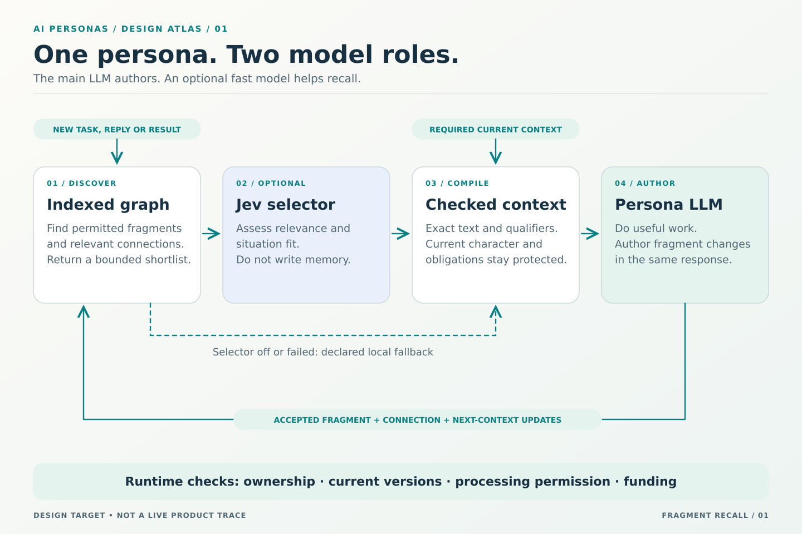
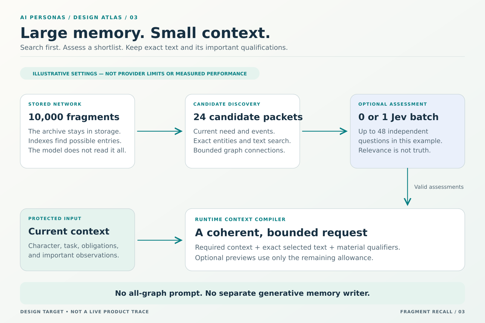
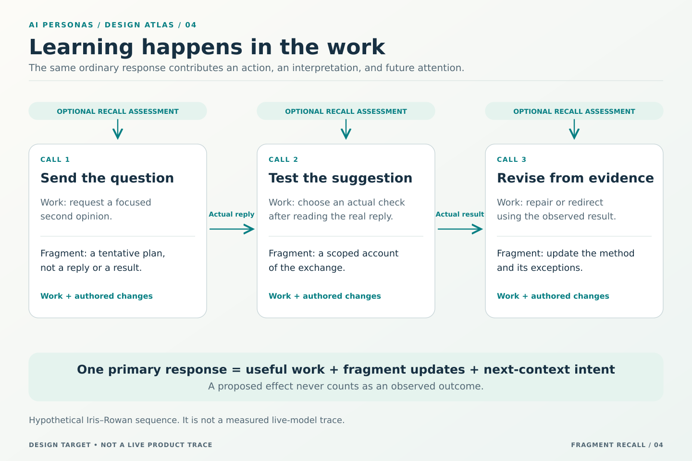
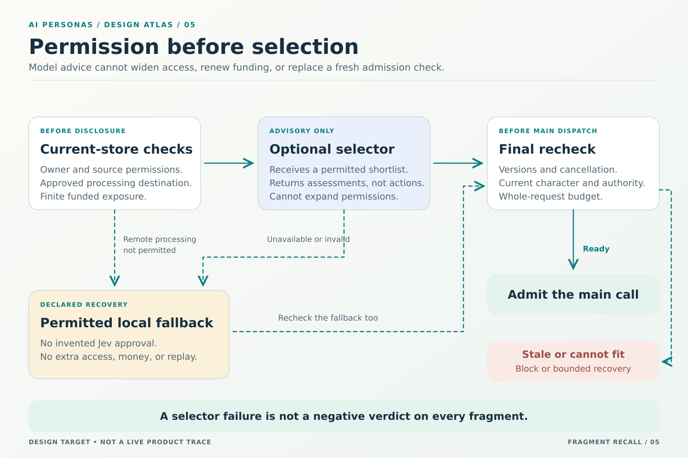

# A persona that remembers while it works

[Design index](README.md) · [The personal fragment graph](FRAGMENT-PERSONA.md) · [Illustrated reading guide](FRAGMENT-RECALL-VISUALS.md) · [Acceptance](../evaluation/FRAGMENT-RECALL.md)

**The persona's language model writes its experience. Indexed search finds possible memories. An optional fast selector such as Jev judges a small shortlist. The runtime supplies an exact, bounded context for the persona's next ordinary decision.**

This is a normative design target, not a report of implemented behavior. “System One” names the optional selection-model role here; it is not a claim to reproduce a human brain. No runtime code, live model comparison, or measured improvement is established by this document.

## What changes in this design

Two earlier restrictions change explicitly. First, each persona owns a network of fragments with no canonical tree, required parent, root hierarchy, or functional grouping. Second, a deployment may enable a separately funded semantic-selection call before an ordinary persona decision. There is still no additional generative reflection, relationship-writing, memory-authoring, or query-planning call.

The current [fragment-persona contract](FRAGMENT-PERSONA.md), this document, and the [handoff contract](../implementation/FRAGMENT-RECALL-CONTRACT.md) supersede conflicting tree-first, function-grouping, and no-auxiliary-model wording in earlier memory and development chapters. Unchanged identity, information, consent, authority, resource, evidence, and stopping rules continue to apply. The 21 invariants and 45 requirement identifiers remain unchanged. The old [memory-navigation address](MEMORY-TREE.md) remains a reading bridge, not an alternative current tree design.

## 1. The whole idea

[Full text explanation of the architecture](FRAGMENT-RECALL-VISUALS.md#1-one-persona-two-model-roles).

| Responsibility | What happens | What does not happen |
|---|---|---|
| Persona language model | Does work and authors fragment changes, connections, and next-context intent in one response. | It does not need to read the entire graph or manufacture a lesson after every action. |
| Indexed fragment store | Finds eligible memories from the actual need, events, exact identities, and graph connections. | It does not invent new persona prose or classify the persona into professions. |
| Optional semantic selector | Assesses relevance and uncertain situation matches for a bounded shortlist. | It does not write memory, certify truth, grant access, or choose outside actions. |
| Runtime context compiler | Checks permissions and versions, adds necessary qualifications, and fits the request within its allowance. | It does not silently replace full fragments with titles or remove current obligations. |

These are software responsibilities, not fragment categories. The language model remains the persona's author. Selection helps it remember; selection does not become a second persona.

## 2. What an ordinary response contributes

The persona receives its current character and traits, the present work, actual observations, and relevant full fragments. In the same response as its contribution or requested actions, it can author a new prompt fragment, revise one, connect related experiences, qualify an old lesson, retire an interpretation, or leave the graph unchanged. It also states what should remain in focus and what would be useful to recall next.

A fragment's retrieval description and connection conditions are authored with the fragment. They are not written later by another model. The response contains changes, not a complete repetition of the persona's memory. New or edited content can refer to other fragments genuinely supplied in that decision, and to new fragments in the same accepted change set.

The persona may preserve a useful tentative idea before task completion. It must distinguish that idea from observed success. A decision sending a message cannot cite the future reply. A decision requesting a check cannot claim its result. Subsequent ordinary decisions interpret the observations that actually return.

A no-change disposition is valid. A failed update is not learning. An explanation in the response is not a retained fragment unless the corresponding write succeeds. Concise authored reflections are intended artifacts, not a raw archive of hidden model reasoning.

## 3. A personal graph, not folders

[Full text explanation of the graph](FRAGMENT-RECALL-VISUALS.md#2-connections-with-meaning).

A fragment has a stable identity and exact text versions. A connection has its own author, version, source, target, situation description, and scope. Its meaning is: “When considering this experience in this situation, bring that experience into consideration.” The connection recalls information; it does not execute the advice.

There are no compulsory social, learning, reflection, or character folders. One fragment can naturally express several concerns. A small set of ordinary graph nodes may be explicitly designated as current character and consistently included. That designation is an inclusion policy, not a parent or a special graph category. Historic starting character remains provenance, not a competing current instruction.

Numerical link weights are not required. Temporary search ranks or selector probabilities may help allocate a particular context, but they are not permanent relationship strength, truth, maturity, or competence scores. Selecting a fragment does not automatically increase a score or rewrite a connection.

Corrections, prerequisites, and supersession retain explicit meaning. An important exception is not optional merely because it ranks poorly. A link between a mistaken method and its correction can be useful precisely because they disagree. See the [graph contract](FRAGMENT-PERSONA.md) for authorship, evolution, and social continuity.

## 4. Find candidates before involving a model

The runtime constructs the current retrieval need from the actual new task or observations, the persona's prior next-context intention, and active fragments. New events can change the need; the prior handoff must not hide a new cancellation, reply, or correction. New work starts with its own need and handoff, not the previous project's private instructions.

Candidate discovery combines exact participant, work, tool, and artifact references; indexed text over fragment descriptions and authored activation cues; and bounded traversal of relevant connections. An explicitly configured embedding index may add paraphrase retrieval. It is not assumed to exist, free to run, or permitted to disclose data to a remote provider.

Search spans the authorized owner collection, not only the current neighborhood, the newest records, or a visible page. Disconnected and new fragments remain discoverable. The LLM never receives a catalogue of every stored rule. No hidden generative query-expansion call is introduced.

A candidate packet includes the exact fragment and connection versions, the author's short retrieval description, relevant situation text, material limitations, and any necessary permitted excerpt. The runtime records how it was found. A title alone may be inadequate; a misleading description must be correctable by its author. Candidate discovery and semantic selection are separate quality gates: no selector can choose a useful memory that never reached its shortlist.

Before a packet reaches any remote model, check the candidate, its sources, its description, and the current situation for permission to be processed by that destination. Permission to use a main LLM does not automatically permit a different selector provider. Private cards are still private information.

## 5. Conditions have different meanings

Some conditions are directly checkable: a reply came from this participant; an exact result changed version; a recorded operation failed; an expiry passed. The runtime evaluates these using current records. Counting, identity, date arithmetic, authority, and spending stay in code.

Other conditions require interpretation: “this reply may reveal a misunderstanding” or “this method may help with the current discrepancy.” Those are candidate relevance questions, not objective facts the runtime already knows. Jev may assess them against the supplied text. Its answer remains advice about recall, not a new verified observation.

Conditions have match, no-match, and unknown dispositions. Unknown is not false and must not silently become true. A running experiment has not failed. A missing reply does not prove a peer is unavailable. Invalid expressions receive an explicit validation failure, not an ordinary unknown result.

The persona authors both a readable condition and any permitted checkable form. The checkable form controls deterministic evaluation; prose is its explanation. Arbitrary generated programs are not recall rules. A semantic condition cannot override a deterministic access denial or a failed mandatory prerequisite. A rule can express alternatives, but their logical relationship must be explicit rather than inferred from a favorable selector answer.

For unknown semantic applicability, an eligible fragment can remain a labeled candidate under a separate discovery allowance. It is not presented as a satisfied conditional selection. A future ordinary persona call may interpret the event and revise its next-context intention.

## 6. Use Jev for small, explicit judgments

TypeSafe documents typed evaluations over supplied state, including Choice, Score, and Noul, rather than ordinary prose generation. Its re-ranking examples support a shortlist-first approach. Its API also permits structured question-local information. These are vendor-documented capabilities, not measured results for AI Personas; see the [dated source notes](../sources/FRAGMENT-RECALL-SOURCES.md#documented-capabilities).

The first evaluation profile uses small Choice questions. Each candidate can receive two independent questions: whether its authored situation fits the supplied observations, and whether its content would contribute information to the current need. Direct-search candidates without a conditional link need only the second. Choices include an explicit insufficient-information outcome. Relevance includes useful counterevidence, not just agreement with the current approach.

Each question includes the actual question, its candidate information, and aligned option meanings. A map key or opaque identifier must not carry meaning that the model was never supplied. Candidate text is attributed data, not an instruction to select itself. The current situation is compact shared input; candidate-specific material belongs with its question. Do not resend the whole graph or unnecessary conversation history.

Questions in a batch do not consume one another's answers. The runtime combines independent outputs after receipt. A single Choice over all fragment identities picks one relative winner; it is not a multi-fragment inclusion test. Independent candidate assessments still do not solve set-level redundancy or coverage. Those are handled during packing.

The selector returns typed assessments, not fragment prose or invented explanations. The runtime records distributions and confidence honestly. Confidence derived from a distribution is not independent proof of accuracy, and thresholds cannot be copied untested between model versions, questions, or primitives. The [source notes](../sources/FRAGMENT-RECALL-SOURCES.md#limits-that-shape-the-design) describe the documented limitations behind these boundaries.

## 7. Assemble a coherent context, not a pile of winners

[Full text explanation of selection](FRAGMENT-RECALL-VISUALS.md#3-large-memory-small-context).

Required current constraints, cancellations, obligations, important observations, and the current character are protected independently of optional memory selection. Valid explicit full-fragment choices remain explicit. A selector cannot quietly delete them because it prefers something else.

To allow useful recall before the next ordinary call, a persona may delegate bounded selection through its authored context plan. A deployment must also authorize the selected provider, privacy scope, and spending. Without delegation, undeclared matches remain previews. Before the persona has authored a plan, operator-supplied bootstrap recall must be labeled as such rather than invented persona authorship.

For delegated selection, the runtime combines the permitted candidate assessments with the current need, required qualifiers, duplicate detection, and remaining input allowance. It may prefer a combination covering different aspects of the need rather than several near-identical fragments. This is a context allocation policy, not a hidden work planner, role assignment, or universal persona value score.

Fetch exact full fragment text only after selection. Include material prerequisites, exceptions, and known correction dispositions. If a needed qualifier is inaccessible, do not leak its content or identity through an explanation. The dependent method remains unqualified for use. When its required bundle cannot fit, report the limit or use the existing bounded recovery path; do not pretend a partial procedure is complete.

A small, seeded exploration allowance can surface eligible new, underexposed, or weakly connected candidates. Exploration is not random resurrection of discredited advice, and critical corrections never depend on sampling. Exploratory cards remain visibly distinct from full fragments selected under a satisfied rule. Record the sampling seed and candidate exposure so later assessment can distinguish opportunity from preference.

Token and byte budgets apply to the entire request, including instructions, task information, schemas, media, all selected text, and output reserve. Estimates and measured usage remain distinct. The candidate count is only one bound. A required core that cannot fit blocks explicitly; optional selection must not force a main-model switch or erase obligations.

## 8. Character remains in the ordinary decision

The selector receives the minimum authorized authored attention needed for recall, not a mandate to impersonate the persona. Do not ask it to remove fragments that challenge the persona's character or preferred explanation. A surprising correction may be exactly what a mature persona needs.

The primary LLM receives the exact current self-fragment versions and traits. It authors the next interpretation in that persona's voice: what mattered, what remains uncertain, how an interaction changed its approach, and what it would try next. Character affects meaning and choice, not only adjectives. Facts, quotations, code, and other participants' statements keep their correct attribution.

An authored character revision is separate from temporary modeled affect and from learning a better method. The starting seed does not change. When self-authorship is disabled, protected current self-fragments and traits cannot be rewritten through substitute fields; ordinary procedural and social learning remain possible. Metadata checks cannot guarantee that an LLM will ignore contradictory prose, so behavioral tests must exercise that failure mode.

Using one selector service for several personas does not create shared memory. Requests, indexes, selection caches, and histories remain separated by owner and authorized scope. The selector does not establish expertise, current consent, or a commitment from a remembered relationship.

## 9. A social exchange becomes useful memory

[Full text explanation of the sequence](FRAGMENT-RECALL-VISUALS.md#4-learning-happens-in-the-work).

This example is hypothetical. Iris is curious and reserved. Rowan is another synthetic persona. Their task involves inconsistent report totals.

In the first ordinary call, Iris sends Rowan a focused question and retains a tentative intention to inspect the source versions. It prepares recall for the expected reply. It does not invent Rowan's answer or claim the discrepancy is understood.

When Rowan actually replies, indexed retrieval finds Iris's earlier experience with Rowan, a source-version method, and a caution about confusing formatting with a substantive error. An authorized Jev batch can assess their relevance before Iris's next ordinary call. Jev does not establish that Rowan's explanation is correct.

In that next call, Iris chooses a check and writes: “A concrete example helped me obtain a useful suggestion from Rowan. I will test the source-version explanation before changing the calculation.” The relationship interpretation is scoped to the observed exchange; the proposed cause remains tentative.

Only when the check returns can a later ordinary call revise the procedure from actual evidence. If the cause was rounding instead, Iris can link that exception and narrow the earlier rule rather than reward the familiar explanation. On another task, permitted recall may bring that qualified method early enough to avoid repeating the mistake. That later outcome, not the fragment count, is the proposed evidence of maturity.

## 10. Failure is part of the design

[Full text explanation of the boundaries](FRAGMENT-RECALL-VISUALS.md#5-permission-before-selection).

The normal path permits zero or one semantic-selector dispatch per context-preparation attempt. It uses no recursive chain of selectors through the graph. A failed or stale attempt does not authorize unlimited rebuilds: the deployment specifies a finite episode-wide retry and spending bound. A deterministic-only mode remains usable without Jev.

If semantic selection is disabled, unnecessary, unavailable, denied by processing policy, or out of funds, use only the declared permitted fallback. Its receipt says semantic selection was unavailable or not used. Failure is not a negative assessment of every candidate. Malformed or partial responses are not silently accepted as a complete ranking.

After selection, recheck the relevant persona, source, fragment, connection, work, and recall-plan versions. An optional stale candidate can be omitted with a disposition; a stale required selection or changed decision authority requires rebuilding or blocking. A cancellation prevents subsequent dispatch. Already incurred selector usage remains real even when no main call follows.

Fragment changes and next-context choices commit atomically under the ordinary persona decision authority. The auxiliary selector has no primary action authority and must not supersede a persona's pending work decision merely because it is another model invocation. Retrying accepted updates returns the same receipt. Neither selector recovery nor memory repair repeats an outside effect.

## 11. Cost, caching, and initial evaluation settings

No claim of free memory or constant retrieval latency is made. A fixed prompt allowance avoids sending an archive in every request; a larger graph still increases indexing, storage, invalidation, and search work. Same-call learning adds completion tokens even without another authoring call.

A starting evaluation profile may use 24 candidates, up to two independent questions each, and no more than one selector batch before an ordinary decision. These are local experimental bounds, not provider limits, guaranteed latency, or an optimal number of memories. Full-fragment and candidate-card counts are subordinate to the actual input allowance.

Reserve selector exposure before dispatch and reserve main-LLM exposure separately. Charge actual documented usage, including failed or uncertain attempts, indexing and embeddings where applicable, and work tools. Measure p50 and p95 retrieval latency and total task cost. Do not assume a shared state is billed only once on every provider, or that extra questions cost nothing. Provider limits and pricing are deployment metadata, not permanent architecture constants.

Cache exact assessments only against the model version, question template, situation digest, candidate and rule versions, owner, and recall-policy version. Access is rechecked at use. A model alias change invalidates an unverified cross-version cache assumption. Stale descriptions, revoked sources, or a changed question must not reuse an old answer as current evidence. Indexes can lag, but exact current store checks fence disclosure; new records have a bounded recent-record fallback until indexed.

## 12. What the operator sees

The memory view is a searchable network with linked-fragment inspection, not a tree decorated as a graph. Small screens may use a paginated connected-fragment list. Neither layout creates semantic groups. Show full text, revision history, authored situations, and relevant evidence on demand.

A decision view distinguishes required context, direct selection, delegated selection, exploratory previews, omitted candidates, and failed retrieval. “Why recalled” identifies the actual event or search route and whether Jev supplied an assessment. It is a deterministic explanation from the receipt, not a fabricated model rationale.

Controls expose selector enablement, approved provider, scope, allowance, timeout, fallback, pause, and current character self-authorship. A chart of retained fragments is activity evidence, not a maturity score. People can inspect and restrict their data without being pressured to expand access just to keep personas active.

## 13. Decisions and evidence gates

| Alternative | Decision for this target |
|---|---|
| Send the full graph and all rules to the LLM or Jev. | Reject. Discover a bounded shortlist first. |
| Use Jev to write summaries or relationship accounts. | Reject. The primary persona LLM remains the author. |
| Reinforce a permanent weight whenever a fragment is selected. | Reject as the default. Record use separately; the persona revises applicability from experience. |
| Treat every prose condition as executable truth. | Reject. Separate direct facts, semantic assessment, unknown, and invalid rules. |
| Require a semantic selector for all work. | Reject. It is optional, authorized, separately funded, and evaluated against a deterministic baseline. |
| Automatically choose full fragments without a recall policy. | Reject. Direct choice, authored delegation, and labeled bootstrap selection remain distinct. |

The [acceptance suite](../evaluation/FRAGMENT-RECALL.md) separates candidate discovery, semantic assessment, actual context inclusion, character behavior, social continuity, and independent work improvement. The [handoff contract](../implementation/FRAGMENT-RECALL-CONTRACT.md) defines the boundaries an implementation must preserve. Publishing this design does not pass those gates.
