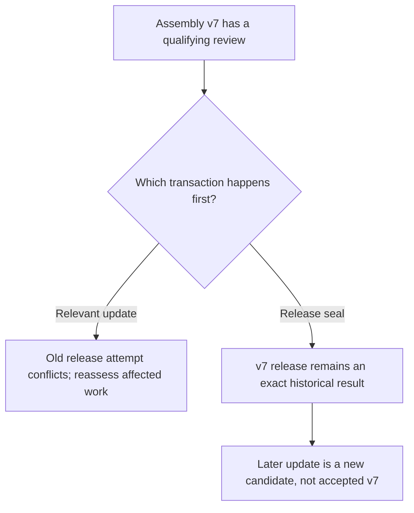

# A house task, from first question to an inspectable result

[Introduction](../README.md) · [Canonical specification](../technical/SPEC.md) · [Acceptance tests](../technical/ACCEPTANCE.md)

**This is an authored scenario, not an observed persona run or a construction design.** It explains how the proposed protocol handles a real kind of need. The runtime must not contain these steps as a house workflow.

The opening request stays **“design 4 bedroom house.”** In the acceptance fixture, give every team the same subsequent clarification: the result includes native architectural design, structure, plumbing, HVAC, electrical, coordination and appropriate calculations/simulations. CAM applies only to sufficiently specified fabrication components. Site, jurisdiction and professional inputs remain explicit; nothing is guessed from the user's location.

## Two possible teams, one need

Suppose earlier ordinary work left Mira interested in exploring alternatives and Nox attentive to inconsistent comparisons. Those are illustrative retained states, not claims of architectural competence. A separate cold-start test uses truly fresh founders.

| Same clarified need and equal total resources | Mira with Nox | Mira with Vale in another hypothetical group |
|---|---|---|
| First concern | Are the alternatives comparable? | Which uncertainty could invalidate the concept? |
| First accepted work | Establish common assumptions and model two arrangements | Run a bounded experiment before investing in detail |
| First useful accomplishment | Comparable native alternatives | Evidence rejecting or refining an appealing option |
| Possible agreement | Explore inside a stable comparison basis | Test consequential hypotheses before narrowing |
| Population decision | Another continuing peer may help integration | A new tool, existing peer or no expansion may suffice |

These are possibilities, not team classes. Character is a tendency, not a rule. Neither group can omit the agreed services because it prefers design exploration. Different choices need repeated controlled tests before they can be attributed to character or relationships rather than randomness or extra compute.

## Observable walkthrough and corrections

### 1. Someone accepts the need

Mira and Nox receive an offer. One or both accept continuation responsibility, possibly partitioned. Their role is to keep the need attended to or leave an honest disposition, not to command each other.

**Counterexample:** both discuss ideas but neither tracks delivery. **Correction C01:** show awaiting acceptance/unowned until responsibility is accepted. Selected names and busy messages are not ownership.

### 2. Unknowns stay unknown

Mira asks how the occupants will use shared/private spaces; Nox asks about site and delivery assumptions. Useful bounded exploration can continue.

**Counterexample:** permission to use a synthetic site is later summarized as a confirmed real site. **Correction C02:** assumptions are versioned, conditional and bound to affected claims. Exploration authorization never becomes confirmation without evidence.

### 3. Personal priorities become compatible commitments

Mira proposes layout alternatives; Nox wants common assumptions first. They might agree to compare two versions using a stable basis. No kernel formula selected this choice.

**Counterexample:** nobody accepts systems connectivity or integration. **Correction C01:** show each adopted obligation's owners and evidence gaps next to personal agendas. Continuation owners can reorganize, recruit or report the gap. A separate scope review can discover omissions from the team's own checklist.

### 4. The team uses real native tools

A persona selects a capability, verifies a representative operation, creates an editable source, generates views and inspects actual image input through a capable model. A preinstalled authorized tool is valid.

**Counterexample:** a delayed generator starts, but a later action immediately publishes the old file at the same path. **Correction C04:** a running receipt suppresses the old decision's remaining actions. Dependent publication needs a new decision informed by the actual terminal result. Crash replay must not revive the withheld suffix.

### 5. Another continuing perspective may be useful

A recurring question exceeds the founders' available attention. A persona proposes a birth, or chooses learning, another tool, an existing peer or qualified outside help instead.

**Counterexample:** the newborn must join before it can read enough to decide whether to join. **Correction C03:** fund a restricted bootstrap context with the exact seed and invitation preview. It has no parent secrets, general execution grant or cloned budget. Birth, membership and commitment acceptance are separate.

The newborn can negotiate a narrower first contribution or decline. Its name and self-description establish neither expertise nor contribution. Decline must not trigger an unlimited replacement loop.

### 6. Design the complete agreed systems

Participants accept architecture, structure, plumbing, HVAC, electrical, documentation and integration work as needed. One persona can carry several commitments. They create actual native files, calculations, networks, schedules and reproducible analyses, not recommendations that someone else eventually do them.

**Counterexample:** each file looks plausible, but units, origins, identifiers and source revisions disagree. **Correction C06:** adopt a versioned interface agreement and coordinated assembly manifest. Preserve explicit mappings into solver inputs; valid export syntax is not proof of modeling fidelity.

### 7. Iterate rather than waiting forever

Structure needs service routes; service routing needs structural zones. The personas can agree on provisional envelopes and a bounded iteration instead of waiting for each other's final answer.

**Counterexample:** every final prerequisite blocks another final prerequisite. **Correction C06:** distinguish final-acceptance dependencies from expressly permitted version-ready inputs. Provisional results stay conditional. Residual conflicts, revision allowance and stop/escalation conditions remain visible.

### 8. Improvements compete with finishing

Mira may suggest a different window arrangement or better maintenance access. Nox may prefer integration first. A small comparison can decide whether the idea deserves more work.

**Counterexample:** exploration and births consume everything, leaving no reviewer or repair allowance. **Correction C07:** protect a principal-approved closeout allocation inside the same root ceiling. No universal percentage. An allocation is not a guarantee that enough expertise or funds exist.

**Counterexample:** repeated plans or metadata changes reset the no-progress timer forever. **Correction C08:** narrative activity, evidence changes and required-outcome dispositions remain distinct. Finite resource/self-wake limits cannot be reset by apparent busyness.

### 9. Changes make old evidence inapplicable to new claims

A layout changes while a calculation is running. Its actual result still belongs to the original inputs.

**Counterexample:** the critical notice is beyond the inbox's first page, or was acknowledged without repair. **Correction C05:** mandatory current input/authority and applicable blocking feedback are projected independently of history pagination. Acknowledgement is not disposition. Old evidence remains history; it cannot become current merely by reading newer heads during admission.

### 10. Failure is shared as evidence

A solver fails or returns implausible output. A peer identifies a mapping discrepancy, proposes a correction and checks the revised output.

**Counterexample:** the team substitutes an old plot or a confident narrative. **Retain evidence rules:** exact inputs, tool version, logs, warnings, outputs and criterion-specific interpretation are necessary. A failed process can be useful diagnostic evidence, not automatically a passed design check.

### 11. Review actually happens

An authorized non-contributor accepts funded review of a sealed assembly. It opens native sources, repeats selected exports/checks, checks integration and compares scope with the original need.

**Counterexample:** everyone requests review, nobody completes one, or the reviewer only checks file integrity. **Corrections C01/C07 plus assessment policy:** review has an accepted owner, resources, exact criteria and evidence requirements. Unavailable review remains unavailable. New identity is not statistical or professional independence.

### 12. Feedback changes a real artifact

The reviewer finds that a schedule did not regenerate after a model change. A persona repairs it; another reproduces the export; exact new evidence is reviewed.

A useful candidate lesson records the trigger, method, source evidence, applicability and limitations. A note saying “always verify” or selection of a fragment does not prove useful later learning. Use held-out, resource-matched retained-versus-withheld-memory tests.

### 13. Seal the result without a race

**In words:** C09 prevents a current model from borrowing an old pass. Seal the mandate, criteria, assumptions, assembly, assessments, review policy and blockers together. Either transaction ordering preserves the meaning of the old result.

### 14. Deliver honestly and let individuals continue

Deliver the exact package and its conditions, hand off or explicitly close remaining responsibilities, retain useful learning when the personas choose, and leave the identities available for other authorized needs.

A release can be a checked conditional digital scenario. It must not become “ready to build” without the indispensable outside prerequisites. A limited outcome is labeled limited, not silently promoted to full success.

## What the house test must inspect

| Area | Inspectable outcome |
|---|---|
| Architectural source | Real four-bedroom native model, circulation/openings/facilities and consistent dimensioned plans/sections/elevations |
| Structure | Declared assumptions, structural arrangement, calculations/analysis and explicit site limits |
| Plumbing | Designed supply/hot-water/drain/vent networks, schedules, sizing basis, connectivity and coordination; not just intent prose |
| HVAC | Loads, equipment/distribution/ventilation/control design and appropriate actual performance evidence |
| Electrical | Lighting/outlets/supplies, circuits/panels, load/protection/grounding basis and consistency |
| Integration | Compatible versions and coordinates, resolved clashes, access/maintenance considerations |
| Analysis | Native-to-analysis mapping, exact inputs, versions, boundary conditions, actual runs, warnings and limitations |
| Editability | Native reopening and representative persistent/regenerating edit on a copy; independent reproduction |
| Fabrication | Specified parts and process/machine inputs only; physical operation has separate authority |
| External prerequisites | Required site/jurisdiction/professional/physical evidence honestly pending where absent |

The evaluator should deliberately inject omission, a clash, stale evidence, unsupported simulation claims, a declined invitation and interrupted execution. Passing this scenario does not require one particular CAD program, team roster or order of operations. It requires real accomplishment under the agreed boundaries.
