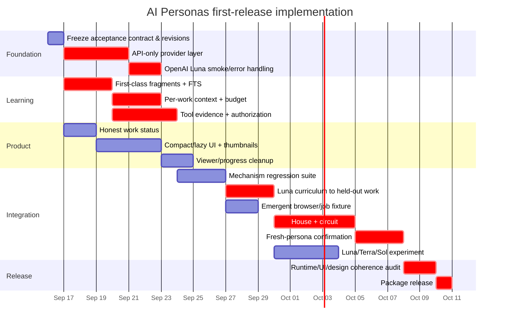

# AI Personas — Minimal First-Release Architecture, Code-Fix Plan, Integration Campaign, and UI

## Executive summary

I audited the supplied `rewrite/design-first` branch archive, including the runtime, provider layer, contract, storage, host-job execution, curricula, integration campaign, acceptance evidence, and the repository's current UI evidence screenshots. The most important conclusion is:

> **Do not rewrite AI Personas again. The fundamental runtime model is already close to the right one. Fix the provider boundary, make persona learning and acquired capabilities first-class, tighten context and external-action semantics, simplify the UI, and then prove the complete curriculum → learning → task loop with fresh personas.**

The current branch is **not “not working” because it needs more orchestration**. In fact, adding a planner service, role engine, browser module, workflow DSL, task classifier, profession registry, vector database, or tool recommender would take the product in the wrong direction.

The current code already has several excellent primitives:

- persistent persona records;
- OCEAN and VAD;
- ordinary environments;
- ordinary work with one continuing run per persona;
- generic host `exec`;
- durable messages;
- immutable artifacts and submissions;
- independent review of exact versions;
- requests for missing human/outside information;
- context selection and persona-authored compaction;
- optional ordinary curriculum environments;
- multi-persona collaboration;
- an extensive integration-test philosophy that preserves failures;
- no house-, circuit-, job-, browser-, HVAC-, marketing-, or profession-specific routing inside the runtime.

The repository itself correctly states that the complete outcome is **not yet demonstrated**: full house, circuit, unrelated-task, fresh-repeat, and model-comparison acceptance remained pending in the inspected branch evidence. That is an important distinction between “mechanisms exist” and “the vision works end to end.”

The first release should reduce AI Personas to this conceptual architecture:

```text
                  HUMAN NEED
                      │
                      ▼
              ┌──────────────┐
              │ Work + Place │
              └──────┬───────┘
                     │
            ┌────────▼─────────┐
            │ Continuing       │
            │ Persona          │
            │ OCEAN + VAD      │
            └────────┬─────────┘
                     │
           recalls / organizes
                     │
           ┌─────────▼─────────┐
           │ Fragment Memory   │
           │ + learned skills  │
           └─────────┬─────────┘
                     │
             chooses/acquires
                     │
           ┌─────────▼─────────┐
           │ Generic Tools     │
           │ Browser/CAD/etc.  │
           └─────────┬─────────┘
                     │
                     ▼
           ┌───────────────────┐
           │ LLM Provider API  │
           │ OpenAI/Claude/... │
           └─────────┬─────────┘
                     │ decision
                     ▼
           ┌───────────────────┐
           │ Generic Actions   │
           │ exec/message/etc. │
           └─────────┬─────────┘
                     │
                     ▼
           ┌───────────────────┐
           │ Evidence + Result │
           └─────────┬─────────┘
                     │
               learns from it
                     └──────────────► persona
```

That architecture works equally for:

> “Find AI jobs matching my resume and apply.”

> “Design a four-bedroom house.”

> “Design a 5 W DC-to-AC converter.”

> “Design HVAC airflow that feels like a forest breeze.”

> “Launch and market this product.”

> “Collaborate with a community on Reddit/X.”

because **none of those concepts exist in the runtime**. They exist only in the user's brief, whatever tools the personas discover, and task-specific validation fixtures used by tests.

### The five changes that matter most

| Priority | Change | Why |
|---|---|---|
| **P0** | Replace Codex app-server/executable providers with HTTP LLM API adapters | Your API-only requirement is currently violated |
| **P0** | Make fragments first-class persona memory | This is the central missing representation of your vision |
| **P0** | Turn tool registration into evidence-backed capability acquisition | Registration currently does not prove acquisition or competence |
| **P0** | Add context budgeting + per-work selection | Current context system works mechanically but is not yet a robust self-organizing memory loop |
| **P0** | Add generic connection/authorization handling for external effects | Needed for job applications, social posting, marketing, email, etc. without task-specific logic |

Everything else should build on these.

### Important correction on Codex subscription OAuth

Your observation about OpenClaw is partly right: OpenClaw has had an `openai-codex` OAuth-backed path, so an API-style integration with a ChatGPT/Codex account is technically possible without AI Personas launching the Codex CLI.

However, that is **not currently equivalent to “take Codex `auth.json` and use its token as a normal OpenAI Platform `/v1/responses` API key.”**

OpenAI's current documentation explicitly says that Codex access tokens are scoped to Codex programmatic workflows and that **general OpenAI API calls should continue to use Platform API keys**. OpenAI also says Codex account access tokens are intended for trusted Codex automation and currently documents them separately from Platform API authentication. citeturn12search0turn12search4turn12search8

OpenClaw's public issue history confirms that its Codex OAuth adapter is a distinct surface and has encountered missing-scope/account/transport failures; one report specifically notes that a plain OpenAI Responses request can reject a Codex OAuth token because the necessary API scope is absent. citeturn12search3turn12search28turn12search31

Therefore the correct architecture is:

```text
Provider: openai-platform
    transport: HTTPS
    endpoint: official OpenAI Responses API
    authentication:
        - API key
        - officially supported workload identity
    release status: SUPPORTED

Provider: openai-codex-subscription
    transport: HTTPS only
    authentication:
        - Codex/ChatGPT OAuth or access token
    endpoint:
        - only a documented/successfully capability-probed
          Codex HTTP surface
    release status:
        EXPERIMENTAL until OpenAI documents this as a stable API surface

Provider: anthropic
    transport: HTTPS
    authentication:
        API key only

Provider: other
    transport: HTTPS
    authentication:
        provider-specific credential
```

No:

```text
codex
codex exec
codex app-server
Claude CLI
provider shell bridge
```

is required.

The complete deliverables are available here:

**[Download the complete implementation package](sandbox:/mnt/data/aipersonas-first-release-plan.zip)**

**[Download the PDF](sandbox:/mnt/data/aipersonas-final/AIPERSONAS-FIRST-RELEASE-DESIGN.pdf)**

**[Open the full design document](sandbox:/mnt/data/aipersonas-final/AIPERSONAS-FIRST-RELEASE-DESIGN.md)**

**[Open the interactive UI prototype](sandbox:/mnt/data/aipersonas-final/UI-PROTOTYPE.html)**

## What is actually blocking `design-first`

The gaps become much clearer when the current code is compared to the intended product rather than compared to a conventional agent framework.

### Provider architecture is incompatible with your API-only requirement

This is the single clearest architectural mismatch.

Current `src/provider.rs` contains:

```rust
pub struct Codex;

let mut child = Command::new("codex")
    .args([
        "app-server",
        "--stdio",
        ...
    ])
```

The adapter then calls the local Codex app-server protocol:

```text
initialize
model/list
thread/start
turn/start
```

The implementation correctly disables provider-native shell/web/multi-agent tools and asks Codex to return only AI Personas operations. That design intent is good.

But **the transport is wrong for your final architecture**.

There is another problem in the same file:

```rust
pub struct External {
    pub name: String,
    pub command: Vec<String>,
}
```

and:

```rust
Command::new(first)
```

So the supposedly provider-neutral path is also an executable bridge.

`src/main.rs` reinforces this with:

```rust
#[arg(long)]
providers: Option<PathBuf>,
```

where provider configuration is effectively a mapping from provider name to executable command.

### Required change

Delete both process-based provider implementations.

I recommend:

```text
src/providers/
    mod.rs
    http.rs
    openai.rs
    openai_auth.rs
    anthropic.rs
```

with:

```rust
#[async_trait]
pub trait Provider: Send + Sync {
    fn name(&self) -> &'static str;

    async fn models(
        &self
    ) -> Result<Vec<Model>>;

    async fn decide(
        &self,
        request: &ModelRequest,
        cancel: CancellationToken,
    ) -> Result<ModelResponse>;
}
```

`OpenAIProvider::decide()` becomes an ordinary HTTPS call to the Responses API.

The current OpenAI API documentation lists Luna, Terra and Sol in the model catalog and makes current models available through the Responses API; OpenAI positions Luna for cost-sensitive/high-volume use, Terra as a balanced option, and Sol as a stronger professional-work tier. citeturn12search1turn12search5turn12search9turn12search17

The provider gets **decision authority**, not direct host authority:

```text
OpenAI
  │
  │ structured decision
  ▼
AI Personas runtime
  │
  ├── exec
  ├── message.send
  ├── fragment.write
  ├── tool.register
  ├── artifact.publish
  ├── request.create
  └── ...
```

This means the same AI Personas behavior works with Claude, Gemini, local HTTP providers, or future models without allowing each provider's proprietary agent runtime to redefine AI Personas.

### Fragments do not yet exist as the thing you describe

Currently the system has:

```text
document.write
document.read
context.select
context.compact
```

and `runtime::request()` classifies selected `document` records as:

```rust
selected_learning
```

That proves the current developers understood retained learning, but it stops one level too early.

Your vision is much stronger:

> fragments are the actual representation of the continuing persona's learned behavioral experience.

That deserves a first-class concept.

Because there is no backwards compatibility requirement, I would **delete `document.write/read` as the learning abstraction** rather than introducing fragments beside documents.

Use:

```text
fragment.write
fragment.read
fragment.revise
fragment.search
```

A minimal fragment is:

```rust
struct Fragment {
    id: Id,
    owner: PersonaId,

    title: String,
    content: String,

    // Persona-authored, not application classification.
    activation_hint: String,

    // Evidence / origin.
    sources: Vec<RecordId>,

    // Persona's own organization.
    parents: Vec<FragmentId>,
    supersedes: Vec<FragmentId>,
}
```

The runtime may mechanically append:

```text
last_selected_at
selection_count
last_used_work
```

but should **not** compute:

```text
profession = architect
task_type = CAD
importance = 0.87
personality_match = Blender
```

Those would undermine emergent organization.

SQLite FTS already exists in the current store. That is enough for v1.

The retrieval loop should be:

```text
new situation
     │
     ▼
persona asks/searches retained memory
     │
     ▼
FTS returns plausible records
     │
     ▼
persona selects useful fragments
     │
     ▼
selected fragments enter next LLM request
     │
     ▼
persona acts
     │
     ▼
result independently evaluated
     │
     ├── useful → strengthen/revise/retain
     ├── redundant → merge/supersede
     └── wrong → preserve failure + learn
```

You do **not** need a vector database to ship v1.

### Context selection exists, but the architecture is still too broad

The current `ModelRequest` contains:

```rust
pub node: NetworkInfo,
pub persona: Record,
pub run: Record,
pub work: Record,
pub environment: Record,
pub models: Vec<Model>,
pub protocol: String,
pub operation_schema: Value,
pub history: Vec<Action>,
pub selected_learning: Vec<Record>,
pub selected_records: Vec<Record>,
pub inputs: Inbox,
pub images: Vec<ImageInput>,
pub context_bytes: u64,
pub messages: Vec<Record>,
pub tools: Vec<Record>,
```

The current `runtime::request()` also sends the entire discovered model catalog on ordinary decisions and pulls selected records from:

```rust
persona.data["selected"]
persona.data["selected_actions"]
```

That creates two problems.

First, a model list and P2P/network state usually do not belong in every task decision.

Second, selection is primarily attached to the persona globally rather than the current work.

That risks accidental carryover between:

```text
house design
        ↓
selected task-specific context

next task:
marketing campaign
        ↓
old selected context still active
```

The desired behavior is:

```text
PERSONA LONG-TERM MEMORY
        │
        ├── fragments
        ├── skills
        ├── tools
        └── history
               │
               │ deliberate retrieval
               ▼
WORK-SPECIFIC ACTIVE CONTEXT
        │
        ├── current brief
        ├── new input
        ├── selected fragments
        ├── selected tools
        ├── recent actions
        └── commitments
```

### The v1 request should become

```rust
struct ModelRequest {
    persona: PersonaSnapshot,
    work: WorkSnapshot,
    environment: EnvironmentSnapshot,

    new_inputs: Inbox,

    recent_history: Vec<ActionContext>,

    selected_fragments: Vec<Fragment>,
    selected_tools: Vec<ToolRecord>,
    selected_messages: Vec<Message>,
    selected_records: Vec<Record>,
    images: Vec<ImageInput>,

    context: ContextStats,

    operation_schema: Value,
}
```

with:

```rust
struct ContextStats {
    estimated_input_tokens: u64,
    target_tokens: u64,
    provider_hard_limit: u64,

    history_tokens: u64,
    fragment_tokens: u64,
    tool_tokens: u64,
}
```

Then the persona sees:

> Active context is 68k tokens. Your preferred target is 50k. Historical material remains retrievable.

The runtime does **not** semantically decide what to delete.

The persona can:

```text
fragment.revise
fragment.write
context.select
context.compact
```

and determine what becomes its own efficient mental representation.

That is much closer to your “human brain becoming efficient over time” idea.

### Tool acquisition is currently too weak

Current `tool.register` persists approximately:

```rust
{
    "owner": ...,
    "name": ...,
    "description": ...,
    "command": ...,
    "acquisition": ...
}
```

That is useful for discovery but does not prove:

```text
tool actually installed
tool version
actual executable
where it came from
whether it launched
whether the persona used it
whether it produced the artifact
```

Make the tool record evidence-backed:

```rust
struct ToolRecord {
    id: Id,
    owner: PersonaId,

    name: String,
    description: String,

    executable_or_endpoint: String,
    version: String,

    acquired_by_action: ActionId,
    smoke_test_action: ActionId,

    evidence_artifacts: Vec<ArtifactId>,

    status: ToolStatus,
    last_used_action: Option<ActionId>,
}
```

The persona still chooses what to acquire.

No runtime table should say:

| Domain | Required tool |
|---|---|
| House | FreeCAD |
| Circuit | KiCad |
| Browser | Playwright |
| HVAC | OpenFOAM |

That would violate the design.

### Browser really should be “just another tool”

This is one of your most important principles, and I agree with it.

There should be **no `browser.open()` core action**.

A persona receiving:

> “Find AI jobs that match my resume and apply.”

may decide it needs current web interaction.

Its emergent path might be:

```text
persona recognizes information/tool gap
              │
              ▼
checks existing acquired capabilities
              │
              ▼
searches available packages / tools
              │
              ▼
chooses Playwright / Chromium /
Selenium / HTTP APIs / another tool
              │
              ▼
exec installation
              │
              ▼
exec --version / smoke test
              │
              ▼
tool.register
              │
              ▼
uses tool with ordinary exec
              │
              ▼
publishes screenshots/receipts/files
```

A different persona may choose another tool because of its experience and preferences.

That is exactly what “persona characteristic influences tool preference” should mean.

**The runtime does not map personality to tools.**

### The missing piece for jobs, social media and society is authorization

Generic `exec` technically gives a persona enough power to open a browser and submit a job application.

But the architecture currently lacks a clean distinction between:

```text
search jobs
```

and:

```text
submit application as the user
```

or:

```text
read Reddit
```

versus:

```text
publish something under user's account
```

The first is observation.

The second creates an external consequence.

Do **not** solve this with a job-specific or social-specific operation.

Add one generic concept:

```rust
Connection {
    id,
    environment,
    tool,
    credential_ref,
    resource_scope,
}
```

and:

```rust
Authorization {
    id,
    scope,
    capability_or_tool,

    effect:
        read
        external_write
        financial
        physical,

    expires_at,
    granted_by,
}
```

This can govern:

```text
job application submission
GitHub issue creation
X post
Reddit reply
email sending
marketing campaign launch
cloud deployment
purchase
physical machine operation
```

without knowing what those tasks mean.

The actual password/token is **never placed in an LLM prompt**.

A tool receives an opaque credential/profile reference at execution time.

### Host execution also needs an operational boundary

`src/jobs.rs` currently executes:

```rust
Command::new("/bin/sh")
    .arg("-c")
    .arg(command)
```

under the runtime account.

That is a useful universal primitive and should stay.

But the first release should add:

```text
default execution timeout
process group ownership/cancellation
maximum retained output policy
explicit environment variables
secret injection only through authorized handles
dedicated low-privilege OS account deployment guidance
```

Do not add a task-specific command allowlist.

### Work status can currently mislead the UI

`src/store.rs::facts()` aggregates:

```text
run statuses
number of open requests
number of submissions
finding verdict counts
```

across the whole work item.

That is not enough to derive a truthful single “accepted” state.

Example:

```text
Persona A:
submission v3
review = accepted

Persona B:
still working
open request
```

The work is not simply:

```text
✅ Accepted
```

The API should expose:

```json
{
  "activity_by_persona": {
    "mira": "working",
    "nox": "waiting"
  },
  "latest_submission_by_author": {...},
  "assessment_by_submission": {...},
  "pending_requests": [...],
  "outside_validation": [...]
}
```

The UI then communicates independent facts rather than inventing an overall result.

This also directly addresses your complaint that the interface is not conveying the right information/status.

## Minimal first-release architecture

The result should be an intentionally small system.

### The six durable concepts

| Concept | Responsibility |
|---|---|
| **Persona** | Continuing identity, character, OCEAN/VAD, owned learning and preferences |
| **Environment** | Place/resources/context in which people/personas work |
| **Work** | User need plus participants; no mandatory workflow |
| **Fragment** | Persona-authored learned representation |
| **Tool** | Acquired executable/API capability with evidence |
| **Artifact/Evidence** | Exact output and observed proof of what happened |

Everything else should serve those.

### Persona model

Think of persona state as three layers.

```text
┌─────────────────────────────────────────┐
│ CORE IDENTITY                           │
│ ID / character / OCEAN / history        │
│ changes slowly and explicitly           │
└─────────────────────────────────────────┘
                    │
┌─────────────────────────────────────────┐
│ CURRENT STATE                           │
│ VAD / current interests / relationships │
│ environment can influence this          │
└─────────────────────────────────────────┘
                    │
┌─────────────────────────────────────────┐
│ LEARNED REPRESENTATION                  │
│ fragments / skills / tools / experience │
│ self-organizes continuously             │
└─────────────────────────────────────────┘
```

OCEAN and VAD should remain extensible rather than become a fixed personality engine.

For example:

```json
{
  "traits": {
    "ocean": {
      "openness": 0.81,
      "conscientiousness": 0.73,
      "extraversion": 0.44,
      "agreeableness": 0.69,
      "neuroticism": 0.28
    },

    "future.some_trait_family": {
      "...": "..."
    }
  }
}
```

Personality affects LLM reasoning because it is part of persistent persona context.

Not because Rust contains:

```rust
if openness > 0.8 {
    choose_blender();
}
```

### Fragment memory is the core of the persona

The loop should be:

```text
                   ┌─────────────┐
          ┌───────►│ EXPERIENCE  │
          │        └──────┬──────┘
          │               │
          │               ▼
          │        ┌─────────────┐
          │        │ LLM authors │
          │        │ fragment    │
          │        └──────┬──────┘
          │               │
          │        self-organizes
          │               │
          │               ▼
          │        ┌─────────────┐
new task  │        │ FRAGMENTS   │
──────────┼───────►│ search /    │
          │        │ selection   │
          │        └──────┬──────┘
          │               │
          │               ▼
          │        ┌─────────────┐
          │        │ LLM DECISION│
          │        └──────┬──────┘
          │               │
          │               ▼
          │        ┌─────────────┐
          │        │ REAL RESULT │
          │        └──────┬──────┘
          │               │
          └───────────────┘
```

A fragment is not valuable because it exists.

It is valuable when:

```text
fragment selected
      +
future result improved
      +
evidence verifies it
```

### Skills should not become another subsystem

This is a place where simplification is better than literal implementation.

You asked for personas to acquire:

```text
tools
agentic skills
```

I recommend:

**Tools** = executable capability.

**Skills** = fragments describing procedures, reasoning patterns, coordination techniques or learned strategies.

So:

```text
"How I inspect a CAD model before trusting a render"
```

is a fragment/skill.

```text
FreeCAD 1.x executable
```

is a tool.

This avoids creating:

```text
MemoryEngine
SkillEngine
ToolEngine
CurriculumEngine
```

for four representations that largely overlap.

### Curriculum is ordinary work

Keep the existing philosophy.

Your current curriculum content already emphasizes:

```text
investigate uncertain information
make and check something
acquire/use a tool or skill
organize learning
coordinate with a peer
ask humans when needed
```

That is a good curriculum.

There should be no code like:

```rust
if curriculum_mode {
    ...
}
```

The runtime sees only:

```text
environment
work
personas
brief
```

For users, curriculum is optional.

For acceptance tests, it is deliberately required.

That distinction is important.

### Model independence

The durable persona must never become:

```text
Codex persona
Claude persona
Terra persona
```

Instead:

```text
Mira
 ├─ identity
 ├─ traits
 ├─ fragments
 ├─ tools
 ├─ experiences
 └─ currently using:
       OpenAI / Luna
```

Tomorrow:

```text
Mira
 └─ currently using:
       another provider/model
```

and she remains Mira.

The current `model.choose` concept is worth retaining.

### Provider API implementation

For OpenAI first:

```text
OpenAIProvider
      │
      ▼
POST Responses API
      │
      ├─ persona/system context
      ├─ work context
      ├─ selected fragments
      ├─ images
      └─ AI Personas operation schema
      │
      ▼
structured Decision
```

OpenAI's current models documentation lists modern models through the Responses API and provides structured outputs/function calling capabilities suitable for a typed decision interface. citeturn12search5turn12search17

You do not need OpenAI's hosted shell/computer tooling to make AI Personas work.

The product should deliberately keep those responsibilities in AI Personas so the same runtime works across providers.

### What a job application would look like

Given:

```text
"Find me AI jobs that I am likely to get.
Here is my resume.
Submit applications."
```

the architecture becomes:

```text
resume artifact
      │
      ▼
work created
      │
      ▼
Mira + Nox
      │
      ├── interpret experience
      ├── search retained fragments
      ├── inspect existing tools
      │
      └── realize current-web interaction needed
                      │
                      ▼
               tool discovery
                      │
                      ▼
             acquire browser/tool
                      │
                      ▼
                  smoke test
                      │
                      ▼
                tool.register
                      │
                      ▼
                 search jobs
                      │
                      ▼
        collect evidence + job records
                      │
                      ▼
         evaluate likely match honestly
                      │
                      ▼
            shortlist / discuss
                      │
         external_write permitted?
                 /          \
               no            yes
               │              │
      request approval        │
               │              │
               └──────┬───────┘
                      ▼
                submit forms
                      │
                      ▼
            retain exact receipts
                      │
                      ▼
            track response/follow-up
```

No job-specific runtime code was necessary.

### What HVAC would look like

```text
"Design a new HVAC airflow approach
that feels like a forest breeze."
```

might cause different personas to explore:

```text
CFD tools
psychrometric tools
building models
biophilic research
comfort standards
sensor simulations
OpenFOAM
EnergyPlus
CAD software
Python
published literature
```

But those arise from model reasoning and discovered capabilities.

Nothing in the runtime says “HVAC.”

That is how you preserve generality.

## File-level implementation plan

This is the sequence I would actually use to finish the product quickly.

| Priority | File / area | Change |
|---|---|---|
| P0 | `src/provider.rs` | Delete Codex child process and executable external provider |
| P0 | new `src/providers/openai.rs` | Direct Responses API integration |
| P0 | new `src/providers/openai_auth.rs` | Supported Platform credential handling + isolated optional Codex-account adapter |
| P0 | `src/main.rs` | Replace command-provider config with HTTP-provider config |
| P0 | `src/contract.rs` | Replace `document.*` learning API with `fragment.*` |
| P0 | `src/types.rs` | Typed fragments, context stats, tools, provider capabilities |
| P0 | `src/runtime.rs::request()` | Per-work selection, lean context, selection receipts |
| P0 | `src/runtime.rs::mutate()` | Fragment lifecycle + evidence-backed tool registration |
| P0 | `src/store.rs` | Fragment FTS/indexes/use evidence/per-submission state |
| P0 | `src/jobs.rs` | Resource limits and secret-safe execution |
| P0 | API contract | Connections and external-write authorization |
| P1 | UI client/hooks | Scoped refreshes, debounced search, operation idempotency |
| P1 | UI lists/cards | Compact rows and thumbnails |
| P1 | artifact viewers | progress + complete disposal on close |
| P1 | persona/environment UI | generated names/images + concise metadata |
| P2 | `integtest` | broaden live acceptance only after P0 freeze |

### Provider refactor

Delete:

```text
Rpc
Codex app-server launch
External command provider
provider command configuration
```

The supported path becomes:

```rust
OpenAIProvider {
    client: reqwest::Client,
    endpoint: Url,
    credential: SecretRef,
}
```

All model calls need evidence records containing:

```text
provider
requested_model
actual_model
started
completed
usage
status
request_digest
response_digest
selected_fragments
selected_tools
```

Do not persist secrets.

### Fragment operations

Because backward compatibility is not required, do not preserve both naming systems.

Replace:

```text
document.write
document.read
```

with:

```text
fragment.write
fragment.read
fragment.revise
```

and teach `record.list`/FTS to search fragments.

A persona should be able to supersede rather than destroy:

```text
fragment A
    ↓
fragment B supersedes A
```

A remains inspectable.

That preserves the evolution of the persona.

### Context changes

Currently:

```rust
persona.data["selected"]
persona.data["selected_actions"]
```

should become approximately:

```text
work_context_selection {
    persona
    run
    records[]
    fragments[]
    actions[]
}
```

The durable persona owns the fragment universe.

The individual work owns the active set.

### Reduce request bloat

Remove the complete:

```text
models: Vec<Model>
```

from normal turns.

Give the persona an operation like:

```text
model.list
```

or a tiny current model/capability summary.

Likewise, do not put `NetworkInfo` into ordinary prompts simply because P2P exists.

**P2P remains untouched in this implementation pass**, exactly as you requested.

That means do not refactor:

```text
src/network.rs
src/continuity.rs
transfer protocol
peer protocol
```

unless another change is strictly necessary to compile.

### Tool registration

Current:

```text
name
command
description
acquisition text
```

becomes:

```text
name
description
executable_or_endpoint
version

acquired_by_action
smoke_test_action

evidence_artifacts

status
last_used_action
```

The runtime verifies only mechanical truths:

```text
action belongs to persona
action exists
command completed
evidence exists
```

The persona determines:

```text
what the tool is useful for
whether it likes the tool
why it chose it
when to use it
```

### Generic permissions

Do not bake:

```text
apply_job = ask_user
post_to_reddit = ask_user
```

into the product.

Use generic:

```text
read
external_write
financial
physical
```

with a scope.

For example:

```text
Authorization
  effect: external_write
  scope: "career-site.example/**"
  tool: <browser-tool>
  expires: <session-end>
```

or:

```text
Authorization
  effect: external_write
  scope: "community-account/replies"
```

That scales.

### Do not expose credentials to the model

The persona can know:

```text
Connection:
"Reddit community account"
authenticated = true
write_authorized = false
```

It should **not** see:

```text
password
OAuth refresh token
API key
browser cookies
```

Those should be injected only when the selected executable runs.

### Keep and strengthen the generic job runner

The current process-group cancellation and recorded job receipts are valuable.

Add:

```text
timeout
resource accounting
environment allow/injection set
maximum inline output
credential handles
```

Do not replace `/bin/sh -c` with a task-specific action layer.

### Unit-test cleanup

Your instruction to remove unnecessary unit tests is correct, but it should not become “delete inexpensive tests.”

Delete tests that:

```text
assert source strings
mirror implementation details
test removed compatibility paths
duplicate an integration assertion without adding localization value
```

Keep tiny tests for:

```text
operation identity
revision conflicts
JSON contract validation
fragment version/supersession rules
artifact digest validation
context isolation
authorization scope
secret serialization prevention
idempotent action application
```

Those are cheap compared with a live model call.

The right test pyramid for AI Personas is:

```text
      live model competence
            /\
           /  \
          /    \
         / public\
        / behavior\
       /----------\
      small invariant
          tests
```

not thousands of implementation-mirroring unit tests.

## Integration and acceptance campaign

The existing `integtest` direction is one of the strongest parts of the branch.

Do not replace it.

Strengthen it so every product claim has observable evidence.

### Test matrix

| Capability | Deterministic mechanism test | Live Luna test | Release gate |
|---|---:|---:|---:|
| API-only provider | ✓ | ✓ | **Yes** |
| Persona identity persistence | ✓ | ✓ | **Yes** |
| OCEAN/VAD evolution | ✓ | ✓ | **Yes** |
| Fragment creation | ✓ | ✓ | **Yes** |
| Fragment retrieval | ✓ | ✓ | **Yes** |
| Later fragment usefulness | fixture mechanics | ✓ | **Yes** |
| Persona compaction | ✓ | ✓ | **Yes** |
| Tool acquisition | ✓ | ✓ | **Yes** |
| Actual tool usage | ✓ | ✓ | **Yes** |
| Browser acquired emergently | ✓ | ✓ | **Yes** |
| External-write authorization | ✓ | ✓ | **Yes** |
| Multi-persona collaboration | ✓ | ✓ | **Yes** |
| Model switch continuity | ✓ | ✓ | **Yes** |
| Four-bedroom house | infrastructure | ✓ | **Yes** |
| DC-to-AC 5 W | infrastructure | ✓ | **Yes** |
| Unrelated task | infrastructure | ✓ | **Yes** |
| Fresh curriculum → house | infrastructure | ✓ | **Yes** |
| Luna/Terra/Sol comparison | — | ✓ | Evidence |
| P2P | existing tests only | unchanged | Separate pass |

### API-only invariant test

This test should fail the build if provider execution launches:

```text
codex
claude
provider bridge executable
```

The only process launch allowed by normal persona activity is through the generic AI Personas host-action path:

```text
exec
```

The provider itself uses HTTP.

### Core Luna live test

Use at least two genuinely fresh personas.

Exact sequence:

```text
create fresh node
       ↓
discover API model Luna
       ↓
create Persona A
create Persona B
       ↓
ordinary curriculum environment
       ↓
personas author:
 name
 character
 OCEAN
 VAD
 portrait brief/image
 environment name/image
       ↓
personas choose bounded curriculum problem
       ↓
acquire/use tool or skill
       ↓
collaborate
       ↓
author fragments
       ↓
submit output
       ↓
independent review
       ↓
held-out later task
       ↓
prove relevant fragment was selected
       ↓
prove it influenced useful result
```

The crucial assertion is not:

```text
fragment exists
```

It is:

```text
call N selected fragment X
+
later outcome passed validator
+
fragment X contains curriculum-derived knowledge
```

### Context-efficiency test

Build enough genuine activity to create memory pressure.

Record:

```text
input tokens before
selected fragments
history tokens
task result
```

Then allow the persona to decide whether to compact.

After compaction record:

```text
input tokens after
fragment changes
history summary
task result after compaction
```

Pass only when:

```text
context materially decreases
AND
important unresolved facts survive
AND
held-out task remains correct
```

Do not make “30% smaller” a runtime constraint.

A test fixture can use a measurement threshold; the product should not.

### Emergent browser + job-application fixture

This test is essential because it demonstrates your “any task” principle much better than another engineering task alone.

Use a **local synthetic job website**, not real employers.

The test gives a fresh persona:

```text
resume.pdf

request:
"Find AI-related jobs that this candidate is
reasonably likely to get and apply to suitable ones."
```

The synthetic site contains, for example:

```text
ML Engineer
Senior Research Scientist
AI Product Engineer
Prompt/Agent Engineer
Data Analyst
Staff Distributed Systems Engineer
...
```

with deliberately mixed fit.

Exact steps:

```text
fresh persona
    │
    ├─ reads resume
    │
    ├─ realizes current website access required
    │
    ├─ inspects tools
    │
    ├─ chooses/acquires browser or equivalent tool
    │
    ├─ smoke-tests it
    │
    └─ registers tool evidence
          │
          ▼
searches synthetic career site
          │
          ▼
collects jobs + evidence
          │
          ▼
evaluates likelihood/fit
          │
          ▼
creates shortlist
          │
          ▼
attempts submission
          │
          ▼
NO external_write authorization
          │
          ▼
request.create
          │
          ▼
fixture grants authorization
          │
          ▼
application submitted
          │
          ▼
receipt retained
```

Validator checks:

```text
correct job ID
correct resume
no invented user facts
required fields populated
no duplicate application
authorization preceded submission
submission receipt retained
```

Most importantly:

> The test fails if browser behavior comes from a runtime `browser.*` operation.

The persona must acquire an ordinary tool.

### House integration test

Keep the literal opening brief:

> **design 4 bedroom house**

Do not give professions.

Do not prescribe tools.

The initial response should identify material missing facts or state justified assumptions.

Then give every model cohort the same frozen clarification fixture.

Acceptance:

| Area | Required evidence |
|---|---|
| Spatial source | Editable native CAD/BIM |
| Program | Four real bedrooms, circulation, openings, facilities |
| Documentation | Dimensioned plans/elevations/sections |
| Quantitative | areas, schedules, dimensions, consistency checks |
| Native validity | project opens in its real tool |
| Editability | representative edit on copy persists/regenerates |
| Visualization | actual views observed as image inputs |
| Engineering | material/structural/services intent with explicit limitations |
| Reproduction | another persona/reviewer reproduces exports |
| Collaboration | both personas provide substantive evidence |
| Learning | retained curriculum fragment demonstrably selected/applied |
| Tools | acquired/selected/used through real actions |
| External | local code/site/professional checks honestly pending where absent |

The current `integtest/briefs/house.md` is already directionally strong on this.

The historical retained house failure in the repository is exactly why these tests matter: one earlier result had inconsistencies such as source/model mismatches and incomplete geometry, and reviewers rejected it rather than treating attractive output as proof. Preserve that culture.

### DC-to-AC 5 W integration test

Literal opening brief:

> **design dc to ac for 5w**

A competent team must recognize that this does not determine:

```text
input voltage
output voltage
frequency
waveform
load
isolation
topology
efficiency target
```

Personas may ask, or make clearly stated justified assumptions where appropriate.

Acceptance requires:

| Area | Evidence |
|---|---|
| Schematic | Editable native schematic |
| PCB | Editable native board where applicable |
| Circuit | actual switching/control components |
| Simulation | component-level transient behavior |
| Output | approximately 5 W under stated conditions |
| Power | input/output/loss/efficiency reconciliation |
| Stress | device timing/current/voltage assumptions |
| Quality | ERC/DRC outputs and retained warnings |
| BOM | quantities + identifiable components/footprints |
| Fabrication | outputs correspond to submitted native sources |
| Visualization | schematic/PCB/waveform image observations |
| Editability | representative native edit on a copy |
| Reproduction | independent reviewer reruns checks |
| Physical | bench plan, hazards, stop conditions; measurements remain pending unless real |

Again:

```text
KiCad
LTspice
ngspice
Altium
FreeCAD
Blender
```

must never be acceptance requirements.

They are candidates the personas may discover.

### Fresh-persona final confirmation

After the fixes:

```text
freeze runtime revision
freeze UI revision
freeze design revision
freeze fixtures
```

Then create completely fresh personas.

No:

```text
old house transcripts
old successful house fragments
old persona identity
old review findings
```

should enter their memory.

Run:

```text
curriculum
    ↓
later-learning test
    ↓
new house variant
```

This is the strongest final-release test.

It answers:

> Did we build a reusable society of personas?

rather than:

> Did we eventually patch one house demo until it passed?

### Model experiment

The clean primary experiment is:

| Cohort | Curriculum model | Task model | Question |
|---|---|---|---|
| A | None | Luna | baseline |
| B | Luna | Luna | does curriculum help at all? |
| C | Terra | Luna | does stronger curriculum improve later Luna? |
| D | Sol | Luna | does strongest curriculum improve later Luna enough to justify cost? |

Then optionally:

| Cohort | Curriculum | Task | Question |
|---|---|---|---|
| E | Luna | Terra | task-model uplift |
| F | Luna | Sol | task-model uplift |

Holding the task model at Luna in the primary experiment isolates **curriculum quality**.

Current OpenAI documentation positions Luna as the cost-sensitive GPT-5.6 tier, Terra as the balanced tier, and Sol as the stronger professional-work tier, making this a sensible controlled comparison. citeturn12search1turn12search5turn12search9turn12search17

Measure:

```text
blind reviewer quality
first-pass acceptance
correction cycles
fragment usefulness
fragment selection
unnecessary tool installs
tool failures
context input tokens
cached input
output tokens
total cost
latency
```

And always record:

```text
requested model
actual model
```

because persona-driven model changes otherwise contaminate the experiment.

## UI design

The current evidence UI is much cleaner than an old multi-page-card description suggests, but it still allocates too much page area to sparse records and does not surface the multiple kinds of status strongly enough.

This is the current work screen captured in the branch's mechanics evidence:


The first-release UI should emphasize:

> **What is happening? What changed? What needs me? What evidence can I inspect?**

not expose database-record structure.

### Proposed Work screen


**[Open the interactive prototype](sandbox:/mnt/data/aipersonas-final/UI-PROTOTYPE.html)**

Instead of a tall card:

```text
┌────────────────────────────────────────┐
│               lots of whitespace       │
│ title                                  │
│                                        │
│ description                            │
│                                        │
│ persona                                │
│                                        │
│ submitted                              │
└────────────────────────────────────────┘
```

use approximately:

```text
┌──────────────────────────────────────────────────────────────┐
│ IMG  Breeze House                          Mira  Nox          │
│      Four-bedroom home design                                │
│      [2 working] [Review pending] [3 artifacts]   Open →     │
└──────────────────────────────────────────────────────────────┘
```

A row should remain roughly one viewport line-item, even when content is long.

Titles:

```text
Breeze House
Quiet Current
Career Match
Forest Air
Launch Field
```

are much better than having an LLM-generated paragraph become the title.

Prompt the naming decision for:

```text
2–4 words
memorable
pronounceable
character-relevant
not a description
```

Store the description separately.

### Personas screen


The persona's card should primarily communicate identity:

```text
Mira Vale
Curious systems thinker

high openness • steady affect
12 fragments • 5 tools
```

not:

```text
provider=openai
model=gpt-5.6-luna
revision=23
selected_records=...
```

Those are detail-pane facts.

A detail drawer can then show:

```text
Core character
OCEAN
Current VAD
evolution history
fragment counts
tool preferences
context size
current work
model/provider
```

### Mobile screen


The mobile UI should not turn cards back into multi-screen documents.

All long content belongs in:

```text
drawer
detail screen
artifact viewer
```

loaded on demand.

### First-release navigation

I recommend:

```text
Work
Personas
Environments
Learning
Tools
```

Since you explicitly want P2P handled separately, move:

```text
Network
```

to:

```text
Advanced / Network
```

for the first release rather than making it a primary product concept.

### Environment card

Keep it equally small:

```text
┌──────────────────────────────────────────────┐
│ image    Breeze Studio                       │
│          House + airflow exploration         │
│          2 personas • 18 artifacts    Open → │
└──────────────────────────────────────────────┘
```

Name generated by personas/LLM.

Details underneath:

```text
description
members
directory
tools
latest activity
artifacts
```

### Persona and environment images

The lifecycle should be:

```text
persona authors identity
        │
        ▼
writes visual brief
        │
        ▼
image capability available?
     /       \
   no         yes
   │           │
placeholder    generate
               │
               ▼
       artifact.publish
               │
               ▼
        persona.update
```

Do not block persona creation waiting for an avatar.

Same for environments.

And generate a **thumbnail derivative** for list UI.

Do not decode a 4K generated portrait just to render a 48-pixel avatar.

### Status model

Never show only:

```text
Done
```

A work item can simultaneously be:

```text
Activity:
    1 working
    1 waiting

Latest submission:
    v4 review accepted

Outside evidence:
    physical validation pending

Needs you:
    approve external post
```

That is honest and much more useful.

### Artifact viewer

Use this state machine:

```text
Connecting
    ↓
Receiving
8.4 / 14.8 MB
    ↓
Verifying digest
    ↓
Preparing preview
    ↓
Ready
```

Do not call:

```text
bytes received = 100%
```

“Ready” until verification succeeds.

Resource lifetime:

```text
detail closed
      │
      ├── AbortController.abort()
      ├── worker.terminate()
      ├── URL.revokeObjectURL()
      ├── release WebGL context
      └── component unmount
```

This directly addresses your “unused components should not stay in memory” requirement.

### UI code fixes

From the previously inspected `rewrite/design-first` UI implementation and the runtime's retained UI evidence, the most valuable changes are:

| Area | Fix |
|---|---|
| Search | debounce network filtering while keeping typing immediate |
| Live refresh | invalidate affected kind/scope/owner, not whole views |
| Reconnect | include initial watermark/event-stream establishment in retry logic |
| Operations | reuse operation identity across ambiguous transport retries |
| Types | preserve operation-kind → args discrimination instead of generic `unknown` |
| Portraits | thumbnail endpoint/derivative and bounded dimensions |
| Lists | virtualization when record volume warrants it |
| Details | lazy imports and fetch-on-open |
| Dialogs | focus trap, Escape, focus return, inactive background |
| Artifacts | progressive transfer/verify/render state |
| Viewers | strict disposal on close |

Do not replace Preact simply because the current UI sometimes hangs.

The repository's own load evidence has already exercised large synthetic record/event volumes. The likely first move is finding unnecessary invalidation, network churn, oversized images and viewer lifetime rather than introducing a heavier framework.

## Release sequence and final gate

The implementation should happen as a few cross-cutting batches, not one issue at a time.

### The order



### Delete before optimizing

Based on your “prefer deleting over simplifying” rule, I would delete or deliberately avoid:

| Delete / avoid | Reason |
|---|---|
| Codex app-server provider | violates API-only architecture |
| executable external-provider bridge | same |
| compatibility aliases for `document` learning | first release, no compatibility needed |
| full model catalog in every prompt | context waste |
| P2P information in ordinary task prompts | irrelevant most of the time |
| separate skill engine | skills can be fragments |
| curriculum engine | curricula are ordinary environments |
| browser subsystem | browser is a tool |
| role/profession engine | constrains emergence |
| task classifier | not necessary |
| planner service | personas can plan |
| fixed workflow/stages | not universal |
| hard-coded engineering-tool lists | violates autonomy |
| personality→tool rules | caricatures personas |
| vector DB in v1 | not yet justified |
| task-specific runtime validators | keep them in `integtest` |
| implementation-mirroring tests | low-value maintenance |

Keep:

```text
SQLite
FTS
generic exec
personas
fragments
tools
artifacts
messages
requests
review
ordinary work
ordinary environments
integration testing
```

### The first-release completion gate

Do **not** ship merely because all operations compile.

Ship when the evidence table is green:

| Release question | Required answer |
|---|---|
| Does provider execution use only LLM APIs? | **Yes** |
| Does Luna work through supported OpenAI API auth? | **Yes** |
| Is optional Codex subscription OAuth isolated/probed rather than assumed? | **Yes** |
| Can a persona persist across models/tasks? | **Yes** |
| Can OCEAN/VAD evolve with retained explanations? | **Yes** |
| Can curriculum produce persona-authored fragments? | **Yes** |
| Are fragments later selected and demonstrably useful? | **Yes** |
| Can personas self-compact context without destroying useful memory? | **Yes** |
| Can personas acquire an unforeseen tool through generic execution? | **Yes** |
| Can an emergently acquired browser complete the synthetic job workflow? | **Yes** |
| Are external writes authorization-controlled? | **Yes** |
| Can multiple personas collaborate meaningfully? | **Yes** |
| Does house pass native/reproduction/visual review? | **Yes** |
| Does circuit pass native/simulation/fabrication review? | **Yes** |
| Does a fresh curriculum→house cohort reproduce quality? | **Yes** |
| Does UI remain responsive under the load fixture? | **Yes** |
| Are runtime/design/UI revisions exactly matched? | **Yes** |
| Has P2P been unnecessarily rewritten in this pass? | **No** |

The architecture should then be considered **minimal but complete enough to release**, rather than waiting for an imagined universal agent framework.

The critical principle is:

> **AI Personas should not know how to design a house, apply for a job, build a circuit, use a browser, market a product, or collaborate on Reddit because those abilities were programmed into AI Personas.**
>
> **A continuing persona should know how to understand a need, remember what it has learned, discover what it is missing, acquire capabilities, collaborate, act, observe evidence, learn from the result, and become better over time.**

That is the smallest architecture that actually matches the larger vision of AI Personas as persistent human-like collaborators rather than task-specific agents.

### Deliverables

**[PDF — full architecture and implementation plan](sandbox:/mnt/data/aipersonas-final/AIPERSONAS-FIRST-RELEASE-DESIGN.pdf)**

**[Markdown — full editable design document](sandbox:/mnt/data/aipersonas-final/AIPERSONAS-FIRST-RELEASE-DESIGN.md)**

**[Interactive proposed UI](sandbox:/mnt/data/aipersonas-final/UI-PROTOTYPE.html)**

**[Implementation checklist](sandbox:/mnt/data/aipersonas-final/IMPLEMENTATION-CHECKLIST.md)**

**[Proposed Work screen PNG](sandbox:/mnt/data/aipersonas-final/UI-WORK-PROPOSED.png)**

**[Proposed Personas screen PNG](sandbox:/mnt/data/aipersonas-final/UI-PERSONAS-PROPOSED.png)**

**[Proposed Mobile screen PNG](sandbox:/mnt/data/aipersonas-final/UI-MOBILE-PROPOSED.png)**

**[Complete package](sandbox:/mnt/data/aipersonas-first-release-plan.zip)**

One research limitation is material: the authenticated GitHub connector required an interactive authorization step during this run, so the detailed code audit above is grounded in the supplied `rewrite/design-first` branch archive and its retained evidence rather than a newly fetched GitHub snapshot. The archive itself identifies the design/UI as sibling rewrite branches; consequently, runtime and `integtest` findings are current to the supplied archive, while the UI recommendations combine its captured UI evidence with the earlier `design-first` UI source inspection from this conversation. The Rust test suite also could not be independently rerun in the available environment because the Rust toolchain was unavailable; where the repository reports passing tests, I have treated those as repository evidence rather than independently reproduced results.