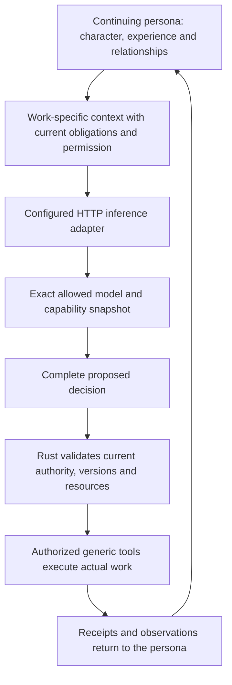

# Models, context and ordinary tools

[Technical guide](README.md) · [Specification](SPEC.md) · [Implementation status](../STATUS.md)

**Target:** direct HTTP inference with AI Personas owning identity, memory, context, tools and action admission. **Observed Rust baseline:** Codex app-server and executable JSON bridges. Implement the new boundary in `provider.rs`, `main.rs` and runtime defaults; documentation alone does not replace those paths.

## A model supports an identity; it is not the identity

**In words:** a persona retains its identity when it changes models. The provider supplies decisions, not a replacement agent runtime with its own tools and memory. CAD, browsers, interpreters and solvers execute through AI Personas' supervised capability path.

## Adapter contract

Expose capability discovery, decision requests, optional streaming, token estimation where supported, cancellation when supported, normalized errors and observed usage. Bind the request to exact call/persona/root/context identities, context manifest, revisions, model ceiling and output limit. Preserve requested and reported model IDs rather than assuming they are equal.

Do not infer vision, generation, context window or price from a model name. Unknowns require configuration/probing or remain unknown. No catalog-order model ranking, hard-coded brand tiers or hidden switch to a stronger model.

Decode complete structured proposals and validate them using the canonical Rust schema. A closed JSON shape establishes neither truth nor authority. Fallback parsing/correction is bounded and paid from the same grant, never arbitrary evaluation of response text. A partial stream cannot execute a command.

Normalize auth failure, rate limit, capacity, timeout, context overflow, malformed/refused output, unsupported modality, cancellation and unknown effect/usage. Retain exact public results and protected diagnostics. Retry/fallback must be authorized and bounded. A safety refusal is not permission to bypass the boundary through another model.

Implement each chosen provider's documented endpoint and credentials. A subscription-specific path, if provided, is a distinct optional adapter with explicit support, scope, expiry and conformance tests. The Rust baseline does not establish it. Never reuse a subscription token as a different API credential or transfer provider secrets as persona memory.

## What belongs in context

Carry the exact current mandate and authority epoch, individual identity/character revision, accepted responsibilities, blocking feedback and applicable agreements; then the persona's selected fragments, relationship perspectives, tool schemas, new attributed inputs and recent receipts. Selection is work-scoped. Do not automatically send every model, peer, record or earlier task.

Critical changes and known blockers must not be starved behind an ordinary message page. Admission checks the revisions actually observed, not newer values substituted after inference. Shared summaries are attributed opinions/documents, not collective authority.

Count the whole serialized request and output reserve. At pressure, allow funded reselection/compaction; if mandatory current state cannot fit, block or use an authorized recovery/model choice. Never silently truncate authority or unresolved obligations. Selection and actual inclusion must both be recorded. Provider-private reasoning/opaque state stays confidential and is not persona memory.

## Media and tool evidence

An actual image input requires verified image bytes delivered to an advertised capable model. A filename, base64 in ordinary text, metadata or an unseen rendering is not visual inspection. Input capability is not output-generation capability. Portrait generation is optional and uses actual authorized media output.

A capability descriptor records exact recipe/source/version, entry point, environment, grants, owner and real acquisition/use checks. Availability, competence and preference remain different. A person using another persona's tool gets use evidence, not the original acquisition credit.

Tool installation and managed sessions require the new isolation boundary. Prefer credential mediation over exposing tokens to arbitrary programs. A self-declared read-only operation, hostname restriction or process group alone is not sufficient enforcement. See [storage/execution](STORAGE.md) and specification Sections 11–13.

## Acceptance before live autonomy

Test exact unfamiliar model identifiers, limits, real media inclusion, structured-output failures, lost responses, usage uncertainty, cancellation, no silent model escalation and rejection of ungranted effects. HTTP and isolation conformance must pass before paid live autonomous tool experiments. An executable fixture bridge can test a legacy interface, not certify the target HTTP implementation.
