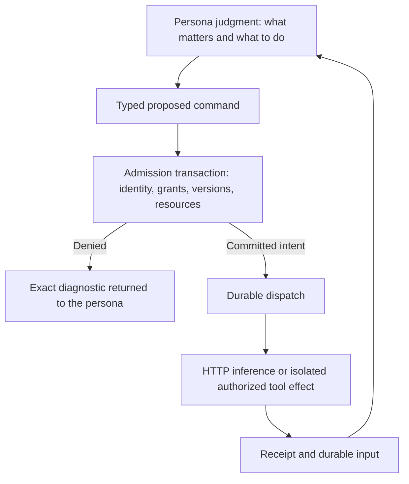

# Technical reading guide

[Plain-language introduction](../README.md) · [Implementation status](../STATUS.md) · [Glossary](../GLOSSARY.md)

The sole target is the existing Rust `rewrite/design-first` branch. This is a modular-monolith design: Rust/Tokio/Axum, the existing SQLite store, immutable artifacts, direct HTTP inference adapters to implement, a supervised isolation boundary to implement, and the matching Preact UI. No other runtime branch supplies code or assumed guarantees.

## One design, different levels of explanation

| Document | Purpose |
|---|---|
| [SPEC.md](SPEC.md) | Canonical v1.2 requirements and invariants; complete behavior, records and guards |
| [CORE.md](CORE.md) | Core-only implementation contract, current source baseline, next batches and private runtime verification |
| [core-gates.json](core-gates.json) | Source-aligned core planning manifest; not a backend API schema or executed acceptance report |
| [STORAGE.md](STORAGE.md) | Transactions, exact versions, asynchronous actions, recovery and wait semantics |
| [PROVIDERS.md](PROVIDERS.md) | Direct inference, model independence, context and tool boundaries |
| [UI.md](UI.md) | Six workspace views, status semantics, current read-only support and future integration |
| [RELEASE.md](RELEASE.md) | Rust file mapping, milestones, migration, packaging and operations |
| [ACCEPTANCE.md](ACCEPTANCE.md) | Mechanical M01–M26 and behavioral B01–B12 gates |
| [API.md](API.md) | **Unchanged generated v1 interface**, not the proposed v2 authoring contract |
| [House example](../examples/HOUSE.md) | Illustrative behavior, counterexamples and full multidisciplinary scope |
| [Source register](../SOURCES.md) | Which attachment or pinned source supports each part |

For core work now, start with [CORE.md](CORE.md). It distinguishes the current reported Rust increment from the historical baseline and leaves UI implementation deferred.

The specification is normative for target behavior. The focused guides are explanatory cross-references. Existing executable functionality is described separately in the status page and generated v1 API. Do not turn proposed Rust names into untyped frontend commands before implementing and generating the backend contract.

## The mechanical and semantic boundary



**In words:** cognition chooses an action. A transaction verifies permission and records its intent. Effects run outside the transaction. Their real outcomes return as evidence for another decision. The runtime enforces the contract without choosing a domain, profession or solution.

## Documentation checks

The executable tools now live in the Rust repository under `tools/design_docs`.
This repository contains no check scripts, browser fixture or build workflow.
From the runtime checkout, with a separate design checkout:

```sh
export AI_PERSONAS_DESIGN_ROOT=/path/to/ai-personas-design
python3 tools/design_docs/scripts/check_core.py
python3 -m unittest discover -s tools/design_docs/tests -v
python3 tools/design_docs/scripts/check_docs.py
```

Reports and Mermaid extraction go to the runtime checkout's `.qa/design-docs`,
not into these design documents. The checks cover repository placement, local
links/anchors, balanced fences, source IDs and unchanged generated v1 API bytes.
All diagrams have adjacent prose equivalents. Their rendering is documentation
validation, never runtime, model or engineering acceptance.

## Core-only implementation checks

The acceptance plan retains 21 invariants, 25 non-UI mechanical gates and 12
behavioral gates; M14 remains explicitly deferred to UI integration. The
migrated validator checks plan consistency, not feature implementation.

Use `tools/design_docs/scripts/verify_rust_core.py` in the Rust repository on a
trusted disposable Linux host and an exact clean Rust checkout to run its
existing suites. The [core guide](CORE.md) supplies the command and evidence
limits. Logs remain private, outside the design and runtime repositories.
See [repository ownership](../REPOSITORIES.md).
