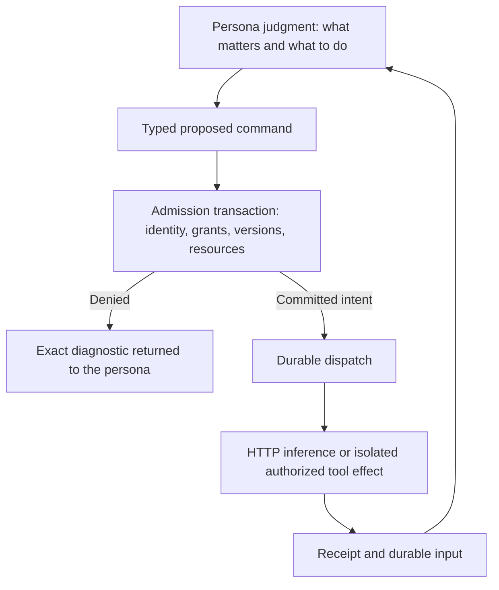

# Technical reading guide

[Plain-language introduction](../README.md) · [Implementation status](../STATUS.md) · [Glossary](../GLOSSARY.md)

The sole target is the existing Rust `rewrite/design-first` branch. This is a modular-monolith design: Rust/Tokio/Axum, the existing SQLite store, immutable artifacts, direct HTTP inference adapters to implement, a supervised isolation boundary to implement, and the matching Preact UI. No other runtime branch supplies code or assumed guarantees.

## One design, different levels of explanation

| Document | Purpose |
|---|---|
| [SPEC.md](SPEC.md) | Canonical v1.2 requirements and invariants; complete behavior, records and guards |
| [STORAGE.md](STORAGE.md) | Transactions, exact versions, asynchronous actions, recovery and wait semantics |
| [PROVIDERS.md](PROVIDERS.md) | Direct inference, model independence, context and tool boundaries |
| [UI.md](UI.md) | Six workspace views, status semantics, current read-only support and future integration |
| [RELEASE.md](RELEASE.md) | Rust file mapping, milestones, migration, packaging and operations |
| [ACCEPTANCE.md](ACCEPTANCE.md) | Mechanical M01–M26 and behavioral B01–B12 gates |
| [API.md](API.md) | **Unchanged generated v1 interface**, not the proposed v2 authoring contract |
| [House example](../examples/HOUSE.md) | Illustrative behavior, counterexamples and full multidisciplinary scope |
| [Source register](../SOURCES.md) | Which attachment or pinned source supports each part |

The specification is normative for target behavior. The focused guides are explanatory cross-references. Existing executable functionality is described separately in the status page and generated v1 API. Do not turn proposed Rust names into untyped frontend commands before implementing and generating the backend contract.

## The mechanical and semantic boundary

**In words:** cognition chooses an action. A transaction verifies permission and records its intent. Effects run outside the transaction. Their real outcomes return as evidence for another decision. The runtime enforces the contract without choosing a domain, profession or solution.

## Documentation checks

`python3 scripts/check_docs.py` checks local Markdown paths/anchors, balanced fences, required coverage and preservation of the generated v1 API. It also extracts Mermaid blocks to `.qa/diagrams/`. The documentation workflow renders those blocks and uploads its check report and diagram images. This is documentation validation, not runtime or persona acceptance.

All diagrams have an adjacent prose explanation. The prose remains usable when a reader's Markdown viewer cannot render Mermaid. The house example is deliberately not a universal workflow.
