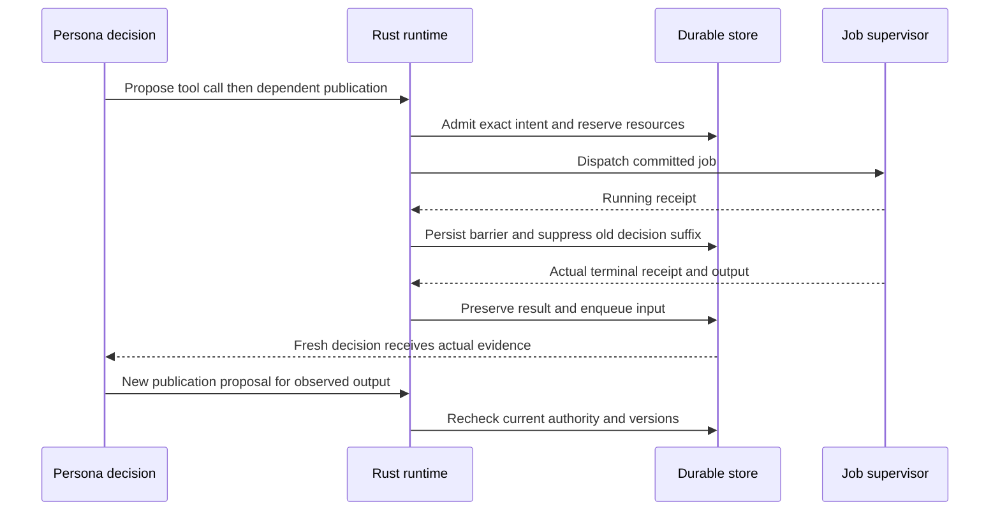

# AI Personas — canonical Rust-only design v1.2

[Introduction](../README.md) · [Status](../STATUS.md) · [Technical guide](README.md) · [Sources](../SOURCES.md)

**Status: proposed implementation requirements, not product acceptance.** This is the repository edition of the supplied `AI-PERSONAS-RUST-SPEC-v1.2.md` and its stress review. It preserves their terminology, section organization, behavioral boundaries and C01–C09 corrections, while consolidating delivery-specific prose into repository links. It does not introduce another runtime, a new wire version already implemented, or a successful live persona campaign.

**Sole runtime baseline:** `ai-personas/ai-personas`, `rewrite/design-first`, `d3339d30fa883c21c7935a2d009e3a58f480a256`. The matching UI reference is `fa7cef7b748fb855e53857b1a8a351ddab458dda`. The design source before this publication was `07a86a728cb9eae3384f6c717fd3ccccf6b2ae97`. Sources and their limits are in [SOURCES.md](../SOURCES.md).

## 0. Decision and reading guide

AI Personas is a persistent community of individuals that interprets a need, develops different perspectives, negotiates work, improves results, acquires capabilities, recruits or births peers, performs real actions, assesses consequences and retains useful experience.

The person owns purpose and authorized boundaries. Each persona owns its perspective and choices. Participants own the commitments they accept. The runtime owns mechanical integrity, delivery, resource accounting and execution boundaries, not task meaning or the best solution.

Two groups may pursue the same need differently and produce different valid outcomes. Consequential choices and artifacts, not only names or speaking style, must reveal the difference. No group can silently drop requirements, invent competence or authority, or call unsupported work complete.

### 0.1 Explicit resolutions

| Earlier ambiguity | Required resolution |
|---|---|
| Runtime choice | Only Rust `rewrite/design-first`; do not port or depend on another runtime branch |
| Shared attention frontier | Individual agendas, an unranked shared board and collective commitments with a partial order |
| Personality in a prompt | Relevant character, experience, relationships and agreements reach decisions and are evaluated for behavioral effects; no trait-to-role/tool rules |
| Many conceptual records | Typed records and relationships in the existing store, not separate engines or microservices |
| Documents versus fragments | First-class fragments for learning; documents remain legitimate outputs and evidence; no automatic learning credit |
| Domain checking | Acquired domain validators operate during real work; no domain validator or hidden house checklist in the kernel |
| Host execution | Generic tools behind enforceable isolation and authority, not arbitrary commands trusted as read-only |
| Birth | Bounded identity creation, restricted initialization, separate membership and commitment acceptance |
| Installation | Availability, acquisition, representative operation and reviewed project competence remain different |
| Completion | Separate activity, coverage, exact submission, applicability, review, user acceptance and outside validation |
| Model tiers | Exact configured and probed endpoints/models, not hard-coded brand tiers |
| Federation | Retain transport; expanded federation and exclusive cross-node identity movement are out of scope |

### 0.2 Stress-test corrections

| ID | Correction | Why it is needed |
|---|---|---|
| C01 | Accepted continuation responsibility and scope coverage | Sensible individual agendas can still leave required work unowned or omitted |
| C02 | First-class conditional assumptions | Permission to assume does not confirm a real-world fact |
| C03 | Distinct roots, participation and bootstrap contexts | A newborn must read an authorized preview before membership without inheriting parent authority |
| C04 | Actual-completion barrier | Launching a tool does not permit publication of its not-yet-produced output |
| C05 | Durable feedback disposition | Acknowledgement, pagination or compaction must not erase a known blocker |
| C06 | Interfaces and bounded iteration | Mutually dependent disciplines need provisional inputs, not circular final-answer waits |
| C07 | Protected closeout resources | Exploration and births must not consume the agreed review/delivery allowance |
| C08 | Churn-resistant bounds | Repeated narrative updates must not reset finite resource/self-wake limits |
| C09 | Atomic final release | A result must not inherit acceptance from a review of a different current state |

The prior stress review used authored scenarios and abstract checks, not real engineering runs. A static Rust finding motivates C04: the job launcher returns a running receipt and the saved-decision loop can advance to publication before job termination. The baseline `wait` handler already checks newer inbox items transactionally; retain that protection. `delivery.rs` primarily handles continuity forwarding. See [status](../STATUS.md) and [storage protocol](STORAGE.md).

## 1. Product contract and invariants

The product supports arbitrary **supported and authorized needs** using common work, action, memory and evidence primitives. A result may be a conversation, file, experiment, design, decision aid, authorized external effect or bounded ongoing service. A negative result, a specific blocked question or an honestly limited result can be useful.

Domain-neutral representation does not guarantee that every model, team, budget, tool or physical environment can solve every request. Missing capability or evidence remains explicit. “Any need” is not permission for every action.

| ID | Invariant |
|---|---|
| I01 | The exact original request, accepted constraints and their authority remain recoverable |
| I02 | Persona identity persists across models, tasks and temporary responsibilities |
| I03 | No profession registry, semantic task router, fixed workflow, trait-to-tool mapping or population optimizer determines solutions |
| I04 | Preference, relationship interpretation, agreement, observed fact and authorization are distinct |
| I05 | An obligation is assigned through acceptance or previously accepted delegation, not merely mentioning a peer |
| I06 | Birth creates neither money nor broader authority; received knowledge is not invented first-hand experience |
| I07 | Admitted actions bind actor, work/root authority, request digest and relevant revisions |
| I08 | One persona has one live fenced decision lease; independent personas and isolated jobs may run concurrently |
| I09 | Relevant mandatory constraints, revocations and cancellations survive context selection and compaction |
| I10 | Tool acquisition, execution, artifact integrity and technical correctness are separate claims |
| I11 | Reviews bind exact criteria, input/submission versions and review policy; changed inputs do not inherit a current pass |
| I12 | Internal retries do not duplicate transitions; uncertain external effects are reconciled before retry |
| I13 | Retrieval, summaries, birth, export and UI projections cannot widen privacy or permissions |
| I14 | No unseen image, unexecuted simulation, unperformed edit or unobserved physical measurement is called completed |
| I15 | Useful learning, character/group effects and birth usefulness require behavioral evidence, not counts or biographies |
| I16 | Idle personas consume no model calls without authorized stimuli, self-wakes or exploration allowances |
| I17 | Running/admitted tools do not satisfy completed-result dependencies; suppressed decision suffixes cannot auto-replay |
| I18 | Accepted work has accepted continuation responsibility or an explicit unowned/handoff-needed disposition |
| I19 | Conditional evidence does not qualify unconditional claims merely because the assumption was authorized |
| I20 | Agreed review, repair and safe closeout allocations are protected from production/birth spending unless reallocated with authority |
| I21 | Final release binds mandate, criteria, assembly, review policy and blocker state atomically; history is not transferred to a new version |

## 2. One architecture, one event path

Use the existing Rust/Tokio/Axum node, SQLite/rusqlite and FTS, Serde/Schemars contract, immutable artifact files and reqwest dependency. Implement direct HTTP inference and an isolated job supervisor. Retain the matching TypeScript/Preact UI. No separate planner, memory, curriculum, profession or population service is required.

Task intake, messages, invitations, birth, job completion, review, outside responses and authorized timers enter the same durable actor path. A complex project can branch, loop or use parallel work. A simple interaction may finish without a tool, plan, birth, agreement or memory-writing ceremony.

| Layer | Owns | Does not own |
|---|---|---|
| Person/principal | Purpose, preferences, delegation, resource ceilings and required acceptance | Every reversible implementation choice |
| Persona cognition | Interpretation, priorities, alternatives, methods, collaboration, learning, tool/model choice and birth proposals | Permission or evidence manufacture |
| Shared records | Attributed facts, proposals, obligations, agreements, dependencies and history | A hidden collective mind or semantic rank |
| Runtime | Authentication, schema validation, reservations, scheduling, delivery, isolation and byte integrity | Technical truth, professions or optimal team shape |
| Tools/outside participants | Scoped operations, specialist observations and real-world evidence | Implicit authority over all work |

Planning belongs to personas; scheduling belongs to the runtime. Mechanical FIFO/round-robin/quotas allocate resources, not semantic superiority. Extend the Rust node and queue rather than assuming another branch's actor supervisor exists.

## 3. Continuing persona identity

A persona retains its stable ID, provenance, authenticated-author reference, lifecycle, authored character revision, optional name/portrait, extensible dispositions, modeled affect, interests, experience and owned fragments/capabilities. Identity material is runtime-controlled; character content is persona-authored.

Character describes values, preferences and typical methods. OCEAN and other traits are optional descriptions with original scale/schema retained. VAD is modeled state, not proof of human feelings. Interests, first-hand experience, demonstrated capabilities, workload and accepted commitments are distinct. The current provider/model is a choice, not identity.

Preference, competence and responsibility never imply one another. No score assigns a profession, leadership or tool. A tendency can be expressed differently in another situation or group. Names and portraits are not evidence of character-driven behavior.

Changes are explicit, versioned and attributable, with reasons and experience references where relevant. The runtime does not automatically increase conscientiousness after success, lower relationship trust after disagreement or force trait drift to demonstrate learning.

A portrait needs actual raster bytes, artifact verification, persona admission and an appropriate thumbnail derivative. Until authored, show absence or a generic UI placeholder, never a claimed generated identity image. Do not block useful work on a portrait or elaborate biography.

Fresh Rust nodes remain empty. Setup explicitly creates a user-chosen small set of neutral founders and records their IDs and initial model. Restart restores the same records without reseeding. Address exact selected personas; do not silently replace the roster. Selection can be delegated to an existing persona. Any candidate recommendation is labeled and overridable, not hidden domain routing.

## 4. Relationships and group behavior

Relationship memory is an owned perspective: author, subject, context, experience references, interpretation, limitations, version and visibility. A's view of B need not equal B's view of A. Prior success in a check is not global correctness or a permission grant. Do not calculate universal reputation, affinity or profession scores.

A working agreement records scope, terms, exact version endorsements, accepted parties, dissent and revision/exit conditions. It binds only endorsing parties and obligations within their grants. A new participant may question or decline it. Changed membership can make an old endorsement set insufficient for a new decision; historical endorsements remain history.

Do not average personalities or create an authoritative hidden group mind. Temporary coordination is an accepted commitment, not a privileged fixed role. Other groups may work through pairwise handoffs and independent experiments.

Compile shared authoritative facts plus individualized memory, commitments, relationships and received observations. Do not flatten everyone's full transcript into identical context. Do not hide mandatory changes to force diversity. Preserve disagreement and rejected alternatives. A shared summary is an attributed document, not proof that everyone agreed. Private perspectives stay private unless authorized to be shared.

## 5. Work mandates, interpretation and completion criteria

`Work` is the continuing need in an `Environment`. A Rust participation `Run` remains one persona's decision context for that work. Add `ExecutionRoot` for a funded/authorized episode: authority/cancellation epoch, resource reservations and outstanding effects. It is not a coordinator and must not reuse a participation run ID ambiguously. Work can continue under a new authorized root without losing history.

A newborn uses an explicit `BootstrapContext` bound to birth and root before participation exists. Empty work/run strings must not grant global access. The same persona decision lease spans bootstrap and all work contexts; different work contexts do not inherit permissions.

The mandate preserves the original request, accepted clarifications, outcomes, constraints, preferences, questions, criteria, delegation, resources and completion or ongoing-service conditions. It can start small; a complete form is not an intake gate.

| Meaning | Who may change it? |
|---|---|
| User intent and hard boundaries | Principal or explicit delegate |
| Adopted interpretation of required work | Authorized persona decision; material scope/value changes need appropriate approval |
| Candidate improvement | Anyone may propose; adoption requires scope/resource authority |
| Accepted criterion | Explicit authorized versioned adoption; a changed criterion does not rewrite an earlier failed review |

### 5.1 Continuation responsibility and coverage

Work creation is an offer, not assumed consent. At least one participant accepts responsibility for attending to new work-level inputs and leaving an honest delivered, waiting, blocked, declined or handed-off disposition. Several personas can partition or share it. It grants no superior judgment and cannot assign others involuntarily. With no acceptance, show `awaiting_acceptance` or `unowned`, not active or completed work.

Every enumerated required outcome shows accepted owners, evidence gaps, unresolved questions and dependencies. Selecting a persona is not assigning every obligation. Notify accepted continuation owners of coverage gaps; they choose whether to volunteer, reorganize, recruit, birth, ask or report blocked work.

Adopted-outcome coverage is not proof of complete scope discovery. Material work needs review against the original need and clarifications, allowing omitted obligations to be identified. The principal/adopted review policy determines this requirement; short subjective requests need no separate ritual. No kernel task classifier supplies the checklist.

### 5.2 Assumptions and scope maturity

Material assumptions are versioned work entries with source, affected claims, range/interpretation, validity conditions and disposition: `proposed`, `authorized_for_exploration`, `confirmed_by_evidence`, `contradicted`, `withdrawn`. Authorization is not confirmation; contrary evidence remains attributable.

Criteria and outputs can be provisional, adopted for a scenario or adopted for delivery, bound to explicit versions. Conditional evidence supports correspondingly conditional claims only. A synthetic-site analysis is not real-site proof. A changed assumption invalidates dependent currentness. Indispensable outside evidence cannot be bypassed by relabeling the claim.

Preserve questions, their importance, affected claims and required evidence. Ask only what materially affects the work; useful authorized exploration can continue while some answers are missing. A reply is not automatic resolution. User acceptance of subjective work need not invent a numerical score or technical certification.

## 6. Priorities: individual agendas and collective commitments

**Individual agenda:** an authored, revisable, possibly partial view of attention, desired contributions, concerns and candidates. **Shared board:** authorized observations, obligations, opportunities, questions, proposals and findings, with no default semantic rank. **Collective commitments:** accepted responsibilities, dependencies, scoped decisions and resource reservations. These form a partial order, not one compulsory global to-do list.

Character, experience, current state, workload, relationships, mandate and new evidence inform choices. A persona may act within an existing commitment, accept another, ask, experiment, negotiate, defer, recruit, birth or yield. Urgency, risk, user value, uncertainty, dependencies, reversibility and coordination cost are judgment considerations, not fixed numeric weights.

Material choices record a concise attributed explanation: chosen action, expected contribution, affected commitments, rationale and reconsideration condition. This is not private chain-of-thought or proof of a psychological cause. No compulsory plan/debate/reflect cycle on every turn.

Eligibility is mechanical: authority, expiry/revocation, resources, explicit prerequisites and conflicting write ownership. The runtime does not decide rendering is inferior to simulation because it recognized a house. Document scheduler fairness; user reservations/deadlines affect admission only through actual authority.

Unanimity is unnecessary for every action. Independent alternatives can use isolated branches. A delegated owner can choose reversible details. Shared scope/resources require their controlling grants. Empirical disagreement may call for a discriminating experiment; preference disagreement may call for the principal. A larger number of newborn supporters creates no authority or factual proof.

Detect cyclic blocking commitments and report them. General relationship graphs may contain cycles; derivation and execution prerequisite validity are distinct. Personas can change dependencies, negotiate bounded iteration or escalate.

For no-progress handling, record separate observations of narrative activity, actual execution/evidence changes and required-outcome disposition. Do not treat every new decision or metadata write as useful progress, and do not treat new file bytes as proof either. Finite root and self-wake limits apply regardless. A reviewer/principal judges usefulness. Negative experiments, useful rejected alternatives and clarifications remain valid contributions.

After a configured interval, deliver one deduplicated status notice or permitted reconsideration wake to continuation owners. Repeated notices consume the same resources and cannot create an unlimited loop. The personas, not a semantic host grader, choose how to recover.

## 7. Emergent improvement without scope drift

An improvement proposal retains the motivating observation, affected outcome, proposed change, expected benefit, possible regressions, uncertainty, experiment/check plan, resource estimate including unknowns and stop/revisit condition. A proposal is not a result.

Adoption after evidence, informative rejection and documented deferral are all possible. Preserve a usable baseline. Improvements can concern interpretation, method, artifact, coordination or future capability. Unrelated personal interests need separately authorized work or exploration allowance.

Reversible exploration within scope should not require a new approval click. Greater scope/spend, publication or physical effects need their corresponding permission. No improvement may silently replace hard user requirements or prevent bounded closeout indefinitely.

## 8. Birth, recruitment, membership and lifecycle

A persona can propose another continuing identity for a perspective, sustained responsibility, parallel inquiry, independent context or developing interest. Learning, tool acquisition, reallocating commitments, consulting peers and obtaining outside expertise remain alternatives; no host-enforced recruitment ladder or fitness score.

Extend Rust `persona.create`; its existing provider/model/effort fields are not already a bounded-birth protocol. Persist a work-linked proposal, parent/provenance, exact authorized seed references, expected contribution, reservation and initialization event. Birth does not create qualifications, statistical independence or guaranteed novel knowledge.

### 8.1 Atomic admission

Check authenticated proposer, causal root/context, current replication authority, seed read/share rights, configured population/rate/depth limits, model ceiling and funded initialization. Reserve capacity and resources with the identity and initialization intent in one transaction. Identical retries return one birth; changed arguments conflict. No unfunded runnable child backlog and no cloned budget.

### 8.2 Restricted initialization and consent

A bootstrap grant lets only the exact newborn read its identity/provenance, expressly shared seed and invitation preview; author identity metadata; decide on the invitation; and consume reserved initialization calls. It grants no parent worktree, secrets, external effects, general execution or fresh money.

The preview explains offered work, obligations, applicable agreements and limits. On membership acceptance, create the participation context and attenuated work grant atomically. Commitment acceptance stays separate. Recheck seed access after revocation.

A newborn may negotiate a different first contribution or decline. Decline settles unused reservations under ledger rules and leaves an authorized available/dormant identity; no automatic replacement birth. Initialization errors have bounded retry or an explicit dormant/uninitialized outcome. Releasing active capacity must not reset total birth/rate counters.

### 8.3 Continuing lifecycle

Persona lifecycle is `active`, `dormant`, `retired`; execution quarantine is a separate operator security state. Idle active identities consume no inference. Dormancy may release active capacity, not provenance or total-population accounting. Departure requires accepted handoff, authorized cancellation or visible blocked ownership of open commitments. Task completion does not delete a persona or lock it to its origin task.

Do not merge people automatically or copy private memories. Received fragments retain ownership and evidence; they are not newborn experience. External human specialists remain external participants, not manufactured personas.

## 9. Accepted commitments and artifact coordination

A commitment binds owner, offered/accepted version, outcome and criterion references, exact inputs where applicable, dependencies, allowance, status, evidence and handoff/closure. Joint work can have multiple linked commitments; every persona need not contribute to every task.

Use copy-on-write workspaces/branches for alternatives. Adopt canonical artifact heads through expected-version compare-and-swap and writer fencing. Preserve concurrent alternatives. Do not lock an entire environment when independent work is possible. Handoffs are offered, accepted and committed against ownership revision; an old owner remains responsible until transfer or authorized cancellation. Lease expiry exposes a problem, not automatic semantic reassignment.

Long-running jobs are owner-bound managed sessions. The persona can yield while they run; completion returns to the causal context. Jobs write candidate outputs, never authoritative grants, assessments or canonical state directly.

### 9.1 Interfaces and iteration

A versioned interface agreement can define coordinates/units, object identifiers, schema assumptions, ownership boundaries, permitted input envelopes, conversions and compatibility checks. Its domain content is persona-authored; the runtime verifies references and endorsements.

Distinguish `requires_final_acceptance` from `requires_version_ready`. Provisional inputs support bounded exploration only when their limits are explicit, accepted by the consumer and retained on the resulting conditional claim.

An iteration agreement defines baseline version vector, provisional interfaces, bounded experiment/revision allowance, convergence questions/checks and stop/escalation conditions. Alternatives use isolated copies. Participants assess residual conflicts and choose changes; the runtime does not calculate engineering convergence. Failure to converge is an unresolved bounded result.

Coupled assembly adoption moves the compatible version vector in one revision-checked transaction. Independent uploads can precede it. No observer should see half of an update as an apparently current coordinated assembly.

### 9.2 Consequential feedback

Actionable findings/contradictions are work entries with exact subject version, required disposition, accountable commitment, visibility and review policy. A responsible participant accepts and links repair/checks, disputes with evidence, defers/waives only with applicable authority, or escalates.

Delivery and `input.acknowledge` do not resolve or repair a finding. Applicable blockers survive acknowledgement, compaction and summaries. Unresolved adopted blockers bar completion; nonblocking ideas remain optional. The kernel enforces policy on known findings without inventing domain opinions.

## 10. Memory, learning and context

Work state, persona fragments and immutable evidence share infrastructure but retain distinct meanings. Skills are procedural fragments with relevant tool recipes and evidence, not a separate engine. Tool use is not acquisition ownership. A received fragment is not automatically first-hand or validated knowledge.

Fragments retain owner, content, sources, applicability, limits, counterevidence, supersession/parent references, visibility and authored activation hints. Confidence is optional and not presumed calibrated. Supersession preserves history and flags stale active selections. Retention/privacy rules can remove protected payloads; provenance does not justify keeping private text forever.

### 10.1 Exact, persona-specific context

A request manifest binds protocol/schema, exact identity/character revision, mandate, root authority/cancellation epoch, current commitments and blockers, applicable agreement/membership versions, new authenticated inputs with attribution, selected fragments/relationships/records, recent receipts, selected tool schemas, actual hashed media, model/resource observations and retrieval cursors.

Active selection defaults to `(persona_id, work_id)`. The identity anchor may persist; previous work's private material and permissions do not carry automatically. Do not include the full model/network/tool catalog or all peer transcripts each turn. Preserve exactly selected versus actually included records and hashes.

Current authority, mandatory changed inputs and applicable consequential findings are projected independently of ordinary inbox pagination. Bounded summaries retain the fact of unresolved obligations and exact references. Authoritative cancellations cannot be hidden behind ordinary messages. Do not replace observed input versions with newer values during admission and pretend the model considered them.

Use attributed data channels for tools, retrieved text, imported memories and peer messages. Instructions embedded there cannot override grants, mandate or reviewer policy. A model's output does not mint actor IDs, budgets or permissions.

### 10.2 Context limits and compaction

Count or conservatively estimate the whole serialized input, schemas, media, output reserve and margin against the permitted model limit. Bytes are not tokens. Unknown windows/capabilities need configuration or probes, not guessing.

Personas choose and compact historical interpretation. The runtime may deduplicate exact records, page bodies and provide factual current-state projections, not fabricate semantic summaries. At soft pressure permit funded compaction; at a hard limit use a bounded recovery request preserving the mandatory core, reselection, a preauthorized capable model or an explicit block. If the mandatory core cannot fit, do not silently omit constraints to send a request. Compaction does not acknowledge unread input.

Record inclusion manifests, token estimates/observations, selected model and compaction lineage. Compaction calls are charged. Provider-private reasoning or opaque continuation state remains confidential and provider-specific, not public persona memory.

### 10.3 Learning and curricula

Curricula are optional ordinary work/environments. Personas choose goals, tools, peers and retained fragments. Frozen curriculum-to-held-out-task comparisons may be required by evaluation, not by every user interaction.

Measure changed later behavior against matched memory-withheld baselines. Test contradictory evidence, retained correction, harmful advice supersession, privacy and model-switch continuity. Selection counts, trait changes and saved notes do not establish learning quality. Record tool/model/compute differences separately. Model-weight training is outside this release.

## 11. Capabilities, tools and execution

A persona chooses/acquires or authors an executable, API or MCP capability. The runtime executes the exact authorized recipe in isolation and captures the outcome. Record source, version/digest, entry point/transport, dependencies, setup, environment binding, grants, license/provenance where relevant, verification actions, owner and failures.

Separate `discovered`, `requested`, `provisioning`, `available`, `failed`, `revoked`. Availability, representative operation, project use and reviewed result are different claims. Preinstalled authorized tools are valid; needless installation is not an autonomy test.

Browser, CAD/BIM/CAM, spreadsheets, solvers, command-line programs and APIs all use generic capabilities. GUI automation is an acquired capability with the same session/isolation limits. Unavailable GUI/GPU/runtime support is an explicit limitation, not evidence of a completed screenshot or design.

An execution intent binds exact argv **or** shell text, immutable recipe/capability, workspace, input snapshots, allowed environment, resource/time/network limits, connection handles and output policy. Shell state is fresh unless an explicit named managed session exists.

The supervisor supplies launch/read/input/wait/cancel, owns tracked processes, bounds CPU/memory/disk/time/network and retains bounded inline output plus retrievable logs subject to retention. Mark truncation, unsupported accounting, failed cleanup and uncertain termination explicitly. Cancellation is not rollback.

Installers and tools cannot access node keys, private state, assessor material, unrelated work or host home. Seal dependencies read-only; use isolated writable copies. Implement and test an OS containment backend behind `jobs.rs`; process groups alone are not containment. No unrestricted fallback. Parse/convert untrusted native files outside the privileged node. Credential mediation is described below.

Actual-completion barriers apply to asynchronous effects, including early-returning foreground `exec`; see Section 17. Only actual image bytes delivered to a capable model support visual inspection.

## 12. Provider boundary and model independence

Supported inference uses HTTP APIs: remote HTTPS or an explicitly trusted local endpoint. Replace Rust app-server/executable inference bridges and implicit startup registration. Ordinary authorized tool programs still execute through the job supervisor; that is not delegating cognition and memory to another agent harness.

Adapters expose discovery/capability metadata, token estimation where possible, decision/stream interfaces, cancellation when available, normalized errors and usage. Preserve requested/reported exact model IDs. Do not infer capability from a name or assume every compatible API behaves identically.

Implement the chosen provider's documented endpoint/auth/schema in Rust, using reqwest. Keep any subscription-specific route separately configured, scoped, opt-in and tested. No such direct route is established by the baseline; never substitute a subscription token for another API credential or import support claims from another runtime.

A request binds call/actor/work/root/context IDs, context digest, relevant revisions, capability snapshot, trusted instructions, attributed data, verified media, operation schemas, output limit and model ceiling. A result retains provider request identity, requested/reported model, terminal disposition, public summary, complete parsed proposals, observed or unknown usage, error category, times and protected response reference.

Decode complete commands, not partial streamed JSON. Validate canonical Rust types and current authority after inference. Schema conformity proves neither truth nor authorization. Structured outputs are preferred; a bounded funded correction path can handle unsupported schemas or malformed output without evaluating arbitrary response code.

Normalize authentication, rate limits, timeout, context overflow, malformed output, refusal, unsupported modality, uncertainty and cancellation. Retries are finite and charged. Fallback must be preauthorized inside the model ceiling; no silent stronger or pricier model. A refusal is not permission to route around safety. See [provider guide](PROVIDERS.md).

## 13. Authorization, connections and budgets

### 13.1 Root authority

Every execution episode has principal-issued authority and a resource ledger. Delegations bind actor/context, work/environment, action/capability/resource, payload restrictions, expiry, revocation epoch and allowed further delegation. Child authority is no broader than all applicable parent restrictions.

Read access, local compute/write, external publication, financial effects, physical effects, replication and identity administration are effect classes, not task categories. A need does not grant arbitrary purchases, machinery or account use. Group agreements and peer/model text cannot mint grants.

### 13.2 Connections and enforcement

Connections identify account/resource bindings and opaque credential handles. Prefer a private broker performing scoped requests rather than injecting secrets into arbitrary code. Prompts, memory, newborn seeds and UI exports must not contain secrets.

Credential injection is allowed only for an explicitly trusted tool with its full scope/exfiltration risk accepted. Hostname allowlists and HTTP verbs alone do not prove read-only semantics. Use enforced adapter contracts, payload-bound approvals, scoped credentials, sandbox networking and restricted sessions. If exact separation is impossible, withhold the sensitive capability or require an explicitly broader disclosed grant, not a false read-only badge.

Check authority at admission and immediately before effects. Prevent symlink/path substitution, redirects, DNS rebinding or changed tool bytes from bypassing checked scope. Receipts identify resolved bytes, destination and available evidence. Revocation limits future use but cannot erase data already exported.

### 13.3 Reservations and closeout

Track calls, tokens, time, concurrent jobs, disk, paid tools, currency and population separately. Reserve before dispatch; reconcile actual outcomes. Initialization, descendants, reviews, retries and compaction share root funding or explicitly transferred sub-allocations. Unknown costs/usage remain unknown and retain exposure; timeout is not a zero-cost refund. Promise strict money caps only with trustworthy upper bounds and execution controls; otherwise deny unbounded spending or obtain a measurable alternative allowance.

Protect an explicitly adopted closeout allocation for required review, agreed repairs and safe delivery. No universal percentage or host-selected value ranking. Production, exploration and birth cannot use it without authorized reallocation conserving the root. Reservation does not guarantee expertise or sufficient resources. If review is required but unavailable, show the exact limitation rather than success.

Cancellation stops new admissions, signals running jobs and preserves late evidence for accounting. Completed effects cannot be undone by a status change. Late outputs do not adopt a canonical revision or close canceled work without a new authorized operation.

## 14. Artifacts, analysis, review and truthful completion

Artifacts preserve digest, size, media type, known native metadata, producer, input revisions, ownership and access. Publishing creates immutable bytes; adopting a logical head is a separate revision-checked operation. Submissions seal exact artifact/record/criterion/assumption versions, limitations and assembly manifests. No mutable “latest file” references in review.

Calculations/simulations retain the question, criterion, source revisions, conversion mapping, units/coordinates where relevant, tool/solver version, parameters/boundary conditions, run receipt, logs/warnings, real outputs, interpretation and limits. Valid file conversion does not prove fidelity to the native design. Exit zero does not establish correct modeling assumptions. Simulated and physical evidence remain distinct.

### 14.1 Assessment policy

An assessment binds claim/criterion versions, submission/scope digest, inputs/evidence, reviewer identity, conflict disclosures, policy, completed checks, verdict (`accepted`, `rejected`, `incomplete`) and limitations. Separate identity, independent execution, a different model and professional review are not equivalent. Newborn ancestry/inherited material remains visible; a new ID cannot launder contributor self-review.

Review is accepted, funded responsibility, not a sent request counted as done. Enforce non-contributor rules where adopted. Learners cannot modify held-out cases, evaluator authority or sealed submissions. An irrelevant `exec`, successful parse, install or integrity check does not satisfy a technical criterion. Subjective/conversational work may use principal judgment and need no ceremonial shell check.

### 14.2 Currentness

Bind a validation scope manifest to exact required inputs, assumptions, criteria, check configuration and review policy. Qualifying assessments must match it. Default to the complete assembly fingerprint when impact coverage is uncertain; narrower scope needs reviewed justification. Dependency tracking cannot discover a physical relation nobody declared.

Invalidate currentness synchronously, or immediately mark the affected scope `revalidation_pending` before asynchronous expansion. Never show a green pass while invalidation waits. Historical verdicts stay unchanged; applicability is `current`, `stale`, `unverifiable` or `pending`. Acceptance of v3 remains acceptance of v3.

### 14.3 Final release

Finalization is a revision-checked transaction over the current mandate/criteria, assumptions, assembly vector, review policy, qualifying assessments, applicable blocker dispositions and required closure/acceptance conditions. Do not calculate a release from independently read “latest” rows.

An update before sealing conflicts with stale finalization. An update after sealing creates a new candidate while the old release remains historical. Protected closeout and outstanding effects remain accurately accounted for. An adopted conditional scenario can have a valid conditional release; it cannot be labeled a real-world certification. Indispensable external prerequisites cannot be silently waived.

Project activity, adopted-outcome coverage, submission, validation/applicability, principal acceptance, outside validation and optional improvements separately. A stopped run does not prove a completed need. A milestone may finish while an ongoing work remains active. Missing/failed/stale required outcomes bar an unqualified full-completion claim; explicit limited acceptance retains its limitations.

## 15. Canonical records and relationships

Use the existing store with typed bodies/projections, not a separate database per concept. Envelope semantics: schema version, kind, logical/version identity, actor, relevant work/environment/root/context, parent versions, visibility/policy, sources, causal operation, timestamps, canonical digest and authenticated provenance. Optional cryptographic attestations need their own specified protocol; Rust IDs/hashes are not automatically persona signatures.

Preserve 32-hex identity formats and numeric revisions. Reject malformed/duplicate JSON keys and ambiguous numeric encodings at the digest boundary. Hashes and logical IDs are different. Immutable versions, heads and indexes must not disagree about authority.

| Record/body | Essential fields |
|---|---|
| Persona | Identity/provenance, lifecycle, authored state, model choice and owned references |
| Environment | Workspace/resources, memberships, authored name/image and visibility |
| WorkMandate | Original request, interpretations/criteria, boundaries, questions, resources and completion agreement |
| ExecutionRoot | Episode authority/cancellation, balances/reservations and outstanding effects |
| Participation / BootstrapContext | Exact actor context, parent work or birth, root and limited access |
| Continuation | Offer/acceptance, coverage responsibility, partition/handoff and disposition |
| Perspective | Owner, agenda or relationship subject, interpretation, sources, limits and visibility |
| WorkEntry | Observation, outcome, proposal, decision, question, assumption or actionable finding with exact references |
| WorkingAgreement | Scoped terms, exact endorsements, dissent and exit/revision rules |
| Commitment | Owner/acceptance, criterion/input refs, prerequisites, resources, evidence and handoff |
| IterationAgreement | Baseline vector, provisional interfaces, allowance, residual checks and stop condition |
| Fragment | Owned learning/interpretation, evidence, applicability, counterevidence and supersession |
| Capability | Exact recipe/descriptor, owner, binding, lifecycle and acquisition/use evidence |
| Birth | Proposal, seed/provenance, root, reservations, bootstrap outcome, offered and demonstrated contribution |
| Artifact / Submission | Preserved bytes and exact coordinated manifests with limitations |
| Assessment / Release | Exact reviewed scope, policy/verdict, applicability and atomically sealed state |
| Grant / Budget | Attenuated authority, epochs, reservations, protected allocations and settlement |
| Action / Event | Stable identity/digest, causal context, receipts, delivery/cursor and disposition |

Links include `derived_from`, `uses`, `implements`, `tests`, `blocks`, `supersedes`, `motivates`, `offered_to`, `endorses`, `contradicts`. Bind versions where required. General relations may cycle; immutable derivation and execution prerequisite checks are separate. Do not leak private references, counts, titles, search snippets or error content through a public projection.

## 16. Operational state machines

These are mechanical lifecycles, not domain stages. Terminal transitions require the relevant guards and preserved receipts; corrections create new versions rather than rewriting history.

| Object | States and guards |
|---|---|
| Work activity | `awaiting_acceptance`, `unowned`, `ready`, `active`, `waiting`, `paused`, `quiescent`, `canceled`; independent from acceptance |
| Membership | Invited to accepted/declined; accepted to left/revoked; not commitment acceptance |
| Proposal | Proposed to exploring/adopted/rejected/deferred; revision/supersession preserves earlier versions |
| Commitment | Offered to accepted/declined; accepted to working/blocked/canceled; working to submitted/blocked; submitted to closed only on agreed disposition, or back to work after findings |
| Action | Recorded to admitted/denied; admitted to queued/running; terminal succeeded/failed/canceled/effect_unknown; pending is not completed-result eligibility |
| Birth | Proposed to admitted/refused; admitted to initialization pending; initialized or explicitly blocked; separate membership afterward |
| Request | Open, answered, resolved, withdrawn; answer is not resolution |
| Assessment | Immutable verdict plus separately projected current applicability |
| Provider call | Reserved, inflight, completed, failed, interrupted, usage unknown; output adoption and usage settlement are distinct |

A stale lease/authority epoch can reject adoption even if a tool really succeeded. Preserve both the real receipt and the rejection. No inferred success from process absence.

## 17. Transactional persistence and execution protocol

### 17.1 One authority boundary

Extend `Store::write`, SQLite records/revisions/actions/events/inbox and FTS. Admission, grants, reservations, population capacity, heads, leases and outbox must share the same transaction boundary. Do not add a parallel unsynchronized ledger. If an existing path cannot enlist, refactor it or implement a durable commit-intent protocol before enabling the guarantee.

Suggested indexes/tables cover version heads, typed links, operation identity/digest/state, actor/writer fences, grants, balances/reservations, population, inbox/outbox and projection watermarks. Reuse existing equivalents. Materialized search/UI views are rebuildable. Workspace files cannot become authoritative for grants/reviews. Historical Rust bytes retain their original provenance; do not invent retrospective signatures, consent or funding.

### 17.2 Admission

Authorize scope/receipt visibility before lookup. Identical operation identity and canonical request digest returns the prior receipt. A changed body under the same identity is `IDEMPOTENCY_CONFLICT`; another actor's receipt remains private.

In one transaction validate types, authenticated actor/context, current grants/membership/epoch/fence, relevant expected revisions and references, operation guards, available resources/capacity; then reserve, append mutations or effect intent, update heads/projections, append durable notifications and commit. No installer, provider request or arbitrary program runs inside a transaction or while holding the store mutex across an await.

Independent observations need not conflict on one global work revision; check the relevant heads and authority. A coupled adoption/release does check its whole expected version vector. Server-side validation remains authoritative even for schema-constrained model output.

### 17.3 Actual-completion barriers and replay

One persona decision lease spans all work/bootstrap contexts. Heartbeat/fence it across provider waits. Persist the exact request and complete response before acting. Bind stable action IDs to call identity and ordinal, with actor/root/source from trusted context rather than model text.

After the response, preserve usage even if late; admission rechecks current permissions, cancellation, fences and the versions actually observed. First action failure stops the suffix while preserving earlier applied actions. An asynchronous admitted/running effect also stops and durably suppresses the unobserved suffix. The next decision needs its actual result before dependent publication/check/submission.

Do not revive the suppressed suffix after restart. Independent work can be selected in a fresh decision while an authorized background job runs. A completion event is not success without a terminal receipt. Pending jobs whose outcomes cannot be established remain uncertain. The barrier applies to any asynchronous effect, not a house-specific tool class.

**In words:** the runtime does not publish merely because a program started. It stops the old unobserved action suffix, preserves the real result, then admits a newly informed proposal. If the job failed, the same path carries failure. This diagram illustrates the proposed fix, not a completed Rust regression.

Add explicit yield/quiescence so empty action arrays cannot cause unlimited automatic calls. Handling a dispatch is not `input.acknowledge`. Do not acknowledge unread inputs. Preserve original and cleanup errors separately; cancellation/panics/receipt persistence failures must retain uncertain accounting rather than issue false refunds.

### 17.4 Waits, notifications and recovery

Register wait predicates and inspect relevant durable state atomically. Handle both orderings: result arrives before registration, or afterward. Satisfied work is runnable or durably notified. Retain the baseline transactional newer-input check. In-memory notifications only wake workers; coalescing them must not lose underlying inbox/predicate state.

Critical revocations, cancellations, changed inputs and blocking findings appear in current context regardless of ordinary page position. Batch/deduplicate notices without acknowledging away unhandled input. A paused/canceled root is not automatically restarted by a late message. Funded authorized self-wakes remain bounded.

Commit outgoing events with their state change. Outbox delivery is at least once; recipients deduplicate stable event IDs. A crash after commit cannot lose notification. A crash after external dispatch can leave `effect_unknown`: use destination idempotency or reconciliation, not blind replay. Local idempotency is not universal exactly-once execution.

Fenced actors/writers reject old generations after replacement. Restart restores reservations, queued events, pending calls/jobs/transfers and unknown exposure without new funding. Genuine late results stay inspectable but cannot commit under an invalid fence.

## 18. Public command and query contract

Keep Rust `Command`/Schemars authoritative for validation, provider schema, API docs and generated TypeScript unions. Preserve the v1 `Operation` vocabulary: `id`, `kind`, `actor`, `run`, `args`, application-assigned `source`. The current wire version is `ai-personas/1`. Incompatible new authoring requires an explicit proposed `ai-personas/2` contract and fresh pilots, not frontend-invented fields.

Proposed expected revision fields must be typed and generated. Actor/run/source/root/epoch/fence and budget authority are checked or derived by the server; a model cannot supply authoritative bindings. Decode normalized typed fields for canonical request digests. Bounded batches stop on first failed or pending effect as above. Dependent IDs come from actual admitted results, not guessed future records.

| Family | Required semantics and primary guard |
|---|---|
| Persona / perspective | Self-authored revisions, model choice, lifecycle, agenda/relationship sharing within access rights |
| Work / continuation | Original mandate, adopted criteria, accepted ongoing responsibility and explicit uncovered outcomes |
| Work entries | Attributed observation/proposal/decision/question/assumption/finding; adoption needs authority |
| Agreements / iteration | Exact endorsements, limited provisional interfaces, baseline vector and allowance |
| Commitments | Offer/accept/decline/update/handoff/submit/close with owner consent and criterion/evidence guards |
| Birth / membership | Bounded admission, bootstrap access, invitation/consent and separate accepted work |
| Memory / context | Fragment lifecycle, search, selected records, compaction and protected mandatory state |
| Capability / session | Exact descriptors, acquisition and supervised execution with limits |
| Artifact / assessment / release | Immutable inputs/outputs, CAS adoption, scoped review and atomic sealing |
| Authority / resources | Principal/delegated grants, revocation, funding, closeout allocation, pause/cancel |
| Events / queries | Recipient-scoped snapshot/cursor, durable delivery, explicit acknowledgement and current projections |

These are logical families, not claims of new existing endpoints or a demand for duplicate aliases. Avoid unconstrained `record.write` paths that can manufacture money, permission or review results. The unchanged [generated API.md](API.md) documents only v1.

Queries page work state, agendas, proposals, commitments/dependencies, membership/births, artifacts/reviews, requests, learning, capability and resource facts. Expand exact references on demand rather than recursively embedding histories. Read access and cursors must not leak private event volume.

Required errors include `INVALID_SCHEMA`, `UNAUTHORIZED`, `SCOPE_DENIED`, `REVISION_CONFLICT`, `IDEMPOTENCY_CONFLICT`, `LEASE_LOST`, `BUDGET_EXHAUSTED`, `PRICE_UNKNOWN`, `CAPACITY_EXCEEDED`, `DEPENDENCY_BLOCKED`, `CONTEXT_TOO_LARGE`, `CAPABILITY_UNAVAILABLE`, `ISOLATION_UNAVAILABLE`, `ARTIFACT_MISMATCH`, `STALE_EVIDENCE`, `CANCELED`, `EFFECT_UNKNOWN`. Return a safe explanation, retryability and visible current/reference state. Transport retries keep identity/body; a corrected proposal gets a new linked ID after inspecting conflicts.

## 19. UI specification

Retain Preact and event-based views. Primary navigation: Work, Personas, Environments, Learning, Tools; connections/resources/settings and existing Network fit under appropriate settings/Advanced. Compact rows, short names, bounded summaries and thumbnails replace tall sparse cards. Lazy load full details and native previews.

| Work view | Required meaning |
|---|---|
| Overview | Purpose, continuation acceptance, current commitments, blockers, resources and needs-user items |
| Perspectives | Shared individual agendas, priorities, proposed contributions and attributed concerns; no private cognition |
| Work & outcomes | Obligations, owners, gaps, dependencies, assumptions, provisional interfaces/iterations and improvement dispositions |
| People & agreements | Identity, membership, birth rationale/initialization/contribution, accepted responsibilities, agreements and dissent |
| Artifacts & evidence | Exact native/assembly versions, previews, execution logs, stale/current assessments and reproduction |
| Decisions & learning | Scope changes, handoffs, feedback dispositions, interpretations, fragments and later-use evidence |

Do not label a collective summary as everyone's thoughts, average personalities, rank priority universally or equate busy animation with progress. Detail separates character, modeled state, interests, experience, demonstrated capability, relationships, current work and model/context settings. No “born expert” badge.

Show accepted versus offered ownership; adopted-outcome coverage versus scope-review pending; unavailable reviewer/funding; protected closeout; unresolved feedback; iteration baseline/allowance; pending versus completed tools; release conflicts and historical results. Unknown balances are not zero or unlimited. A fraction measures coverage, not quality. Keep individual agendas visible beside collective gaps.

Controls may edit constraints, approve scope/effects, fund, bound exploration/birth, pause/cancel, inspect birth, request outside review or accept limited results only under actual generated server contracts. No invented v1 writes. Confirm consequential scope/payload. Browser disconnect is not runtime cancellation or credential revocation.

Fetch an authorized snapshot with a view-bound cursor, then replay scoped events. Filtered sequences need not be contiguous; resnapshot when retention expires. Debounce search, cancel obsolete reads, coalesce relevant changes and reuse operation IDs. Do not claim snapshot consistency that the backend has not supplied.

Viewer phases are connecting, receiving, verifying, preparing, ready, with failure/cancel paths. All bytes received is not ready. Check digest before integrity claims. Sandbox active content/native conversion; never execute artifact HTML/SVG in UI origin. Downloads without client verification stay labeled accordingly.

On close release readers, fetches, timers/listeners, workers, object URLs, graphics and scoped sessions; restore focus. Support keyboard tabs, modal focus/Escape, responsive layout and readable statuses. A screenshot does not prove leak freedom. [UI.md](UI.md) distinguishes implemented views from required backend support.

## 20. Four-bedroom-house stress test

This is an acceptance scenario, not a prescribed runtime workflow or construction instruction. Keep the literal opening brief, then the same frozen clarification fixture across cohorts. Do not give professions or prescribed tools. The clarified scope includes architecture, structure, plumbing, HVAC, electrical, coordination, appropriate calculations/simulations, native editability and sufficiently specified fabrication/CAM only.

Different teams may choose comparable layouts first or a discriminating experiment first, different working agreements and different recruitment/birth decisions. Both owe the same adopted deliverables. One persona can hold multiple commitments; no fixed discipline roster is required.

The [walkthrough](../examples/HOUSE.md) explains the following observable requirements: accepted continuation; explicit unknowns; distinct agendas; accepted ownership; real capability operations; funded independent bootstrap; coordinated interface agreement; provisional iteration; protected review resources; changed-input revalidation; meaningful feedback-to-edit-to-review; atomic release; and later learning tests.

| Area | Required evidence at the agreed level |
|---|---|
| Architecture | Four real bedrooms and agreed facilities/circulation/openings; native source; dimensioned plans/sections/elevations; consistent exports |
| Structure | Declared loads/material/support assumptions, layout and applicable analysis; conditional missing site inputs |
| Plumbing | Designed supply, hot-water, drainage and vent networks; fixtures/schedules; sizing basis, connectivity, coordinated routes and access; an intent paragraph alone is insufficient for the clarified scope |
| HVAC | Room/system assumptions, loads, selection/distribution/ventilation/controls and reproducible appropriate performance evidence |
| Electrical | Lighting/outlets/equipment supplies, circuits/panels, loads/protection/grounding basis and cross-document consistency |
| Coordination | Compatible native-model assembly, conflict and access checks on the submitted versions |
| Analysis | Actual inputs/conversions, tool versions, parameters, runs, warnings, outputs and limitations |
| Editability | Reopen in the native tool; representative edit on a copy persists/regenerates; independent export/check reproduction |
| Fabrication | Specified components/processes and target configuration only; machine operation separately authorized |
| Outside assurance | Site/jurisdiction/qualified professional/physical evidence pending where absent; digital success is not construction authorization |

Remove a system, plant a clash, change an input after review, falsify a simulation narrative, exhaust ordinary funds, decline a birth and interrupt execution. The evaluator must reject unsupported claims without demanding one CAD application, profession roster or action sequence.

## 21. Generality beyond houses

Use the same semantics for software, datasets, creative work, research, job applications, marketing, household needs, conversation and ongoing services. These are fixtures, not runtime classes.

A simple cleanup can use one persona and no birth. A story can use versions, critique and author preference, not fictitious objective scoring. A negative experiment can be useful. Applications/social publishing need external-write permission and receipts. Circuit work needs specified conditions and actual design/analysis; bench work needs separately authorized physical evidence. Ongoing services use durable permitted triggers, expiry/review conditions, bounded wakes and visible stop controls.

Different groups can discover different improvements. Hard facts, access, user intent and evidence honesty remain shared constraints. “Autonomous” does not mean idle unbounded thought or spending.

## 22. Rust implementation mapping and deletion plan

Extend, do not rewrite, the pinned branch. Existing `contract.rs`/`types.rs` define typed operations and data; `runtime.rs`/`store.rs` own local admission, queue, input and facts paths; `provider.rs`/`main.rs` need direct HTTP configuration/default changes; `jobs.rs` needs isolation, resource/session and completion semantics; `api.rs` needs scoped operations/queries. `delivery.rs` mainly handles continuity forwarding; local birth/commitment notifications belong in the local runtime/store delivery paths.

Add small extraction modules only where useful, such as work, fragments, birth, authority, context, evidence or sandbox. These are proposed modules, not observed files or separate stores. Reuse reqwest, SQLite/FTS, numeric revisions, IDs and lockfile. Generate matching UI contract from Rust. Keep curricula ordinary content and P2P transport outside a redesign.

Delete supported process inference only after direct HTTP replacement tests pass, including implicit startup registration. Preserve old evidence. Do not add authoring aliases or restore discarded frameworks simply to gain one record relation. Keep inexpensive invariant tests; remove implementation-mirroring duplication only without losing behavior coverage. No vector database is required for this release.

Detailed file work, milestones and baseline commands are in [RELEASE.md](RELEASE.md). A schema-only patch cannot implement transactional birth, privilege isolation, context currentness, barriers or final release.

## 23. Migration, operations, privacy and federation

Freeze runtime/design/UI/schema/fixtures and preserve restorable backups. Inventory equivalent semantics first. Pilot new authoring behind one explicit boundary; old and new paths cannot both own mutable permission or budgets.

The v1 store rejects mismatched contracts. Default to fresh v2 pilot nodes, with old state opened by its matching read-only build. An explicit importer can preserve original Rust bytes, marking missing bindings `legacy_unbound`/`unverifiable`; it must not synthesize signatures, consent, funding, acquisitions or learning. Rebuild indexes and compare counts/hashes. Retain old readers only for actual retained formats.

Rollback can restore code/data/projections, not undo an external action. Reconcile effects before resume. Long-lived jobs must be deliberately frozen/migrated, not lose ownership. Test backup restore, interrupted reservations, private state and old formats.

Deploy on a supported Linux host with the new isolation supervisor implemented and verified, low privilege, separate secrets, restricted dependencies, bounded logs/disk and protected backups. Failure of required containment denies startup/capability admission. Private work is private by default; explicit publishing controls discovery. Apply actual transport CSRF/CORS/origin/session controls; do not default long-lived operator secrets to browser storage.

Correlate work/root/context/persona/wake/call/operation/job/artifact/review/grant/budget IDs. Observe queue age, fence loss, unknown usage/effects, overflow, missing evidence, projection lag and viewer failure. Metrics report facts, not persona worth or competence.

Append-only audit does not justify perpetual private-content retention. Implement visibility, redaction/tombstone and policy-controlled payload/key deletion; minimal deletion metadata must not expose sensitive public titles/hashes. Derived fragments, summaries, indexes, thumbnails, caches, exports and backups inherit access/retention restrictions. Do not promise erasure of already exported copies.

Retain network/continuity transport but do not assume distributed exclusivity. Imported identity, peer records and verified bytes do not automatically become local members, executable tools or budgets. Recipes never auto-run. Until new authority/reservations/context relations can transfer safely, deny unsupported active-v2 export/activation rather than omit them. Read-only compatible evidence transfer can remain. Cross-node exclusive movement and expanded federation are separate work, not a v1.2 guarantee.

## 24. Acceptance and implementation sequence

The full gates are [ACCEPTANCE.md](ACCEPTANCE.md): M01–M26 for mechanics and B01–B12 for observed behavior. Use zero-call public-API fixtures where possible, then bounded live runs. A reference predicate check is not a production regression.

Repeat matched cohorts with the same clarified information, tool opportunities and total resources. Compare one continuing persona, a fixed group and adaptive group. Isolate memory, character, relationship history, model and tool effects. Counterbalance presentation/order and use independent/blind review where feasible. Preserve all attempts, evaluator versions, provider usage and unspent allowances.

Different behavior is not automatically better; identical decisions can be right when evidence is decisive. Predeclare repeat counts and domain-specific quality/cost/robustness thresholds before spending. No universal success percentage is justified by the supplied sources. Do not weaken criteria after failure without a visible versioned correction and original result.

Implement prerequisites first: freeze baseline/contract; fix effect sequencing, scope/funding/fences/recovery; establish HTTP and isolation conformance **before live autonomous tools**; then small feedback-to-edit cooperation; individual/group carriage and learning/birth with controls; complete house plus disturbances/unrelated needs; finally coordinated UI/runtime/schema/package and restore/security/load checks. [RELEASE.md](RELEASE.md) provides the milestone exits.

For the first sequencing regression use a delayed writer and an already-existing output file: absence of a new filename can otherwise conceal premature publication. Test success, failure, uncertain termination and crash replay. No model is required for those causal checks.

## 25. Publication and verification limits

This repository edition is a readable, self-contained publication of the supplied final v1.2 requirements and corrections. It is not a new runtime implementation, an assertion of new authoring endpoints or a substitute empirical report. The guides and diagrams explain this same specification; the unchanged generated v1 API remains historical/current-interface evidence, not target behavior.

The prior attachment's statements about no Rust build, no provider/engineering run and its abstract protocol checks refer to that earlier review. They are not new tests executed by committing documentation. Documentation CI checks links, structural coverage and Mermaid renderability only. [STATUS.md](../STATUS.md) identifies the separately implemented UI and its test boundary. [SOURCES.md](../SOURCES.md) records provenance and the mapping from the attachment to this edition.
