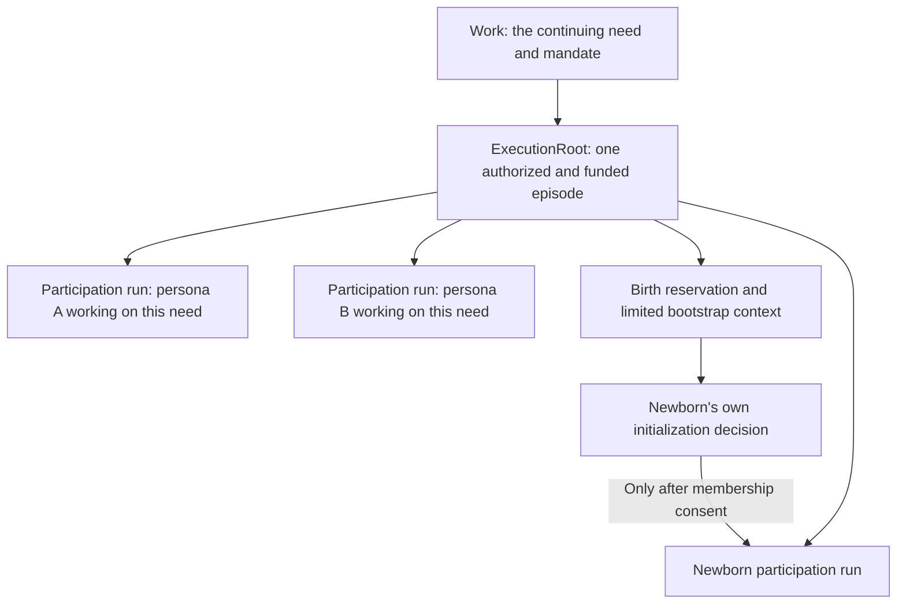
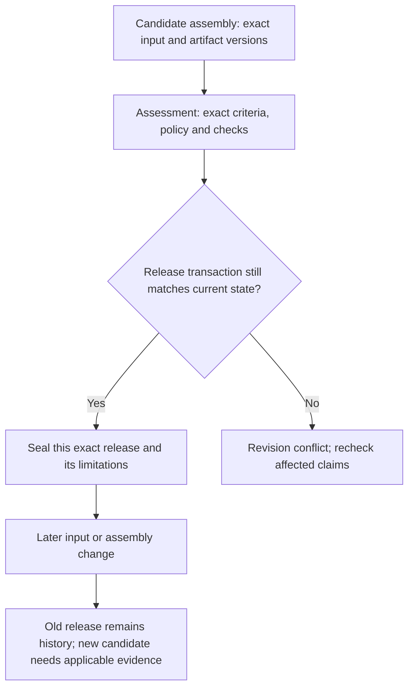

# Persistence, execution and recovery

[Technical guide](README.md) · [Canonical requirements](SPEC.md) · [Status](../STATUS.md)

This page explains target v1.2 semantics. The pinned v1 Rust store already uses SQLite, WAL, full synchronous writes, revisions, action identities, events, inbox records and FTS. That consistency machinery is a starting point, not proof of isolation, new funding/consent guarantees or completed v1.2 behavior.

## Keep the identities unambiguous

**In words:** the need persists across episodes. The root owns shared authorization and resource accounting; each participant has its own decision context. A newborn can initialize before membership, using a restricted context paid from that same root. A root is not a coordinating persona. Empty-string contexts never grant global access.

Retain the existing 32-hex IDs and numeric revisions. Logical identity, immutable version and content digest are different things. Do not relabel an unsigned record or hash as a persona signature.

## One transactional admission boundary

Extend `src/store.rs::Store::write`; do not introduce a second ledger beside it. The transaction must cover permission, relevant expected versions, actor/writer fences, resource and population reservations, record changes or job intents, heads, affected projections and outgoing events.

Receipt lookup first checks access. Same operation identity and canonical payload returns the original receipt. Changed payload conflicts. Separate actors cannot retrieve each other's private action just by guessing an ID. Independent observations need not contend on one global work revision; a coupled assembly adoption must check its complete expected vector.

No network request, installer or arbitrary tool runs inside the SQLite transaction. Do not retain a blocking store mutex across an asynchronous wait. Use committed effect intents and durable completion receipts. The actual implementation needs fault injection, not just a schema diagram.

## A launch receipt is not a result

The targeted static review of Rust `runtime.rs` and `jobs.rs` identified a same-decision race: `jobs::start` returns after spawn; `operate` marks `exec` running; `apply_decision` continues until a failed receipt; foreground waiting happens in a later `work_loop` entry. Publication can therefore capture old bytes while regeneration is pending. This is a source-path finding, not a reproduced run here.

The required barrier is deliberately conservative. Persist the pending action and suppress the unapplied suffix of that saved decision. After the actual result arrives, a fresh funded decision selects the next actions using real evidence. Never replay the suppressed suffix after a crash. Independent work can be chosen in a new decision while a background job remains pending; guessed future IDs and unobserved outputs are not usable dependencies.

The first regression uses a file that already exists plus a delayed writer. Testing only a new filename can hide the defect because early publication merely fails with “file missing.” Include successful, failed and uncertain jobs, cancellation and crash recovery.

## Waiting and feedback are separate

The baseline `wait` handler already checks newer inbox data transactionally. Keep it. Extend durable predicates to terminal-job waits, changed inputs and other relevant conditions, covering both result-before-registration and registration-before-result orderings.

An in-memory wake is only a hint to recheck durable state. Deduplicating/coalescing wake hints must not remove an inbox event or a satisfied predicate. Critical authority changes and known blockers belong in the current context independently of ordinary history pagination.

| Fact | Does not imply |
|---|---|
| Message delivered | Persona read or accepted it |
| `input.acknowledge` recorded | Finding resolved |
| Repair promised | Artifact changed |
| Artifact changed | Check passed |
| Check passed for one scope | Entire current work accepted |

Unresolved findings retain accountable dispositions. A work summary cannot erase them.

## Exact versions and final release

**In words:** do not build acceptance from separately fetched latest values. A release seals the mandate, criteria, assumptions, compatible assembly, review policy, applicable assessments and blocker dispositions together. If a relevant update wins the race, finalization conflicts. If release wins, a later update is a new candidate, not a rewrite of the old verdict.

Review currentness uses an exact validation scope. Default to the whole assembly fingerprint when dependency coverage is uncertain. An asynchronous invalidation job must first mark the affected scope revalidation-pending so the UI never shows an old green result while processing is queued.

## Recovery and effects

Persist the model response before applying actions and bind operation identities to call plus ordinal. Preserve stop-on-first-failure, the pending-effect barrier and explicit yield/quiescence. Old workers cannot commit under a newer fence. Usage is recorded even when the late proposal is no longer adoptable.

The outbox commits with state and delivers at least once; receivers deduplicate events. Unknown outside effects need destination idempotency or reconciliation before retry. A local action ID cannot guarantee exactly-once behavior at every remote site. Timeouts retain possible usage/exposure instead of issuing false refunds.

Restart restores pending events, reservations, leases, jobs, transfers and unknown effects. It must not mint fresh budgets, infer success from a missing process, lose ownership or acknowledge unread inputs. Preserve the original error even if cleanup also fails.

## Files, history and privacy

Native files are untrusted candidates until published and adopted under scope. Preserve exact bytes and revisions; archive references avoid recursive history copies. Byte integrity is not technical correctness. Parse native/active content outside privileged node and UI origins.

Search, summary, graph and event views enforce access. Private references and aggregate counts must not leak. Old data retains its actual unknown bindings. Retention/deletion applies to payloads and derived fragments, previews, indexes and backups; append-only audit is not permission to retain private content forever.

`src/delivery.rs` mainly owns continuity-forwarding behavior. Extend local notifications where runtime/store admission already delivers them. This change is not a P2P rewrite and adds no distributed exclusive-identity guarantee.
