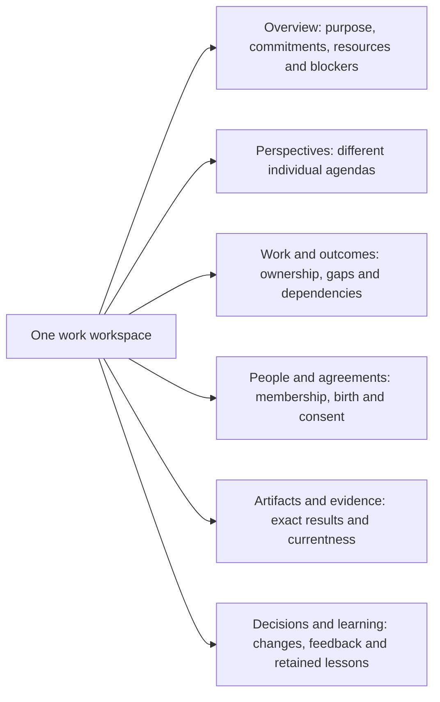

# The workspace people should see

[Introduction](../README.md) · [Specification](SPEC.md) · [Status](../STATUS.md) · [Interactive design](../design/index.html) · [Prototype guide](../design/README.md)

The UI answers six questions: what are we trying to accomplish; what does each persona care about; who accepted responsibility; what changed; what evidence applies now; and what needs the person?

This page now maps the seven supplied desktop/mobile designs to the Rust-only v1.2 contract. The [canonical specification](SPEC.md), especially sections 19 and 24, remains authoritative for behavior. This is a design-repository change, not an implementation of missing Rust operations or a replacement for the matching Preact UI.

**In words:** these are views over the same work, not mandatory workflow stages. A persona can preserve a different agenda even when the group has a coverage gap. People should see that tension rather than an invented universal priority.

## 1. Visual sources and precedence

The FINAL family supplies the calm application shell, Work overview, Personas cards, information-request dialog and initial work detail. The WORKSPACE family supplies the richer work-level presentation of changing priorities, outcome versions, decisions, new membership and stale evidence. They are complementary reference surfaces, not competing backend architectures.

The [source manifest](../design/source-images.json) records original filenames, dimensions and SHA-256 fingerprints. Those entries identify the supplied PNGs; they are not claims that the images are checked-in runtime evidence. The runnable fixture renders new HTML rather than using screenshots as its interface.

| Supplied reference | Design use |
|---|---|
| `FINAL-DESKTOP(1).png` | Sidebar, Work heading, needs-answer callout, filters/search, compact rows, three separate status facts, recent activity |
| `FINAL-MOBILE(1).png` | Compact brand header, stacked request action, full-width search, labelled work cards and bottom navigation |
| `FINAL-PERSONAS(1).png` | Continuing identities, intentional initials, character, current attention, retained notes and acquired-tool counts |
| `FINAL-REQUEST-MOBILE.png` | Focused information-request form, unknown answers, explicit non-permission notice, in-memory preview disclosure |
| `FINAL-WORK-DETAIL(1).png` | Work summary, input, brief, contributors, independent reviewer, permissions and limits |
| `WORKSPACE-DESKTOP.png` | Evolving mandate, shared root allowance, priority rationale, outcome versions, changes and decisions |
| `WORKSPACE-MOBILE.png` | Single-column reading order and horizontally scrollable, keyboard-reachable work tabs at very narrow widths |

### Deliberate refinements, not silent source changes

The pictured FINAL shell has Work, Personas, Environments and Learning with Settings as the fifth mobile destination. The fixture follows that arrangement and exposes Tools through Settings. **The production specification still requires Tools as a first-class main destination** and Network under Advanced; this compact fixture does not amend that requirement.

The pictured initial detail has three overview/result/activity tabs. The fixture retains its overview layout but exposes all six canonical work views. The standalone replay has its own compact tabs plus an explicit Perspectives view. No required information disappears merely because a reference screenshot did not show it.

The WORKSPACE priority card is labelled **Current priority · Authored choice** instead of implying a universal host ranking. The displayed owner and reason are attributable fixture content; other individual agendas remain separately inspectable.

The pictured 100-per-run decision limit and the separate 120-call root allowance belong to different illustrative contexts. Do not add them, equate a participation run with an execution root, or give every descendant another allowance. Protected closeout is **not supplied** in the visual fixture and remains unknown, not zero.

## 2. Current UI implementation is not the backend contract

The pinned [UI implementation note](https://github.com/ai-personas/ai-personas-ui/blob/fa7cef7b748fb855e53857b1a8a351ddab458dda/docs/RUST-V1.2-UI.md) describes the six work views, Tools navigation, compact rows, read-only record adapters, stable ambiguous retries, improved stream recovery, native dialogs and digest-verified bounded previews. It retains existing Rust v1 actions and the generated v1 interface. This update does not change or independently re-audit that sibling repository.

The adapters can render proposed coordination record kinds when returned, but they do not enforce consent, funding, privacy, accepted responsibility or release sealing. Whole-work acceptance and authoritative required-outcome coverage must remain **Not established** where v1 lacks the needed atomic projection. Missing data is not zero, unlimited money or permission.

New production mutation controls must come from the implemented/generated Rust contract, not guessed untyped writes. Do not invent a budget, birth consent, approval or release-seal endpoint to make a mock-up look complete. The [generated v1 API](API.md) is deliberately unchanged.

## 3. Visual system and responsive layout

Use a quiet warm-white workspace, white content surfaces, dark green primary text/actions, muted secondary text and fine sage borders. Amber identifies an outstanding request or conditional state; blue identifies activity; red identifies stale/inapplicable evidence. Always pair color with text.

The fixture centralizes these implementation choices in [styles.css](../design/styles.css): background `#f5f7f2`, surface `#ffffff`, ink `#263e34`, primary `#24573f`, secondary `#617267`, border `#dbe3d6`, and a visible amber focus ring. These are reference-derived tokens, not a claim of pixel-identical extraction or an accessibility certification. Use system fonts; no font service or generated portrait is required.

Desktop starts with a 224 px sidebar, 72 px topbar and 42 px content gutters. Content cards have approximately 13 px corner radii and 20–24 px padding. Primary actions are at least 44 px high. Work rows present identity and latest activity before activity, latest version and evidence. Borders and spacing separate information without a dashboard of unrelated counters.

At 700 px and below, remove the sidebar, retain the compact 69 px brand bar and use 18 px gutters. Move navigation to the bottom with safe-area padding. Reserve content space so the fixed navigation does not hide the last control. Work rows become labelled cards, and the search field spans the available width. At very narrow widths, allow actions, names and explanatory text to wrap; do not hide meaning with ellipses or force page-wide horizontal scrolling.

Intermediate widths reduce gutters, adapt row layout and collapse supporting columns. The richer work detail stacks its supporting cards after the primary content. The standalone replay reads: mandate and allowance, current choice, required outcomes, what changed, outside evidence, recent decisions. Tabs may scroll within their own strip; the page itself must not overflow.

## 4. Work overview

The heading explains the page in one sentence. New work is the primary action. The highest visible information request is a dedicated amber callout with requester/work context, a short question, why the information matters and an Answer request action. It is not an external-action approval.

Filters are **All work**, **Needs you** and **In progress** with explicit counts. Search composes with the active filter; typing remains immediate and preserves the caret. An empty result says that no work matches and offers a clear route back to All work. Filtering never changes underlying work state.

Each work item shows its short title, environment, participating identities, latest attributed activity and three independent facts:

| Fact | Starting fixture | Must not imply |
|---|---|---|
| Activity | Needs you / Working | Completed outcome, valid evidence or accepted ownership |
| Latest version | No submission | An invisible deliverable or a successful review |
| Evidence | Not assessed | A pass, a failed check, or verified outside results |

Participant count does not prove consent or ownership. A locally drafted need remains **Awaiting acceptance**, with no automatically selected personas. Recent activity is labelled sample/authored activity. The prototype's in-memory reset notice must remain visible; a sentence about preservation in the proposed runtime is not a persistence guarantee for this page.

## 5. Personas and supporting destinations

Lead with continuing identity, not provider configuration. Use intentional initials until real, verified portrait bytes exist. Each card separates authored character, current attention, retained notes and acquired tools. Counts are not competence, learning quality or progress scores.

Persona detail separates identity, optional OCEAN/VAD, interests, retained experience, capability evidence, responsibilities, relationships visible to the reader, model/context and provenance. Unprovided traits remain absent. A local presentation draft must not pretend that a model authored a biography or that a real persona was born. Do not average a group's personality or show an expert badge based on a name.

Environments show the place and available work/resources, with explicit access boundaries. Learning shows authored notes with applicability, sources and limitations, not a graduation metric. Tools distinguishes availability/acquisition/operation/task evidence. Settings shows actual connection and resource state; absent credentials and unknown cost must not become a connected badge or a zero balance.

## 6. Information requests and permissions

The mobile dialog retains the reference order: requester/work, question, explanatory text, non-permission notice, answer field, help text, preview disclosure, Cancel and Record response. “Not known yet” is a valid nonempty answer. Whitespace-only and excessive input are rejected with an accessible error. User text is rendered as text, never executable markup.

The lifecycle is **open → answered → resolved**, with withdrawal separately available in the runtime contract. Receiving an answer does not resolve the question. In the fixture only the first transition is implemented: the response is recorded locally, the work waits for assessment, and evidence/submission state remains unchanged. Duplicate response submission is not accepted as another transition.

Use a native modal dialog with an accessible heading, explicit focus containment, Escape, background inactivity, scroll containment and focus return to the opener or a stable fallback. A short viewport scrolls the dialog rather than clipping its actions. Closing removes local dialog contents and the body scroll lock; it does not cancel real work.

A separate scoped-approval preview explains the required principal, resource/account, action/payload, expiry and revocation. When none is supplied, it has **no Approve button** and grants nothing. Never turn an information response, a group agreement or a local preview click into external authority.

## 7. Work detail and evolving work

The application detail preserves the reference layout: back link and pause control, independent status strip, work views, primary summary/input/brief cards, and supporting contributors/permissions cards. Summaries are attributed, not a statement of what everyone thinks. Pausing activity is not cancellation, rollback, release or acceptance.

| Canonical view | Required distinctions |
|---|---|
| Overview | Offered need versus accepted continuation; active versus completed; ordinary versus protected closeout resources |
| Perspectives | Individual proposal versus collective commitment; shared agenda versus private interpretation |
| Work & outcomes | Selected participant versus accepted owner; adopted checklist versus original-scope coverage; assumed versus confirmed input |
| People & agreements | Born versus initialized; invited versus member; offered versus accepted commitment; interest versus expertise |
| Artifacts & evidence | Launched versus completed tool; integrity versus correctness; historical verdict versus current applicability |
| Decisions & learning | Delivered versus acknowledged versus disposed feedback; retained note versus demonstrated useful transfer |

The replay switches among three **authored snapshots**, not mandatory phases or a running simulation. The house example moves from clarification and ownership gaps to a bounded invitation, then consent and revalidation after a provisional model change. Model v4 does not inherit the thermal assessment bound to model v3. The old result remains visible as stale. A native-check receipt is not integrated acceptance, professional approval or construction permission.

Dataset and story fixtures use the same renderer to illustrate no-birth restraint and subjective author acceptance. They do not measure domain generalization or prove emergence. Each scenario preserves original-purpose/outside boundaries and leaves missing authoritative status unknown.

Expose unowned outcomes, reviewer availability/funding, protected closeout balance, bootstrap/invitation states, unresolved finding dispositions, provisional interfaces, exact iteration baseline and remaining allowance, tool pending/completed status and release conflicts. A coverage fraction refers only to adopted outcomes; an incomplete scope review prevents it from being an overall completion percentage.

## 8. Production data and lifecycle requirements

Keep Preact and the existing event-based architecture. Details, previews and history load on demand. Use authorized snapshot-plus-cursor reads, replay relevant events, reconnect from the last applied scoped cursor and re-snapshot when retention expires. A filtered stream need not have contiguous global sequence numbers.

Debounce server search without delaying typing, abort superseded reads, coalesce scope-specific invalidation and clear previous-work state. Stable operation IDs and exact bodies survive ambiguous retries. A corrected proposal uses a new identity linked to the failed operation; a revision conflict requires inspecting the changed state. After reload, in-memory recovery maps are gone: inspect receipts before resubmitting.

Statuses are server-derived and bound to exact inputs, criteria, assembly, policy and blocker revisions. An acknowledged message does not dispose a finding. A pending job does not satisfy a completed-result dependency. A stale review cannot qualify a new release. The UI cannot enforce the missing transactional Rust guarantees merely by displaying their proposed fields.

Artifact viewer states remain connecting, receiving, verifying, preparing and ready, with independent failure/canceled paths. Transfer at 100% is not readiness. Verify hashes before claiming integrity; integrity is not correctness. Active HTML/SVG must not execute in the application origin. Native conversions require the appropriate isolation boundary.

On close/unmount, abort reads, release readers, terminate workers, revoke object URLs, dispose graphics, remove listeners/timers and close relevant scoped sessions. Closing a view does not revoke tokens or cancel persona work. A frontend cannot repair the unsandboxed Rust v1 execution boundary.

## 9. Acceptance and evidence

Use the [fixture tests](../design/README.md) for responsive layout, filtering, safe text rendering, keyboard tabs, modal focus/cleanup, explicit unknowns, request-answer semantics, unowned drafts, bounded replay and absence of invented approval controls. Preserve test failures and corrections separately from claimed results.

The recorded [verification manifest](../design/verification.json) concerns this authored HTML fixture only. It does not establish Preact integration, server transport behavior, access enforcement, complete leak freedom, useful persona cooperation or engineering results. The sibling UI's [pinned CI run](https://github.com/ai-personas/ai-personas-ui/actions/runs/35169941532) is separately reported evidence and is not rerun by this design publication.

Production acceptance still requires the Rust-backed public-API, privacy, replay, load and disposal cases in the [acceptance campaign](ACCEPTANCE.md). A rendered screenshot is a visual observation, not a successful autonomous house-design run.
