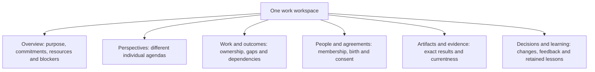

# The workspace people should see

[Introduction](../README.md) · [Specification](SPEC.md) · [Status](../STATUS.md)

The UI answers six questions: what are we trying to accomplish; what does each persona care about; who accepted responsibility; what changed; what evidence applies now; and what needs the person?

**In words:** these are views over the same work, not mandatory workflow stages. A persona can preserve a different agenda even when the group has a coverage gap. People should see that tension rather than an invented universal priority.

## Current UI implementation is not the backend contract

The pinned [UI implementation note](https://github.com/ai-personas/ai-personas-ui/blob/fa7cef7b748fb855e53857b1a8a351ddab458dda/docs/RUST-V1.2-UI.md) describes the six work views, Tools navigation, compact rows, read-only record adapters, stable ambiguous retries, improved stream recovery, native dialogs and digest-verified bounded previews. It retains existing Rust v1 actions and the generated v1 interface.

The adapters can render proposed coordination record kinds when returned, but they do not enforce consent, funding, privacy, accepted responsibility or release sealing. The current UI intentionally leaves whole-work acceptance and authoritative required-outcome coverage **Not established** where v1 lacks the needed atomic projection. Missing data is not zero, unlimited money or permission.

New mutation controls must come from the implemented/generated Rust contract, not guessed untyped writes. Do not invent a budget, birth consent, approval or release-seal endpoint to make a mock-up look complete.

## Views and precise labels

| View | Key distinctions |
|---|---|
| Overview | Work offered versus continuation accepted; active versus completed; ordinary versus protected closeout resources |
| Perspectives | Individual proposal versus collective commitment; shared perspective versus private interpretation |
| Work & outcomes | Selected participant versus accepted owner; adopted checklist versus scope-review coverage; assumed versus confirmed input |
| People & agreements | Born versus initialized; invited versus member; offered versus accepted commitment; interest versus expertise |
| Artifacts & evidence | Launched versus completed tool; integrity versus correctness; historical verdict versus reported current applicability |
| Decisions & learning | Delivered versus acknowledged versus disposed feedback; stored fragment versus demonstrated useful transfer |

Show unowned outcomes, unavailable reviewers, initialization/consent states, provisional interfaces and exact iteration baseline, remaining allowance, unresolved findings, conditional claims and release conflicts. Do not remove an old release just because it is no longer current. A fraction shows coverage, not a quality percentage.

Persona details separate authored character, optional OCEAN/VAD, interests, evidence, capabilities, relationships, current responsibilities, model and context. Do not average group traits or display a born-expert badge. Authored portraits are optional; list thumbnails should not decode huge originals. The current v1 UI bounds small original previews because a thumbnail endpoint is not implemented.

## Interaction and lifecycle

Keep Preact. Main navigation is Work, Personas, Environments, Learning, Tools; existing Network sits under Advanced. Details, previews and histories load on demand. The person can issue only authorized, supported instructions, scope changes, funds, requests and lifecycle actions. Confirm consequential destructive/external commands with exact payload/scope where required.

Read an authorized snapshot plus cursor and replay relevant events. Opaque scoped cursors and consistent v2 projections require backend support; do not claim they exist because the frontend reconnects. Debounce searches, abort superseded requests, coalesce scope-specific refresh, clear previous-work state and preserve operation IDs for ambiguous transport retries. After reload, the current tab's in-memory recovery map is gone; inspect receipts before resubmitting.

Modal dialogs support keyboard focus, Escape and focus return. Closing nested views cancels output polling and reads. Viewer states are connecting, receiving, verifying, preparing and ready, with independent failures/cancellation. Byte transfer completion is not preview readiness. Digest-verified bytes establish integrity only. Active HTML/SVG must not execute in the UI origin; native conversions belong in a safe boundary.

On close, dispose readers, fetches, listeners, timers, workers, object URLs, graphics and relevant sessions. Closing a browser does not cancel persona work. Disconnecting a view does not revoke the operator token or an existing file-session cookie. A frontend cannot fix the unsandboxed Rust v1 execution boundary.

## Testing and evidence

Use synthetic fixture checks for layout, navigation, absence of invented writes, qualified status labels, preview tampering, cancellation and cleanup. Keep them separate from Rust-backed public-API/load checks and live personas. A screenshot proves a rendered state, not the correctness of the unseen runtime or freedom from memory leaks.

The UI's [pinned CI run](https://github.com/ai-personas/ai-personas-ui/actions/runs/35169941532) is separately reported UI evidence. This design publication does not rerun it or treat it as native-house acceptance.
